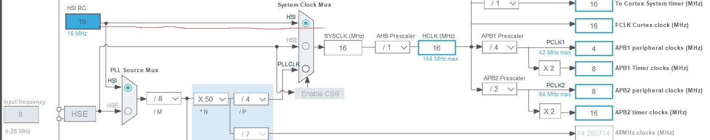
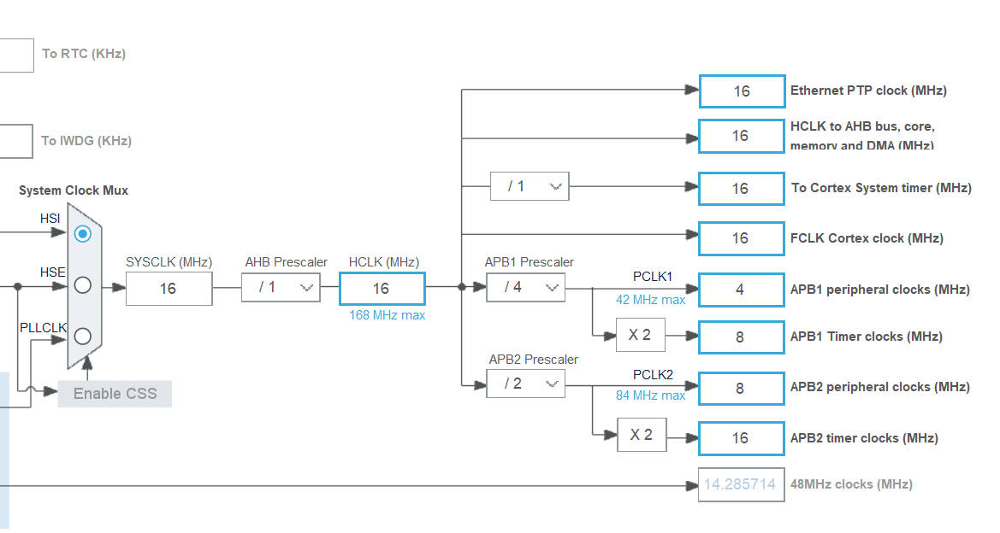
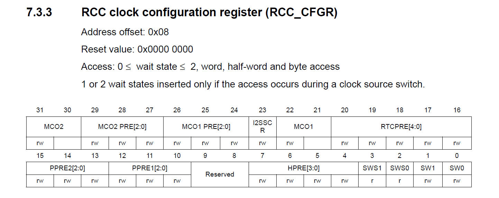
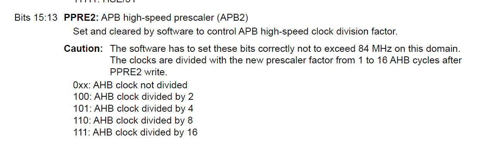
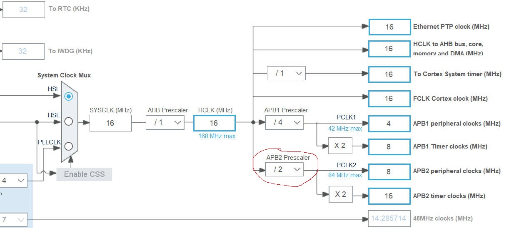

# 36. HSI and RCC Register

The HSI clock signal is generated from an internal 16 MHz RC oscillator and can be used
directly as a system clock, or used as PLL input.

All Those are done by RCC Register.

`RCC_CR` Register is responsible for AHB and APB Prescaler.

