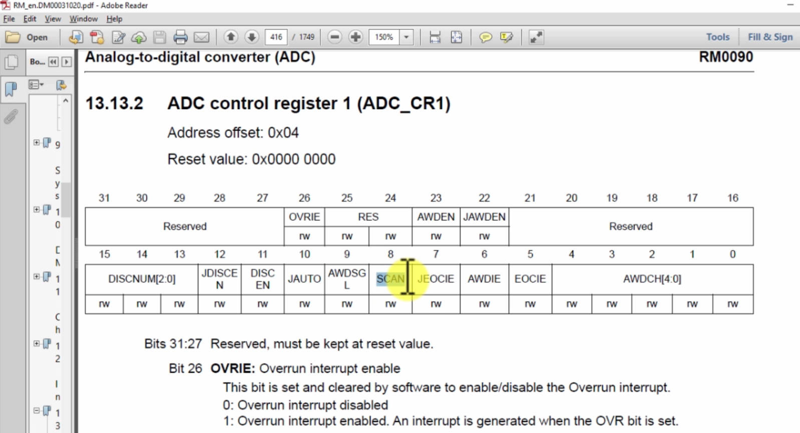
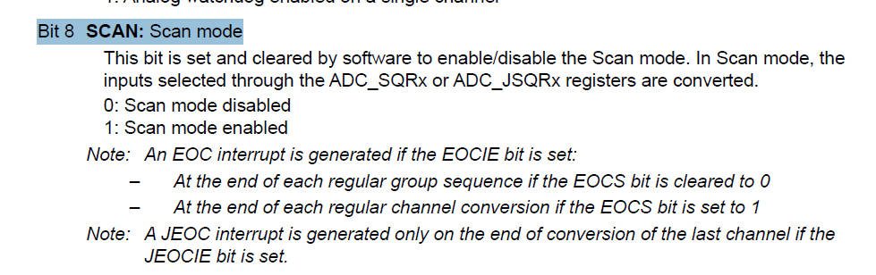
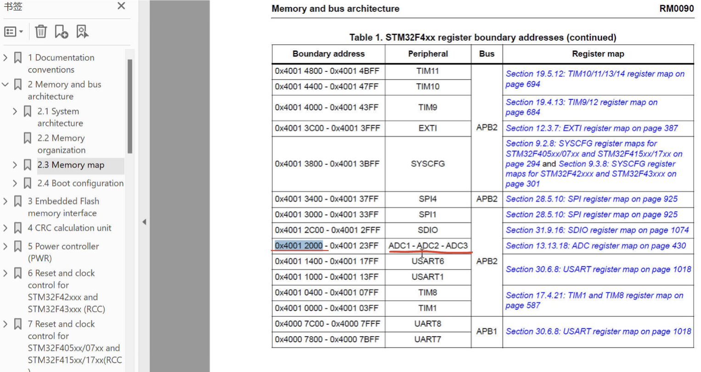
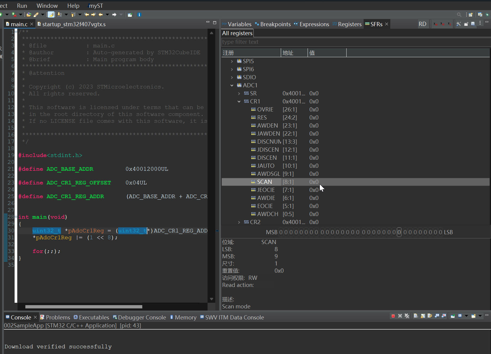
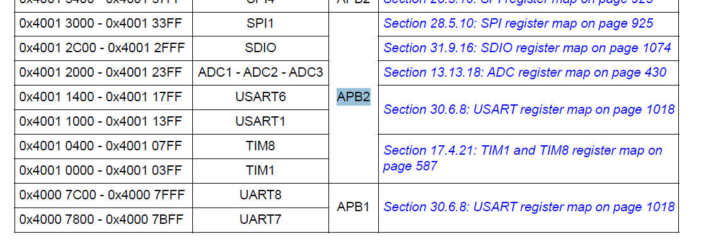
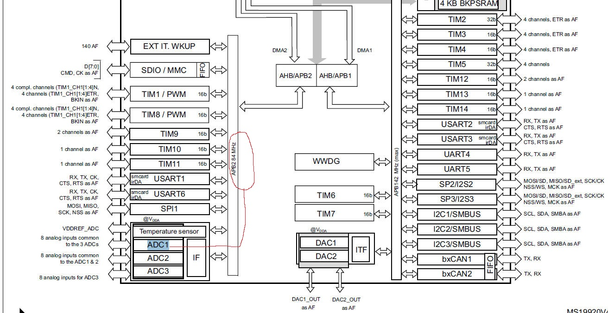
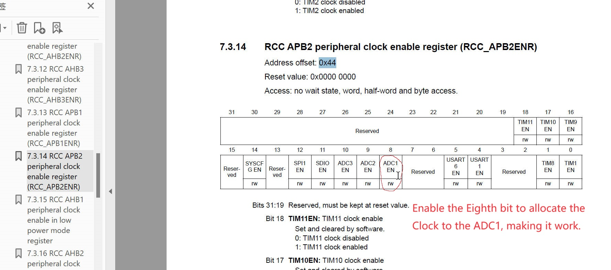
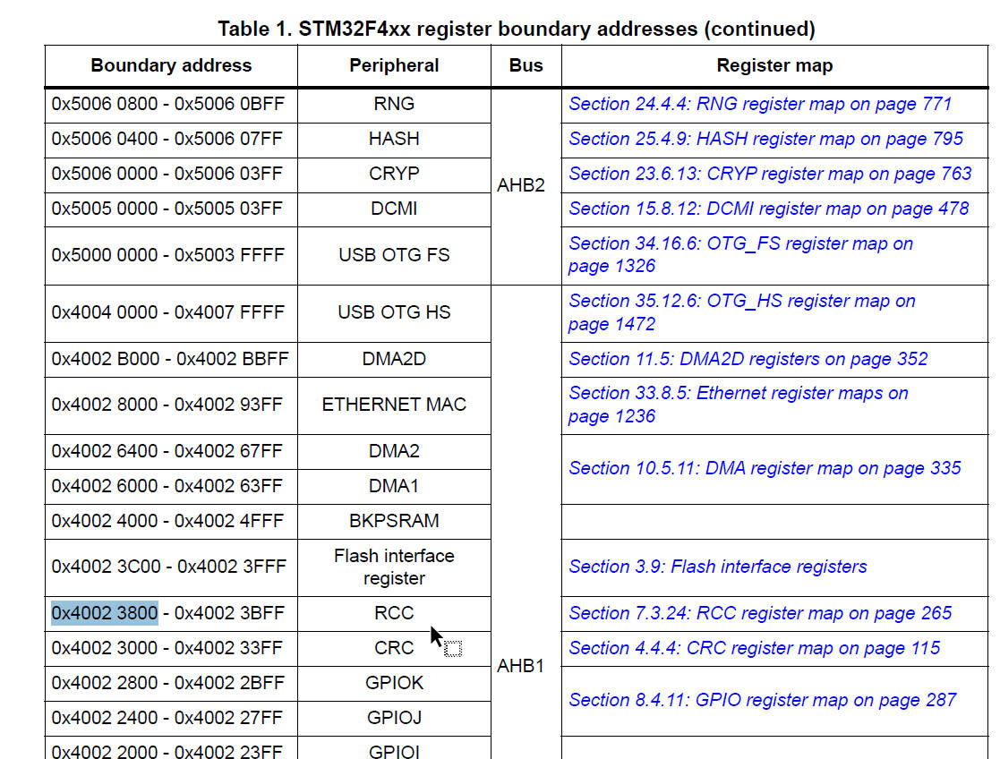
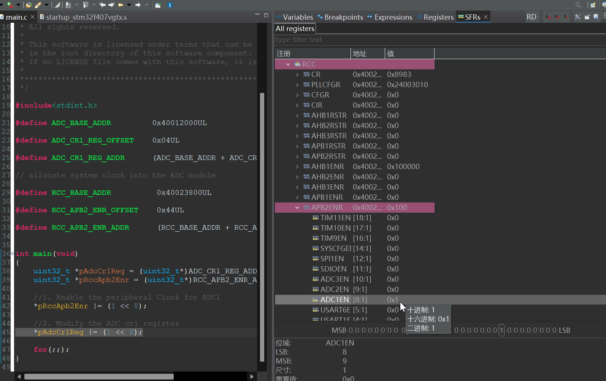
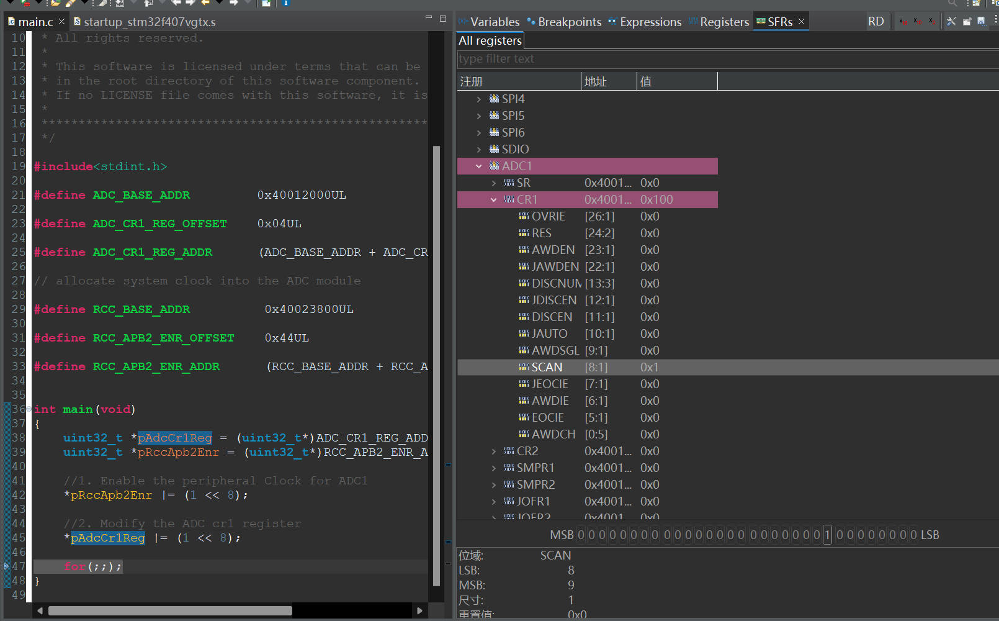

# 37. Peripheral Clock Configuration


In modern MCUs, before using any peripheral, you must enable its peripheral clock using peripheral clock register.

By default, peripheral clocks of all most all peripherals with be disabled to save power.

A peripheral won't take or respond to your configuration values until you enables its peripheral clock.

In STM32 microcontrollers, peripheral clocks are managed through RCC register.

## Experiment: Enable the ADC  control register





Go to the memory map  to find the ADC_BASE_ADDR



I wanna set the 8th bit as 1

```c
*pAdcCr1Reg |= (1 << 8);
```

the main.c 

```c
#include<stdint.h>

#define ADC_BASE_ADDR         0x40012000UL

#define ADC_CR1_REG_OFFSET    0x04UL

#define ADC_CR1_REG_ADDR      (ADC_BASE_ADDR + ADC_CR1_REG_OFFSET)


int main(void)
{
	uint32_t *pAdcCr1Reg = (uint32_t*)ADC_CR1_REG_ADDR;
	*pAdcCr1Reg |= (1 << 8);

	for(;;);
}
```

### Then check the `SFRS->ADC1->CR1` , The Scan bit is not be set as 1, why is that?



**Because the Clock for the Peripheral is not enabled for saving power by default, you should enable the Peripheral Clock.**

## Enable the Peripheral Clock

### Which bus are the peripheral on?

The ADC1 is connected with APB2 Bus, learnt from the referencing manual.





Reference: https://www.st.com/content/ccc/resource/technical/document/datasheet/ef/92/76/6d/bb/c2/4f/f7/DM00037051.pdf/files/DM00037051.pdf/jcr:content/translations/en.DM00037051.pdf

### Go to find the appropriate register in the RCC register



Find the RCC base address



The Final main.c

```c
#include<stdint.h>

#define ADC_BASE_ADDR         0x40012000UL

#define ADC_CR1_REG_OFFSET    0x04UL

#define ADC_CR1_REG_ADDR      (ADC_BASE_ADDR + ADC_CR1_REG_OFFSET)

// allocate system clock into the ADC module

#define RCC_BASE_ADDR          0x40023800UL

#define RCC_APB2_ENR_OFFSET    0x44UL

#define RCC_APB2_ENR_ADDR      (RCC_BASE_ADDR + RCC_APB2_ENR_OFFSET)


int main(void)
{
	uint32_t *pAdcCr1Reg = (uint32_t*)ADC_CR1_REG_ADDR;
	uint32_t *pRccApb2Enr = (uint32_t*)RCC_APB2_ENR_ADDR;

	//1. Enable the peripheral Clock for ADC1
	*pRccApb2Enr |= (1 << 8);

	//2. Modify the ADC cr1 register
	*pAdcCr1Reg |= (1 << 8);

	for(;;);
}
```



