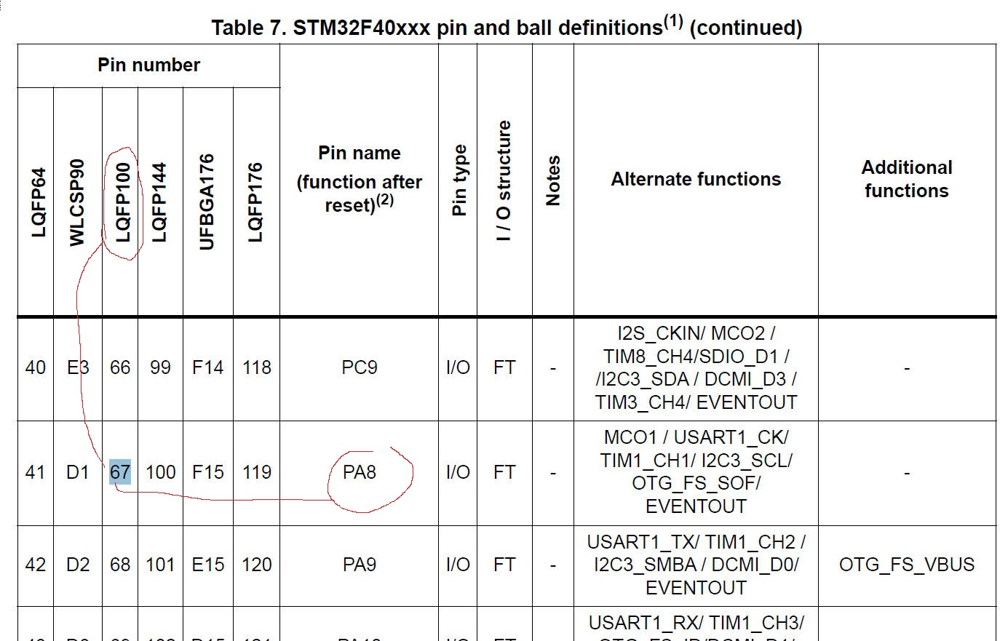

# 38. Exercise: HSI Measurements

Write a program to output HSI clock on a microcontroller pin and measure it using oscillator or logic analyzer.

## Steps to output a clock on MCU pin

1. Select the desired clock for the MCOx signal (Microcontroller Clock Output)
2. Output the MCOx signal on the MCU pin.

### Allow Clock Output

MCO1 signal is not a microcontroller pin, it's a signal which is inside the microcontroller.

### Search the pinouts and pin description on the datasheet

Then go to look at the Schematical Diagram

That means the MCU actually uses the LQFP100 package.

Now We know the output pin is the PA8.