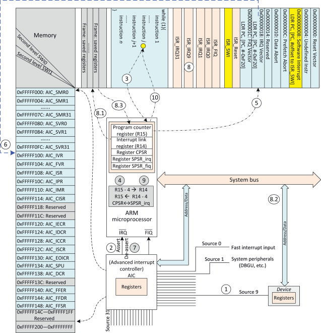
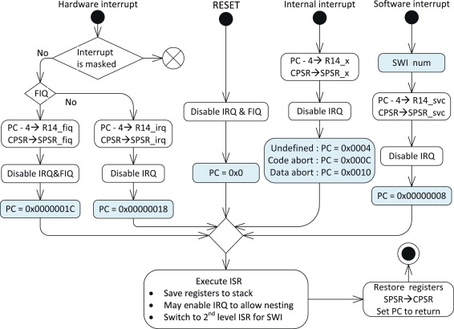
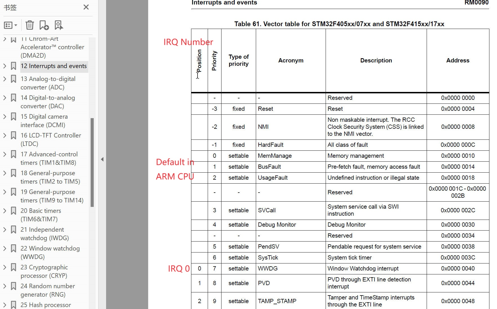
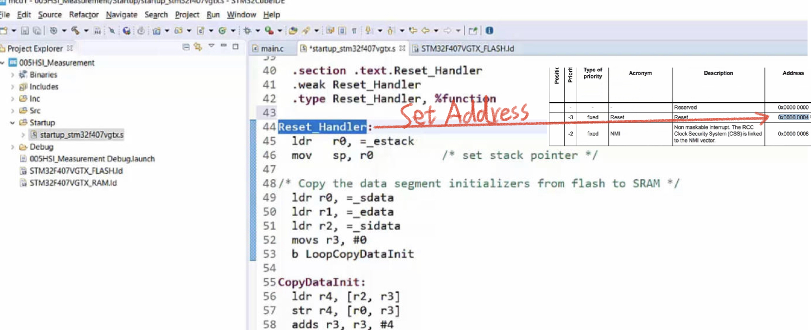
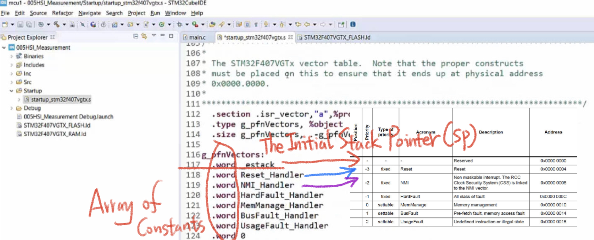
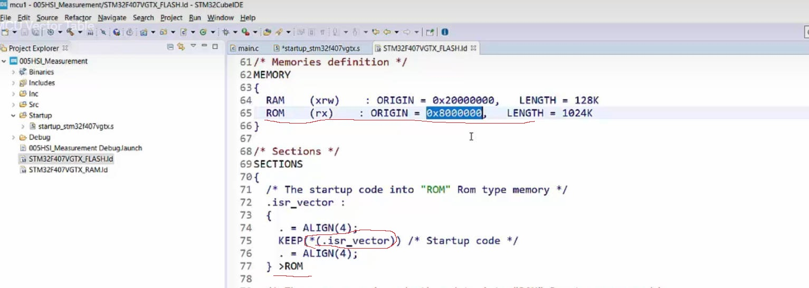
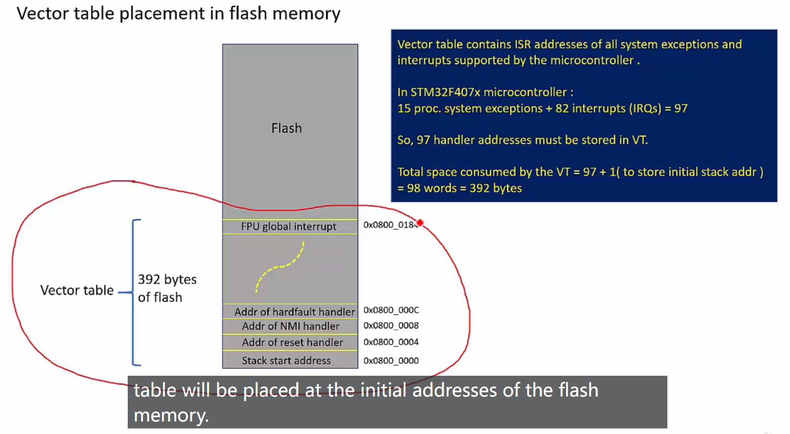
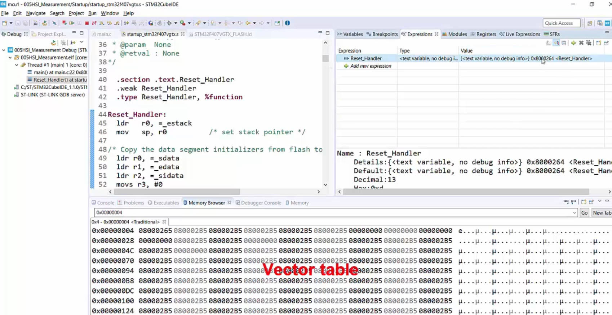

# 42. Understanding MCU Vector Table

## Vector Table

A table of exception handler addresses. (System Exceptions + Interruptions )

Reference: https://github.com/knightsummon/02-Computer-underlying-programming-and-system-optimization/blob/main/09%20CPU%20and%20Operating%20System/9.11%20Interrupt%20(2)%20Process%20Stack%20and%20Interrupt%20Stack.md

Reference: https://www.sciencedirect.com/topics/engineering/interrupt-vector-table

###  Process of all three types of interrupts:

15 System Exceptions and 240 Interruptions

So the vector table should include the addresses of handlers for all these exceptions

## MCU Reference Manual

The startup downloads the real address in the memory into the Vector Table.

How to write a start up files on the bare metal: https://www.youtube.com/playlist?list=PLERTijJOmYrDiiWd10iRHY0VRHdJwUH4g

