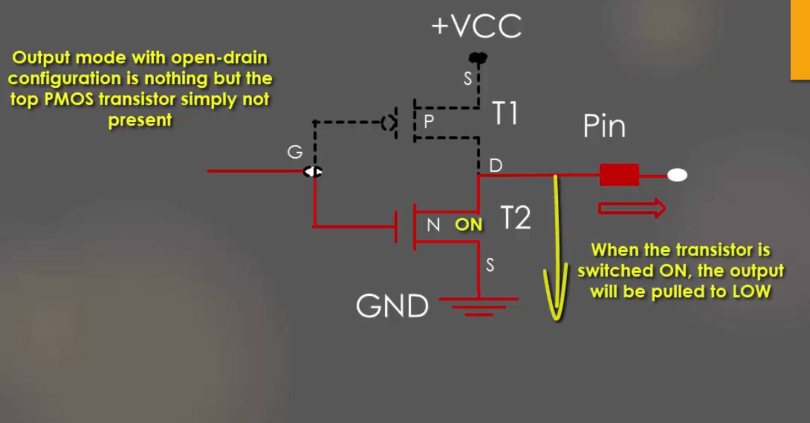
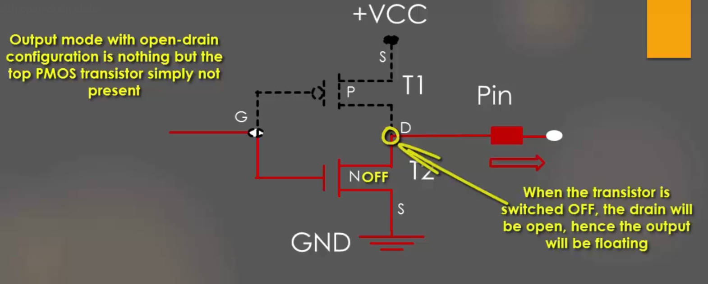
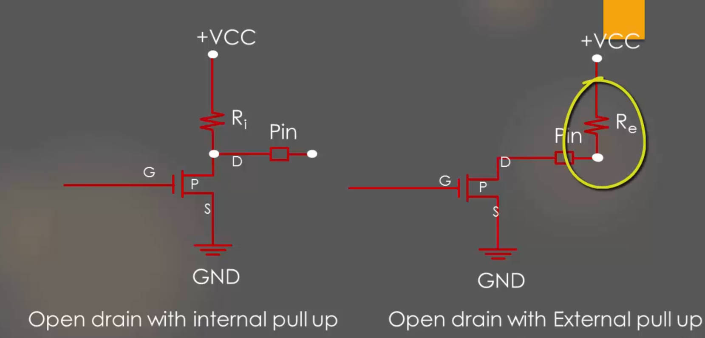
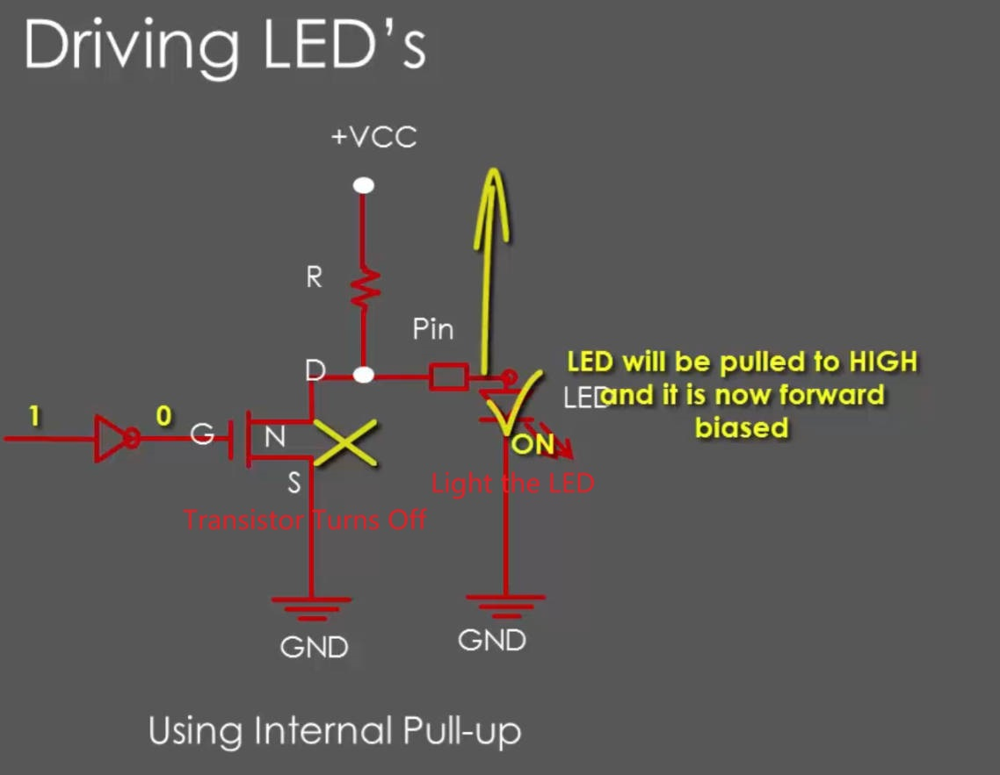
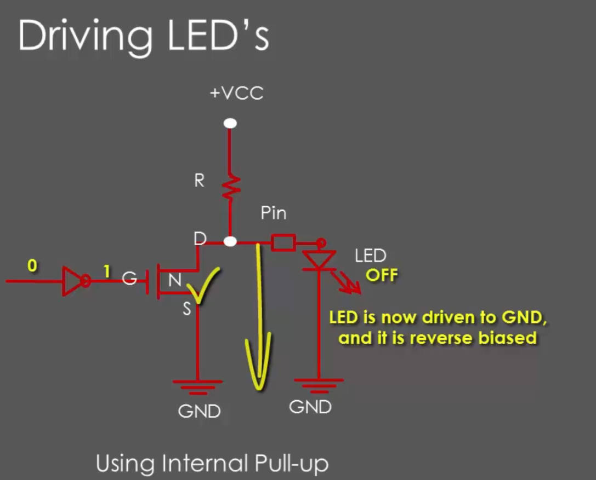
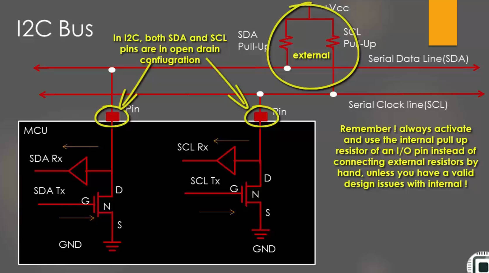

# 52. GPIO Output Mode with Open Drain State

## Open Drain Configuration

## Solution: Add Resistor

`Pull-up resistors` are resistors which are used to ensure that a wire is pulled to a high logical level in the absence of an input signal.

`Pull-down resistors` work in the same manner as pull-up resistors, except that they pull the pin to a logical low value.

References: https://eepower.com/resistor-guide/resistor-applications/pull-up-resistor-pull-down-resistor/

References: https://www.electronics-tutorials.ws/logic/pull-up-resistor.html

GPIO Supports Internal pull-up resistors, which controlled by the GPIO Configure Register, for every GPIO Port.

## Driving LED

When the GPIO is in the `open-drain` Mode

## Practical 2: Driving I2C Bus

