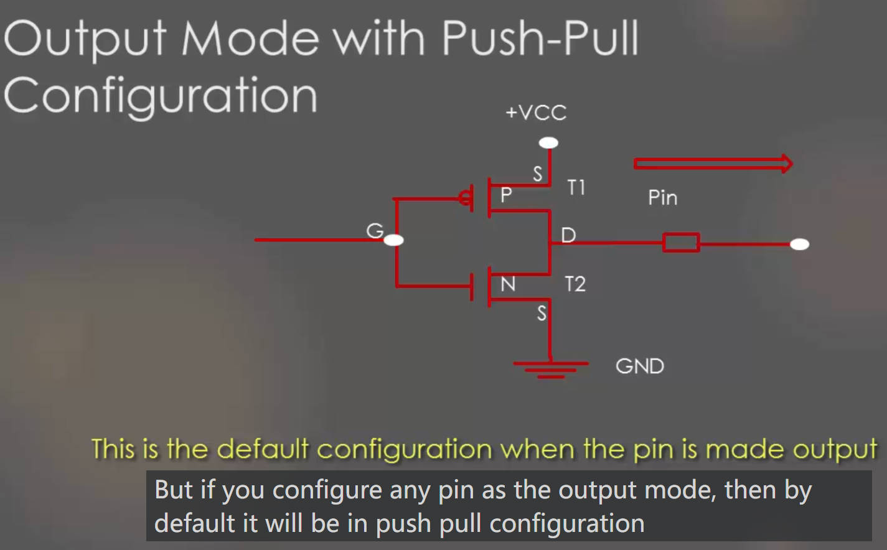
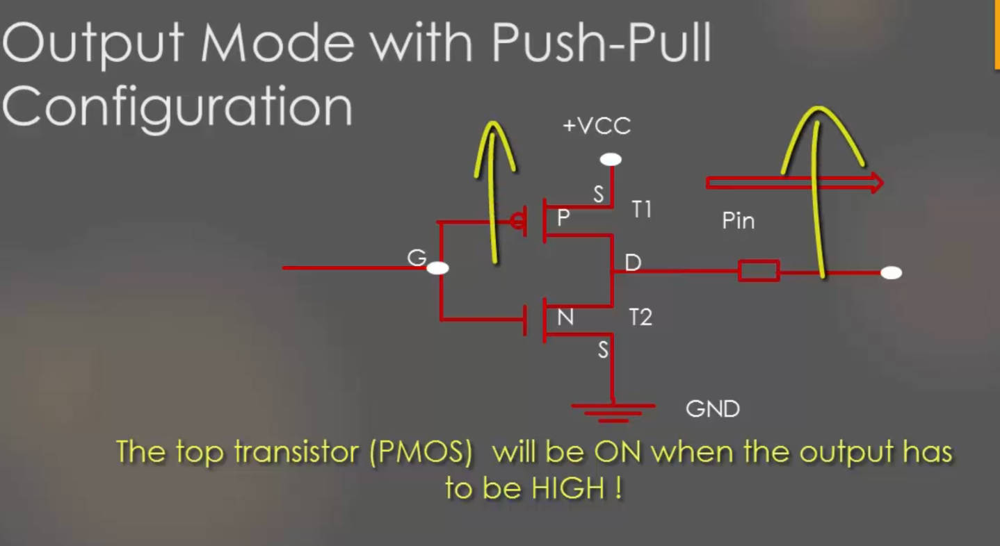
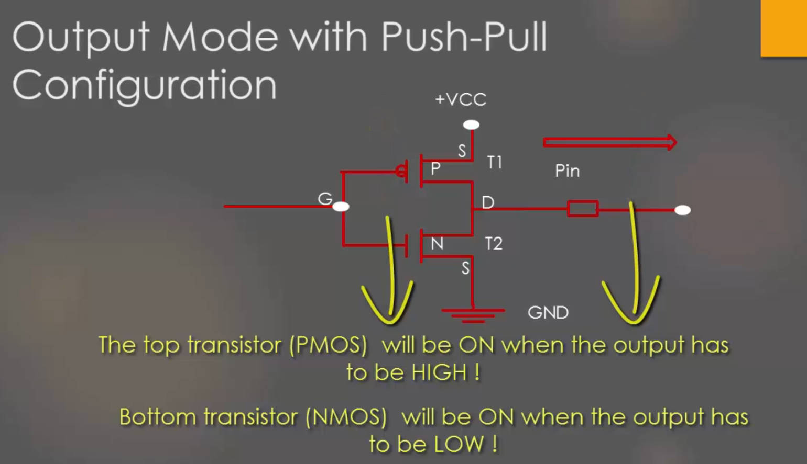
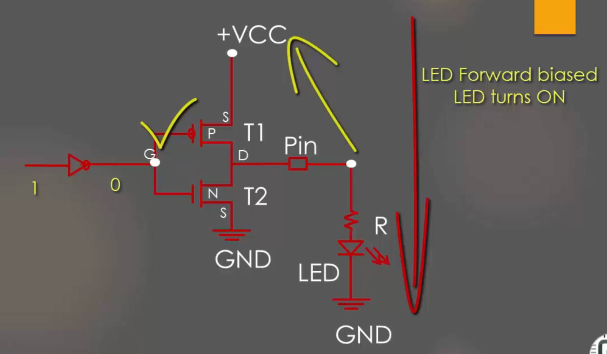
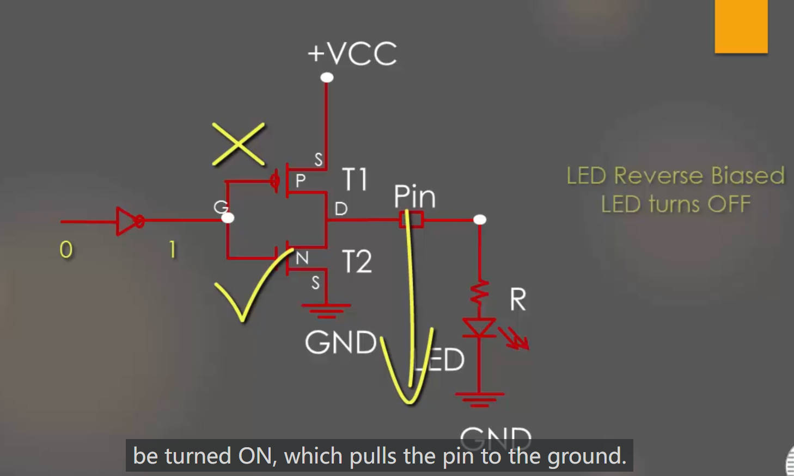

# 53. GPIO Output Mode with Push Pull State

## GPIO Output Mode with Push Pull Configuration

The output Configuration is called Push Pull, because the output will be pulled actively between High and Low with these two transistors

But in the push-pull configuration you don't need any pull-up or pull-down resistor

## How to drive a LED from Push-Pull GPIO Pin

