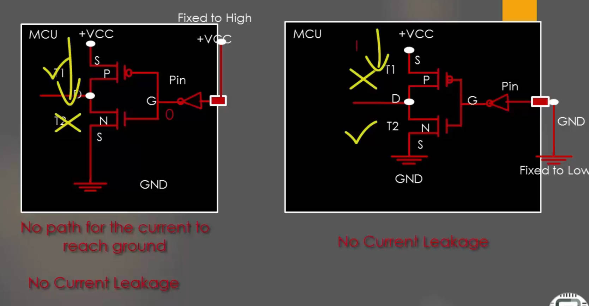
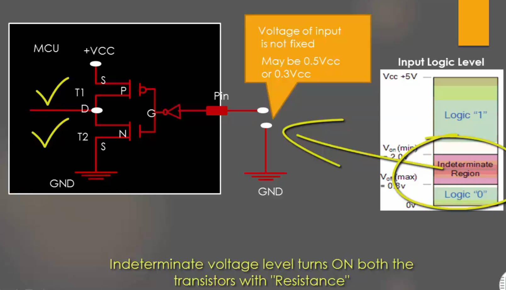
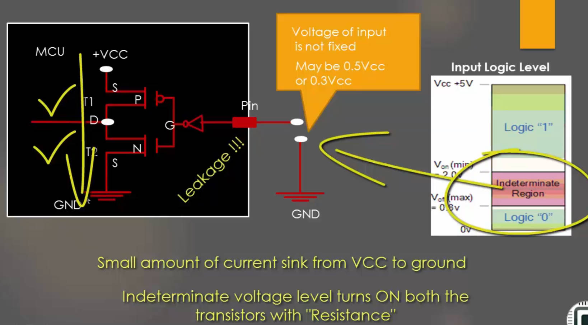

# 54. Optimizing I/O Power Consumption

**If input Pin is floating it may result in the leakage current.**

### Indeterminate Region: the two transistors are slightly on, +VCC leaks power to the ground

