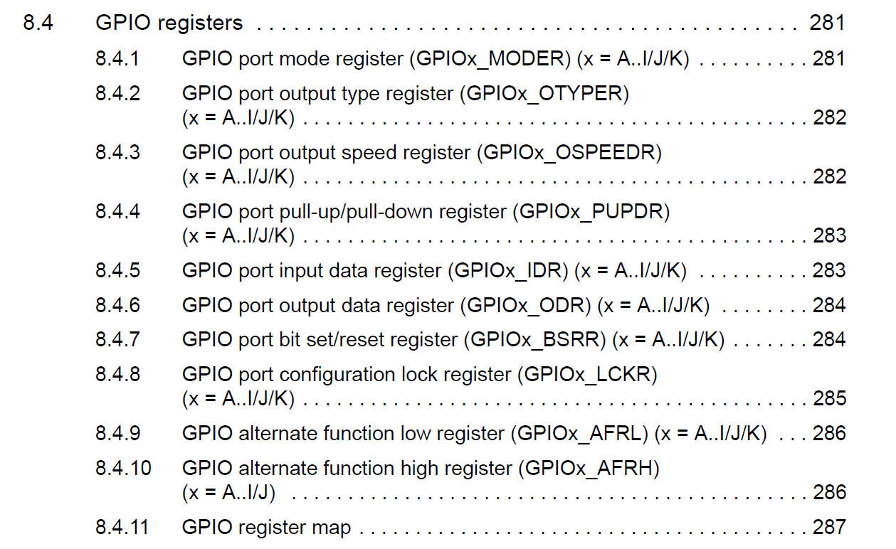
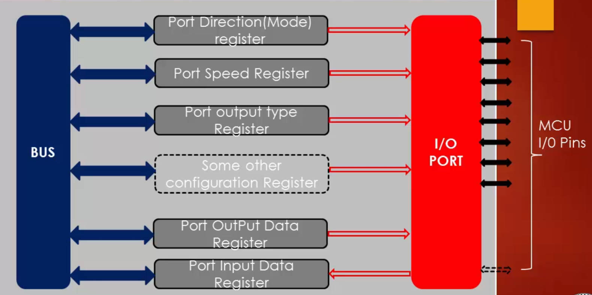
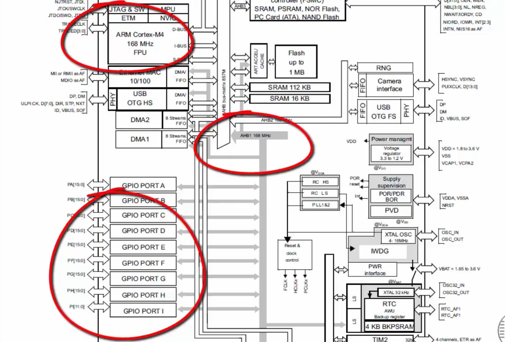

# 55. GPIO Programming Structure 

## GPIO Controlled by these Configuration Registers

These Registers are connected to system bus to CPU, influencing the outputs of  I/O ports.

AHB1 bus operates at max 168Mhz of clock speed and all the GPIO ports are connected to it!