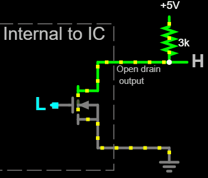
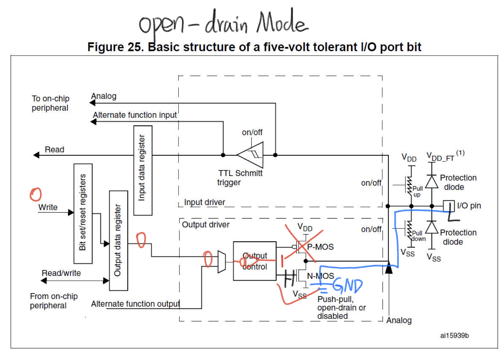
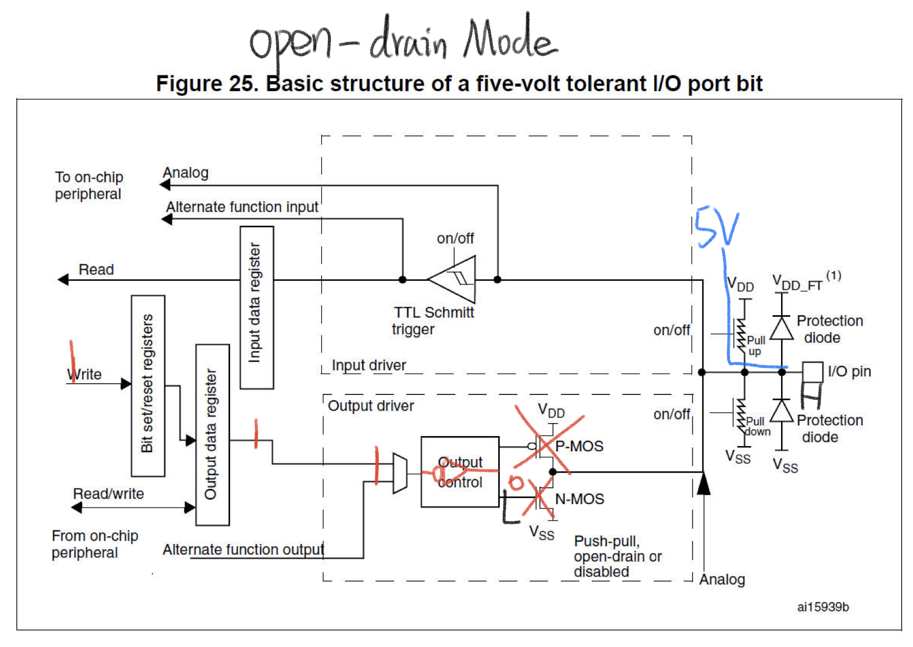

# 60. Output Configuration of a GPIO Pin in Open Drain Mode

**P-Mos: off**  
**Pull-up Resistor: on**  
**Pull-down Resistor: off**

An nMOS open drain output connects to ground when a high voltage is applied to the MOSFET's gate, or presents a high impedance when a low voltage is applied to the gate. The voltage in this high impedance state would be floating (undefined) because the MOSFET is not conducting, which is why nMOS open drain outputs require a pull-up resistor connected to a positive voltage rail for producing a high output voltage.

Reference: https://en.wikipedia.org/wiki/Open_collector

Usage: use push-pull configuration to output `0-1` signal to make the slaver operating in two status.