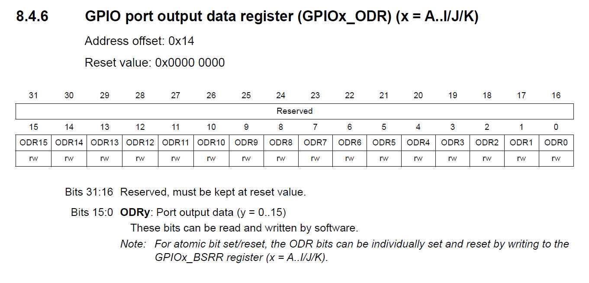

# 67. GPIO Output Data Register and Summary of Various Modes Discussed

## GPIO Functional Summary

By taking various modes and pull up/pull down resisters combinations below configurations can be obtained for a GPIO pin

Input Floating  
Input pull-up  
Input-pull-down  
Analog  
Output open-drain with pull-up or pull-down capability  
Output push-pull with pull-up or pull-down capability  
Alternate Function push-pull with pull-up or pull-down capability  
Alternate Function open-drain with pull-up or pull-down capability  

