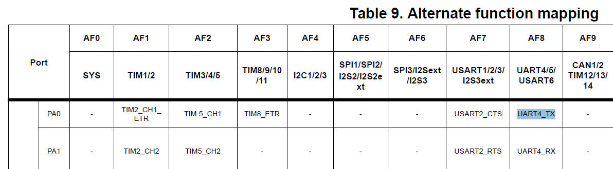

# 69. GPIO Alternate Function Register

## Example

Find out the alternate functionality mode (AFx) and alternative Function Register (AFR) setting to make

PA0 as UART4_TX  
PA1 as UART4_RX  
PA10 as T1M1_CH3  

### 1.AFx = AF8

(This info you can only get it from datasheet of the MCU not from read manual in the case of ST's MCUs)

now we know the  AFy is the AF8.

### 2.Solution: PA0 as UART4 TX

### 3.AFx = AF8

### 4.Solution:PA1 as UART4_RX

