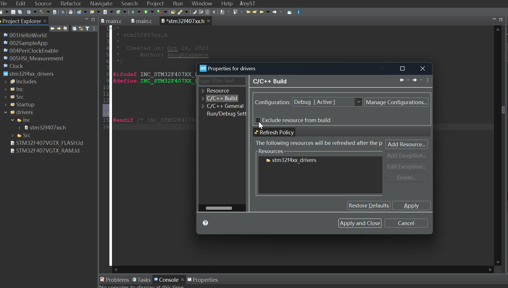

# 74. New Project Creation and Creating MCU Specific Headerfile

## Create the Driver Folder

In a C++ Integrated Development Environment (IDE), the option "exclude resource from build" typically refers to a feature that allows you to specify certain files or resources in your project that should be excluded from the build process. This means that these files or resources will not be compiled, linked, or otherwise processed when you build your C++ project.

