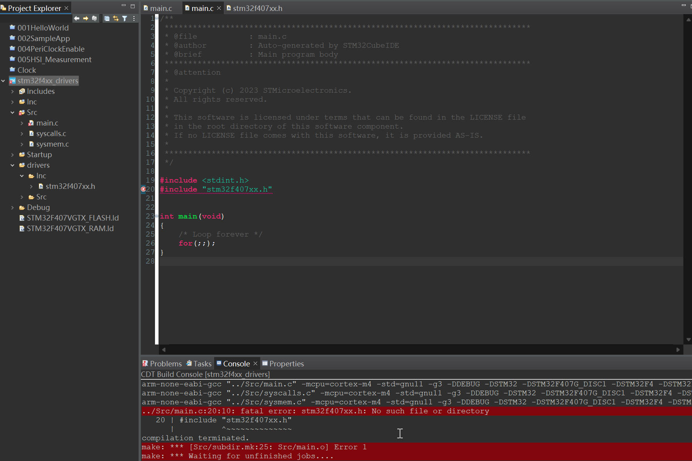
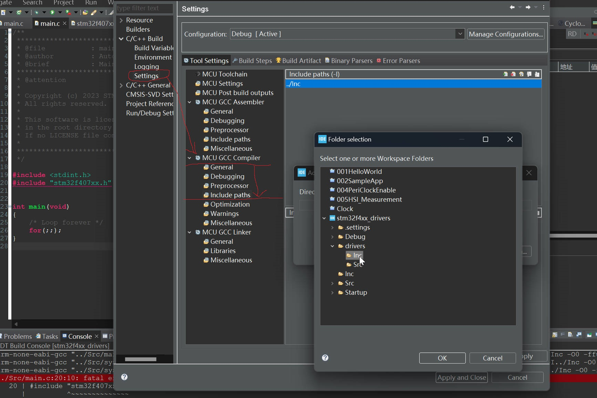
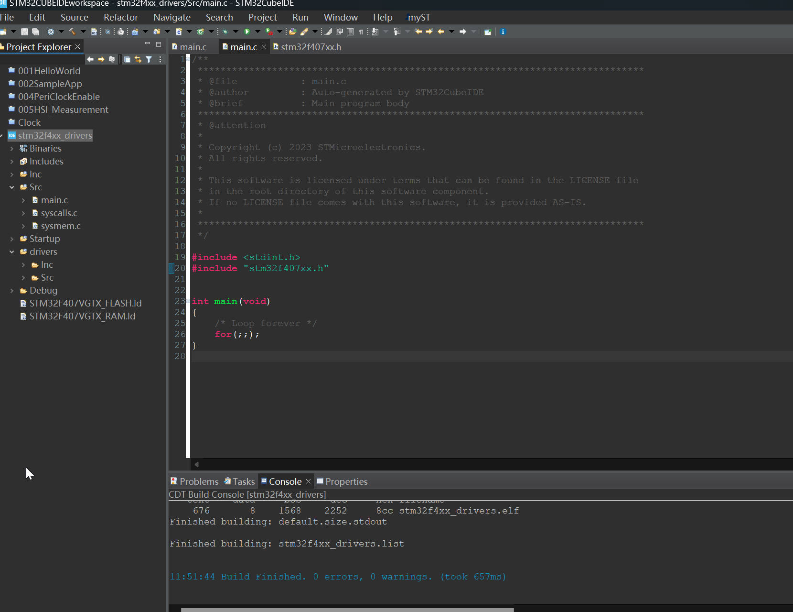

# 75. Include Path Settings

This error comes when your build setting is not properly configuration.

/drivers/Inc/stm32f407xx.h is unknown to the eclipse build system.

## Solution: Add Path to the Environment

Rebuild the Project, No errors.

