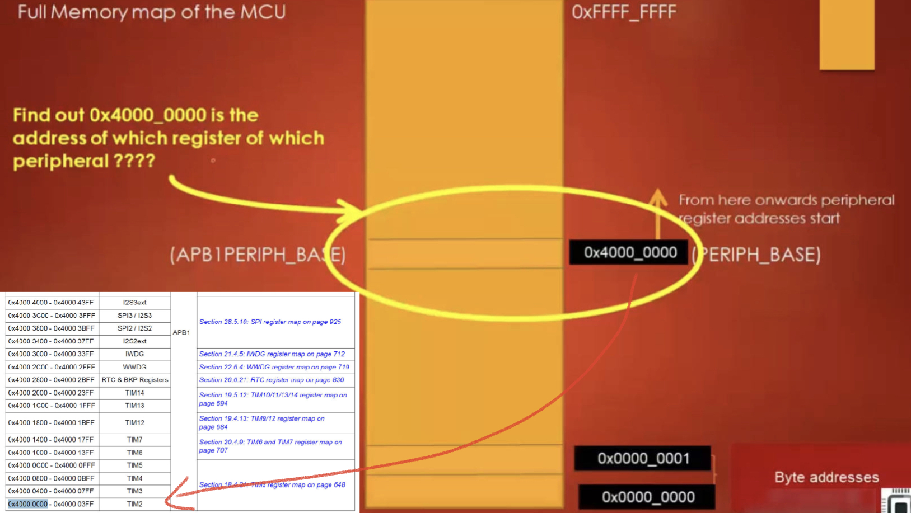

# 79. Defining Base Address of Different Bus Domain

## Structure:

**Defining base address of various bus domains (AHBx, APBx)**

**TIM2** Peripheral

The Register TIMx_CR1's base address is `0x40000000` + `0x00`

