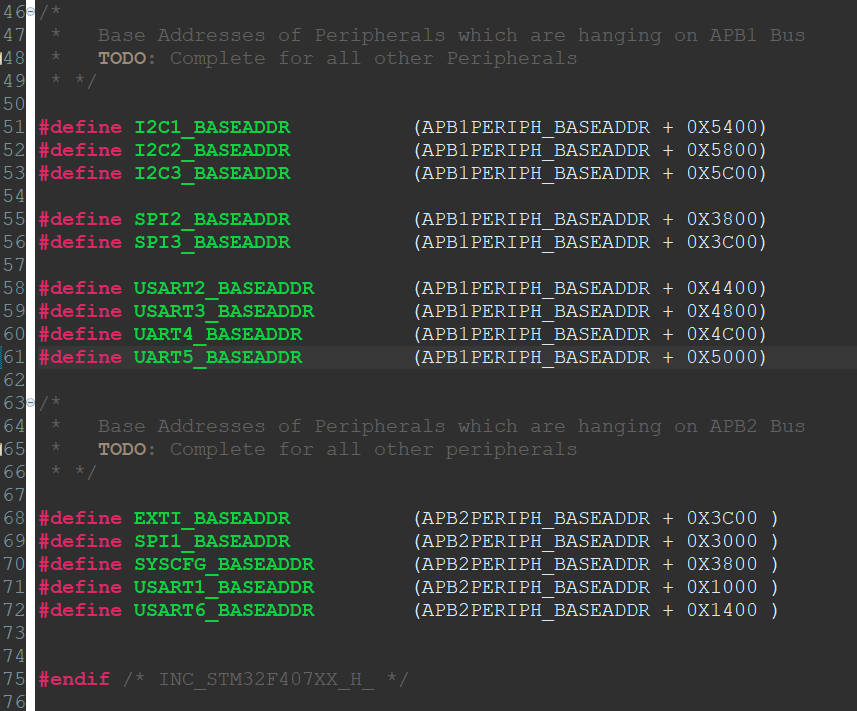

# 82. Defining Base Addresses Conclusion




## Complete Code:

```c
/*
 * stm32f407xx.h
 *
 *  Created on: Oct 26, 2023
 *      Author: knightsummon
 */

#ifndef INC_STM32F407XX_H_
#define INC_STM32F407XX_H_

/*
 *    Base Address of Flash & SRAM Memories
 * */


#define FLASH_BASEADDR         0x08000000U /*(uint32_t)0x080000000*/
#define SRAM1_BASEADDR         0x20000000U /*+112KB*/
#define SRAM2_BASEADDR         0x20001C00U
#define ROM_BASEADDR           0x1FFF0000U
#define SRAM                   SRAM1_BASEADDR

/*
 *   AHBx and APBx Bus Peripheral Base Address
 * */

#define PERIPH_BASE            0x40000000U
#define APB1PERIPH_BASEADDR    PERIPH_BASE
#define APB2PERIPH_BASEADDR    0x40010000U
#define AHB1PERIPH_BASEADDR    0x40020000U
#define AHB2PERIPH_BASEADDR    0x50000000U

/*
 *   Base Addresses of Peripherals which are hanging on AHB1 Bus
 *   TODO: Complete for all other peripherals
 * */
#define GPIOA_BASEADDR         (AHB1PERIPH_BASEADDR + 0x0000)
#define GPIOB_BASEADDR         (AHB1PERIPH_BASEADDR + 0x0400)
#define GPIOC_BASEADDR         (AHB1PERIPH_BASEADDR + 0x0800)
#define GPIOD_BASEADDR         (AHB1PERIPH_BASEADDR + 0x0C00)
#define GPIOE_BASEADDR         (AHB1PERIPH_BASEADDR + 0x1000)
#define GPIOF_BASEADDR         (AHB1PERIPH_BASEADDR + 0x1400)
#define GPIOG_BASEADDR         (AHB1PERIPH_BASEADDR + 0x1800)
#define GPIOH_BASEADDR         (AHB1PERIPH_BASEADDR + 0x1C00)
#define GPIOI_BASEADDR         (AHB1PERIPH_BASEADDR + 0x2000)

/*
 *   Base Addresses of Peripherals which are hanging on APB1 Bus
 *   TODO: Complete for all other Peripherals
 * */

#define I2C1_BASEADDR          (APB1PERIPH_BASEADDR + 0X5400)
#define I2C2_BASEADDR          (APB1PERIPH_BASEADDR + 0X5800)
#define I2C3_BASEADDR          (APB1PERIPH_BASEADDR + 0X5C00)

#define SPI2_BASEADDR          (APB1PERIPH_BASEADDR + 0X3800)
#define SPI3_BASEADDR          (APB1PERIPH_BASEADDR + 0X3C00)

#define USART2_BASEADDR        (APB1PERIPH_BASEADDR + 0X4400)
#define USART3_BASEADDR        (APB1PERIPH_BASEADDR + 0X4800)
#define UART4_BASEADDR         (APB1PERIPH_BASEADDR + 0X4C00)
#define UART5_BASEADDR         (APB1PERIPH_BASEADDR + 0X5000)

/*
 *   Base Addresses of Peripherals which are hanging on APB2 Bus
 *   TODO: Complete for all other peripherals
 * */

#define EXTI_BASEADDR          (APB2PERIPH_BASEADDR + 0X3C00 )
#define SPI1_BASEADDR          (APB2PERIPH_BASEADDR + 0X3000 )
#define SYSCFG_BASEADDR        (APB2PERIPH_BASEADDR + 0X3800 )
#define USART1_BASEADDR        (APB2PERIPH_BASEADDR + 0X1000 )
#define USART6_BASEADDR        (APB2PERIPH_BASEADDR + 0X1400 )


#endif /* INC_STM32F407XX_H_ */
```

