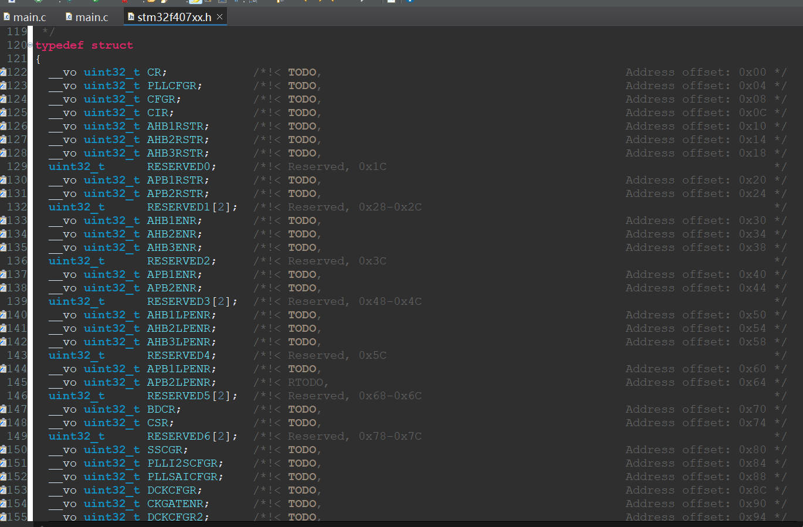
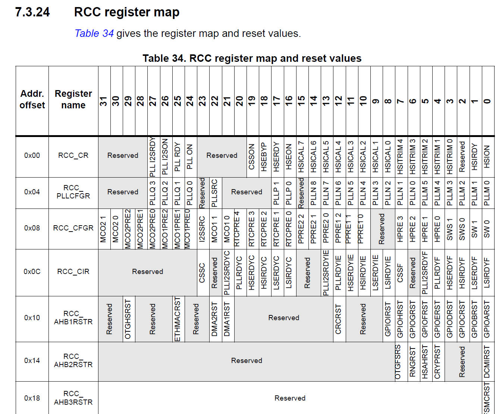
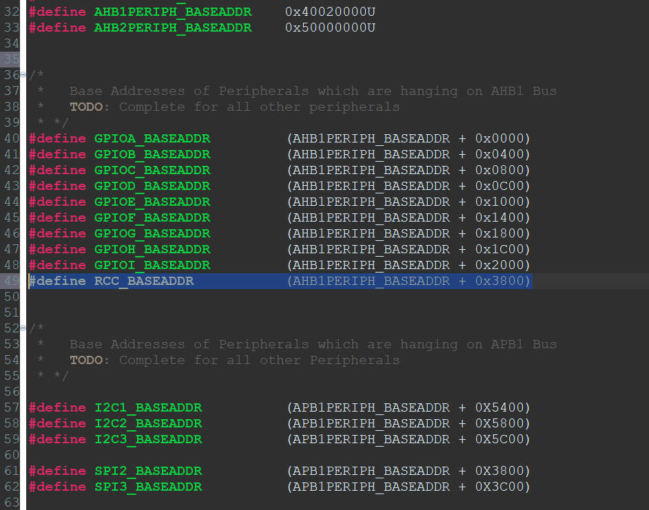
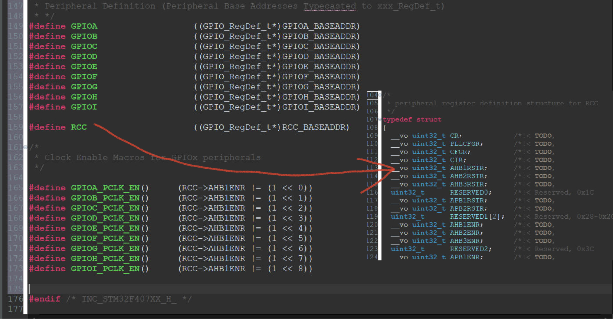

# 86. Writing Peripheral Clock Enable and Disable C Macros

Reference: https://github.com/niekiran/MasteringMCU/blob/master/Resources/Source_code/Workspace/stm32f4xx_drivers/drivers/inc/stm32f407xx.h

## Find the Basic Address of RCC

##  Create Clock Enable Macro

