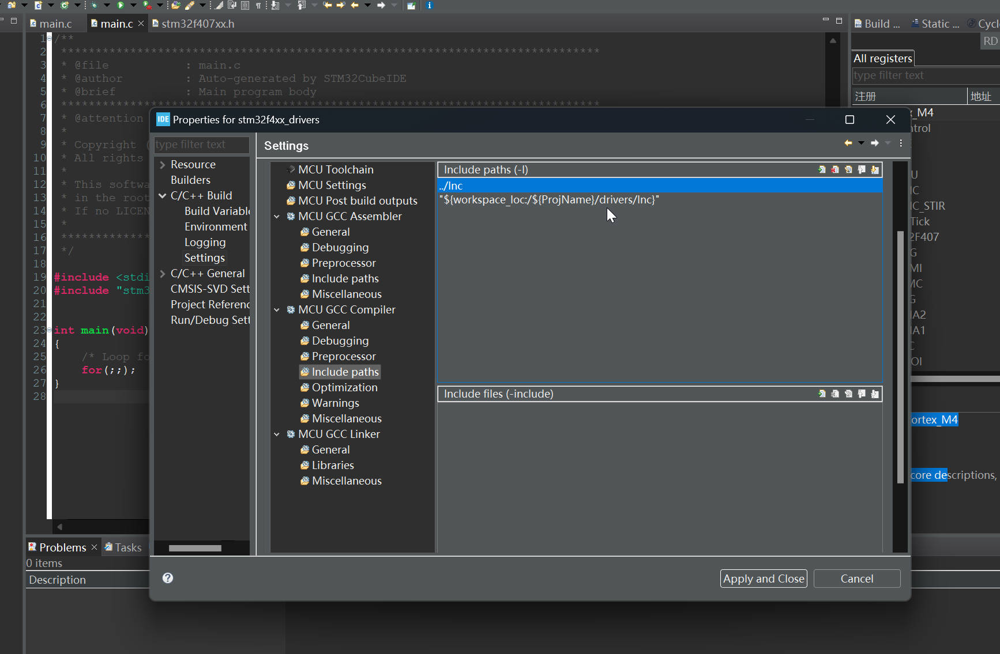

# 87. Project Include Settings and Build

Until Now, Our Device specific header file finally finished, containing the required addresses for various memories, various bus domain, for various peripherals, and also the required peripheral register definition, bus domain, and also clock enable and disable macro.

But Be Sure to remember to add the new path to the GNU Compiler, or it can not find the header during the compiling!

