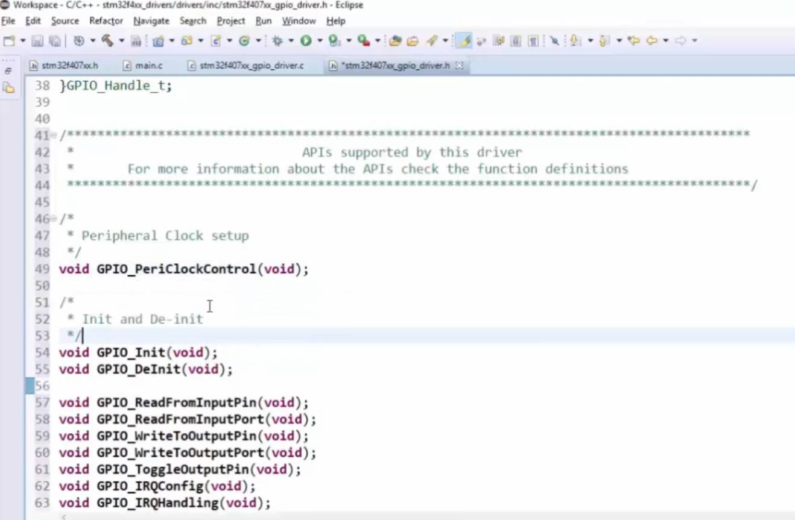
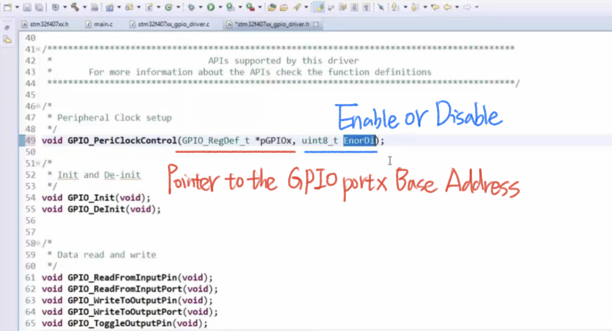
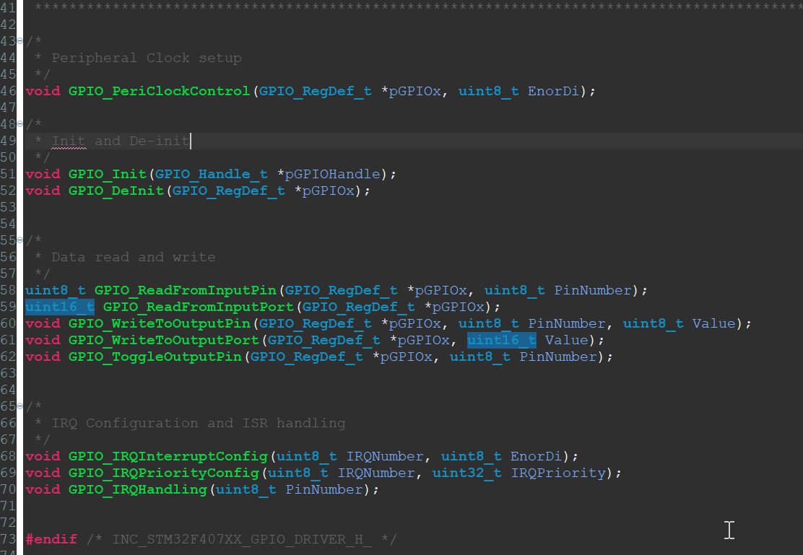
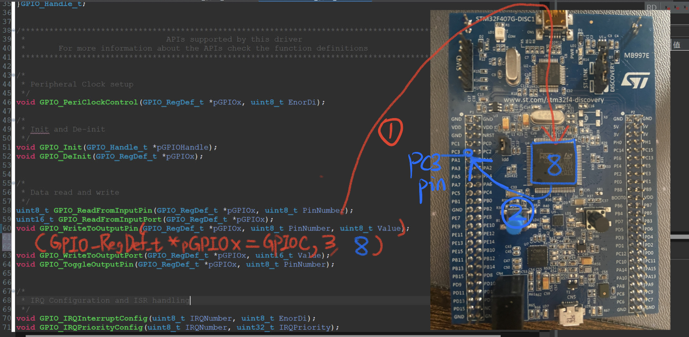

# 91. Driver API Requirements and Adding API prototype

## Now we finish write the prototype of the APIs

## Initialize the Parameters

1. `void GPIO_PeriClockControl(GPIO_RegDef_t *pGPIOx, uint8_t EnorDi);`
   - `pGPIOx`: This is a pointer to a structure (`GPIO_RegDef_t`) that represents a specific GPIO peripheral or port. It is used to identify which GPIO peripheral you want to enable or disable the clock for.
   - `EnorDi`: An 8-bit integer (uint8_t) that specifies whether you want to enable (1) or disable (0) the peripheral clock for the specified GPIO port.
2. `void GPIO_Init(GPIO_Handle_t *pGPIOHandle);`
   - `pGPIOHandle`: This is a pointer to a structure (`GPIO_Handle_t`) that contains all the configuration parameters needed to initialize a GPIO port. It includes information such as the pin configuration, pin mode, pin direction, and other settings.
3. `void GPIO_DeInit(GPIO_RegDef_t *pGPIOx);`
   - `pGPIOx`: This is a pointer to a structure (`GPIO_RegDef_t`) representing the specific GPIO peripheral you want to reset or de-initialize. De-initializing a GPIO port typically means setting it to its default state.
4. `uint8_t GPIO_ReadFromInputPin(GPIO_RegDef_t *pGPIOx, uint8_t PinNumber);`
   - `pGPIOx`: A pointer to the structure representing the GPIO peripheral from which you want to read input.
   - `PinNumber`: An 8-bit integer specifying the pin number from which you want to read the input state. This function reads and returns the digital state (high or low) of the specified input pin.
5. `uint16_t GPIO_ReadFromInputPort(GPIO_RegDef_t *pGPIOx);`
   - `pGPIOx`: A pointer to the structure representing the GPIO peripheral from which you want to read the entire port input.
   - This function reads the state of all the pins in the specified input port and returns the combined state as a 16-bit integer (uint16_t).
6. `void GPIO_WriteToOutputPin(GPIO_RegDef_t *pGPIOx, uint8_t PinNumber, uint8_t Value);`
   - `pGPIOx`: A pointer to the structure representing the GPIO peripheral to which you want to write output.
   - `PinNumber`: An 8-bit integer specifying the pin number you want to write to.
   - `Value`: An 8-bit integer (1 or 0) representing the value you want to write to the specified output pin (high or low).
7. `void GPIO_WriteToOutputPort(GPIO_RegDef_t *pGPIOx, uint16_t Value);`
   - `pGPIOx`: A pointer to the structure representing the GPIO peripheral to which you want to write output.
   - `Value`: A 16-bit integer representing the values you want to write to all the pins in the specified output port.
8. `void GPIO_ToggleOutputPin(GPIO_RegDef_t *pGPIOx, uint8_t PinNumber);`
   - `pGPIOx`: A pointer to the structure representing the GPIO peripheral whose output pin you want to toggle.
   - `PinNumber`: An 8-bit integer specifying the pin number you want to toggle.
9. `void GPIO_IRQInterruptConfig(uint8_t IRQNumber, uint8_t EnorDi);`
   - `IRQNumber`: An 8-bit integer representing the IRQ (Interrupt Request) number for a specific GPIO interrupt.
   - `EnorDi`: An 8-bit integer (1 or 0) specifying whether you want to enable (1) or disable (0) the specified GPIO interrupt.
10. `void GPIO_IRQPriorityConfig(uint8_t IRQNumber, uint32_t IRQPriority);`
    - `IRQNumber`: An 8-bit integer representing the IRQ number for a specific GPIO interrupt.
    - `IRQPriority`: A 32-bit integer specifying the priority level for the specified GPIO interrupt. The priority determines which interrupts are handled first in case of multiple pending interrupts.
11. `void GPIO_IRQHandling(uint8_t PinNumber);`
    - `PinNumber`: An 8-bit integer specifying the pin number associated with the GPIO interrupt you want to handle. This function is used to handle the interrupt that occurred on the specified pin.

`GPIO_RegDef_t *pGPIOx` in those examples, we will define it specifically by the `stm32f407xx_gpio_driver.c` like: `GPIO_RegDef_t *pGPIOx = GPIOC`

## From Code to Board

## Reference:

https://github.com/niekiran/MasteringMCU/blob/master/Resources/Source_code/Workspace/stm32f4xx_drivers/drivers/inc/stm32f407xx_gpio_driver.h