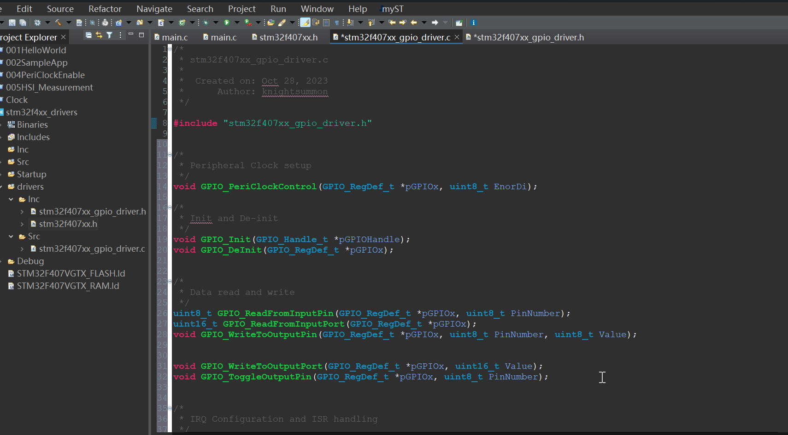
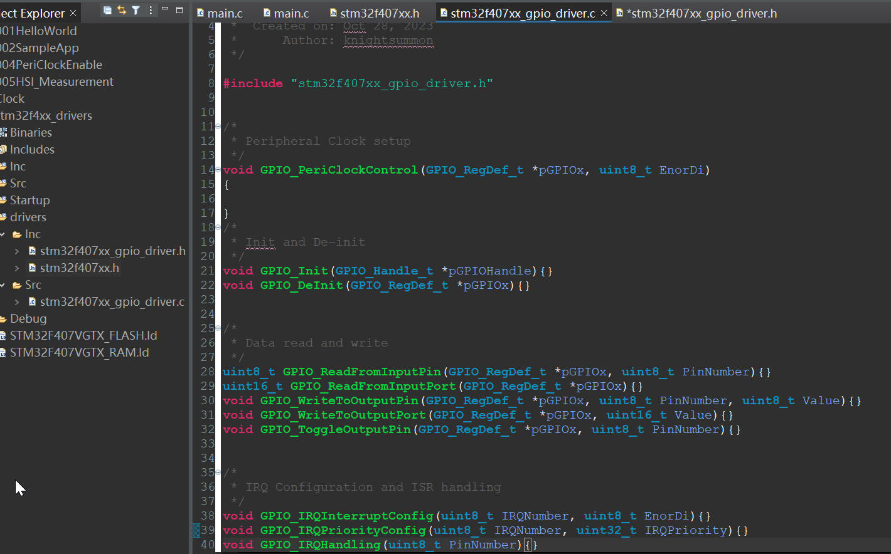
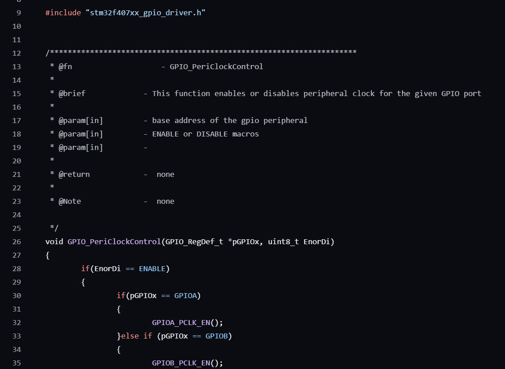

# 92. Driver empty API implementation and Documentation

**Copy the header prototype functions into the  `driver.c`and give it detailed operations**

## Each Function should have It's explanatory documentation 

Reference: https://github.com/niekiran/MasteringMCU/blob/master/Resources/Source_code/Workspace/stm32f4xx_drivers/drivers/src/stm32f407xx_gpio_driver.c