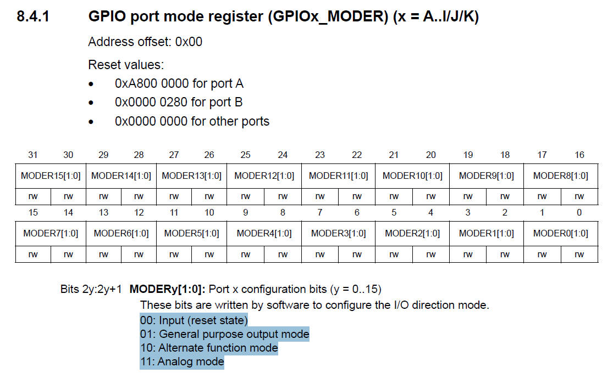

# 94. Writing User Configurable Macros


## Init Template

```c
void GPIO_Init (GPIO_Handle_t *pGPIOHandle)
{
    //1. configure the mode of gpio pin
    
    //2. configure the speed
    
    //3. configure the pupd settings
    
    //4. configure the optype
    
    //5. configure the alt functionality
}
```

## Configure the mode of gpio pin




## 2. configure the speed


## 3. configure the pupd settings


## Set the Configure Values


