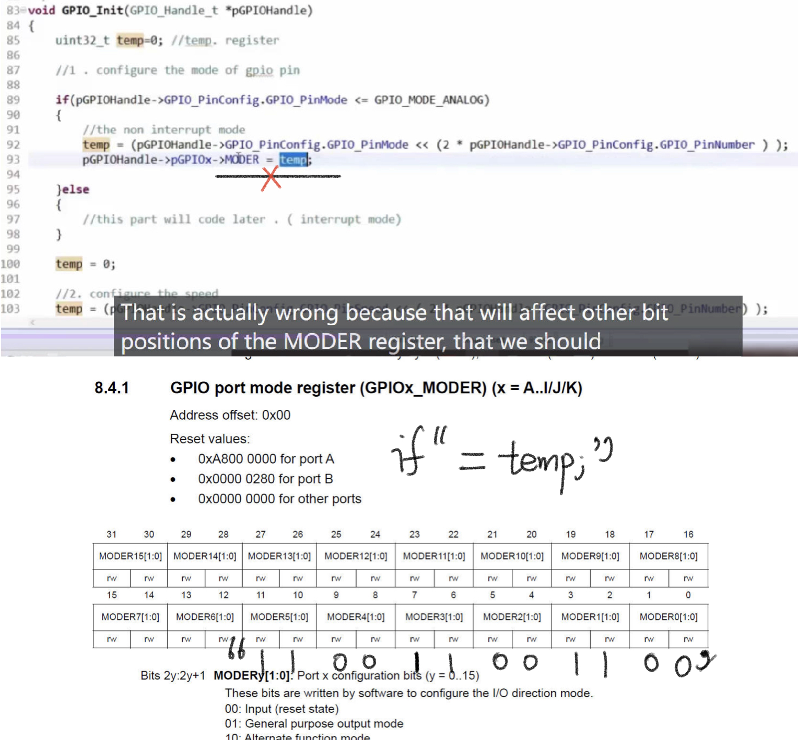
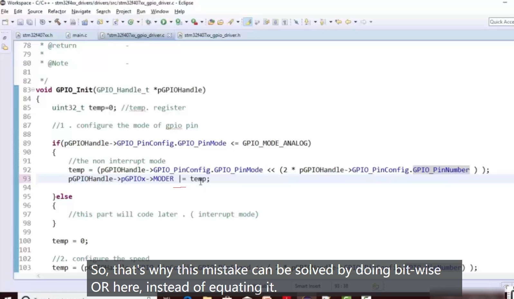

# 96. Implementation of GPIO init API contd

Error Correct:

Pay attention to the value setting when the physic register is involved. Except what port you want to output, you should not affect other ports which are not in use.