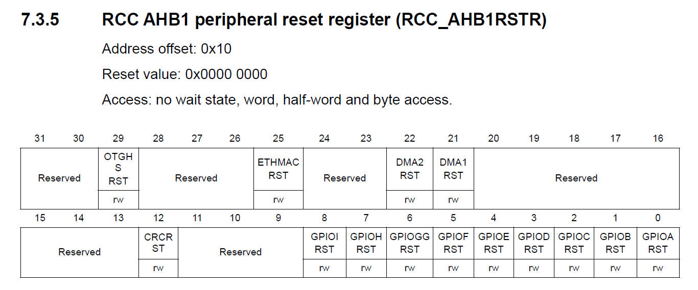
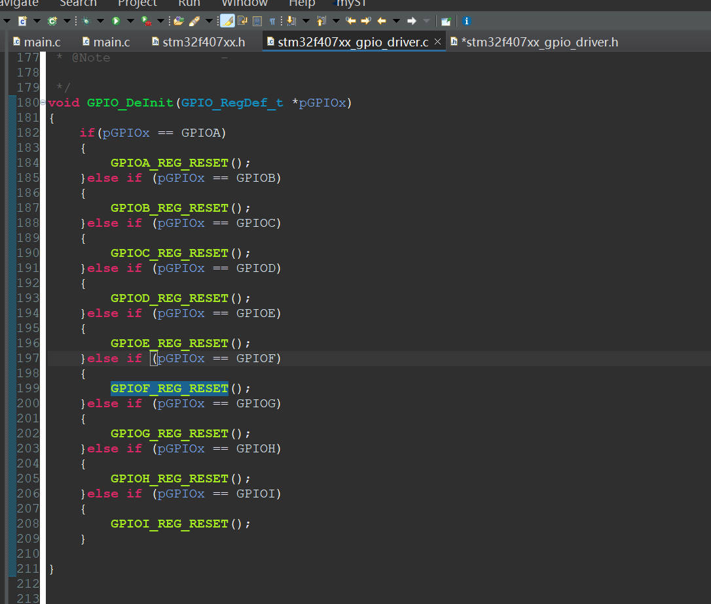
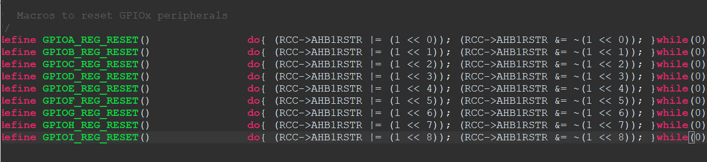
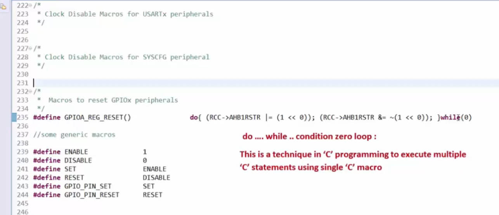

# 98. GPIO de-init API Implementation

Define the `GPIOx_REG_RESET()` function in the MCU header file

`do{}while(0)` to prevent always setting the register as `0`. Run the set zero command once, then immediately invalids it.

## TECHNIQUE:

