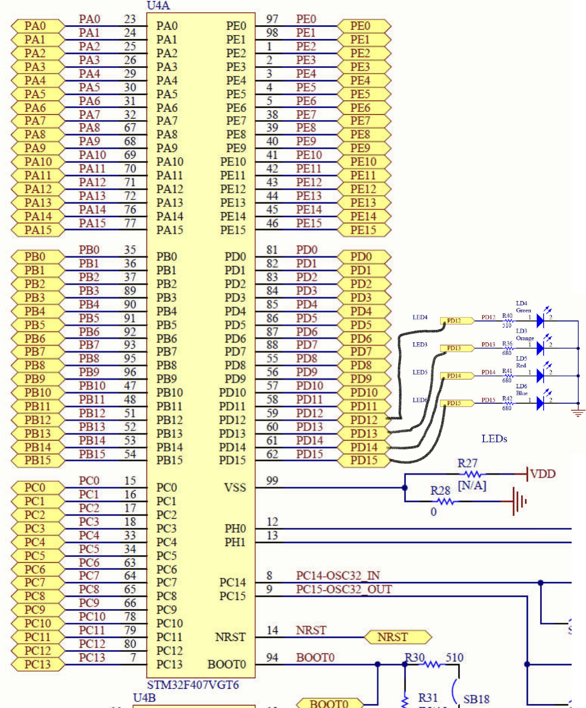
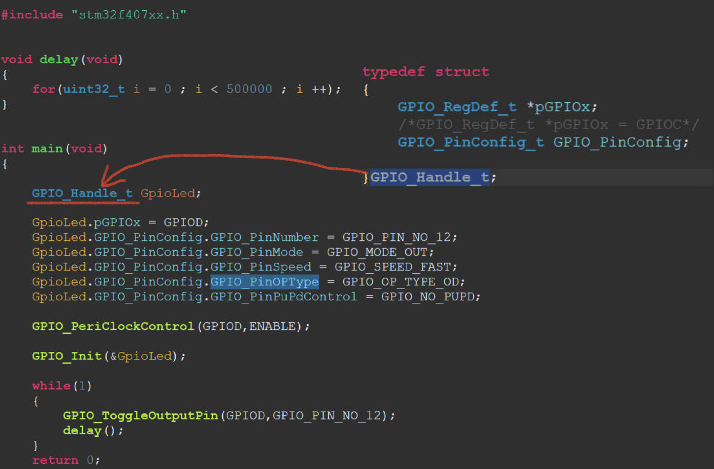
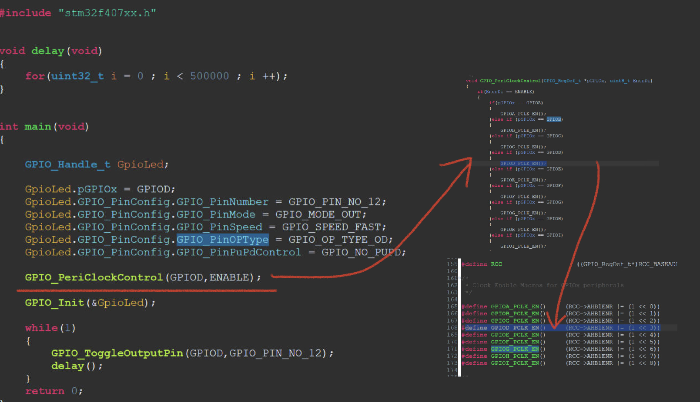
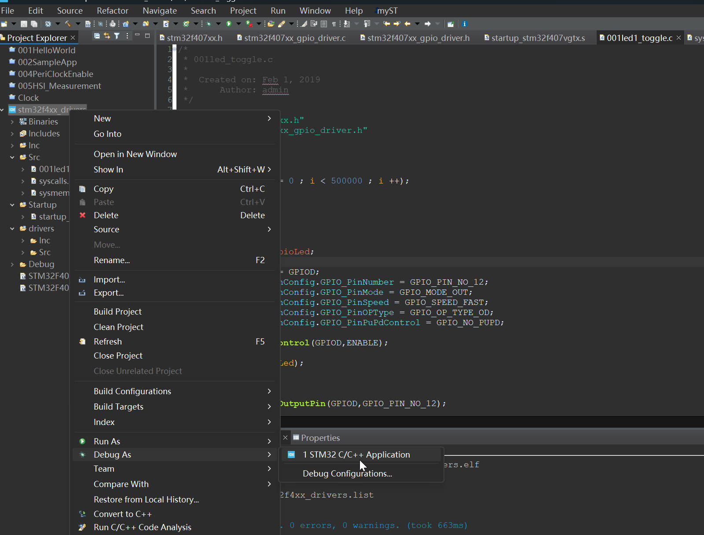
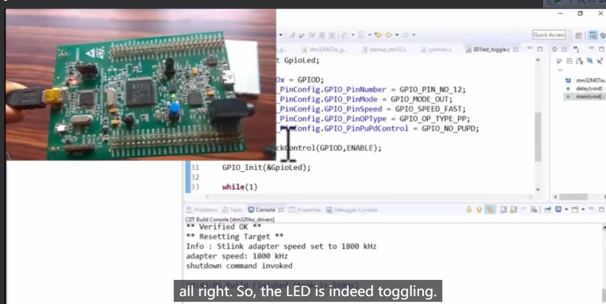

# 102. Exercise: LED toggling with PUSH PULL Configuration

**Let's toggle the LED4(PD12) using our driver API.**

Create the `/Src/001led1_toggle.c`

Now, call those API

**Just keep in mind, before configuring the registers of the GPIO peripheral, you have to enable the peripheral clock.**

## Download the Code onto Board

