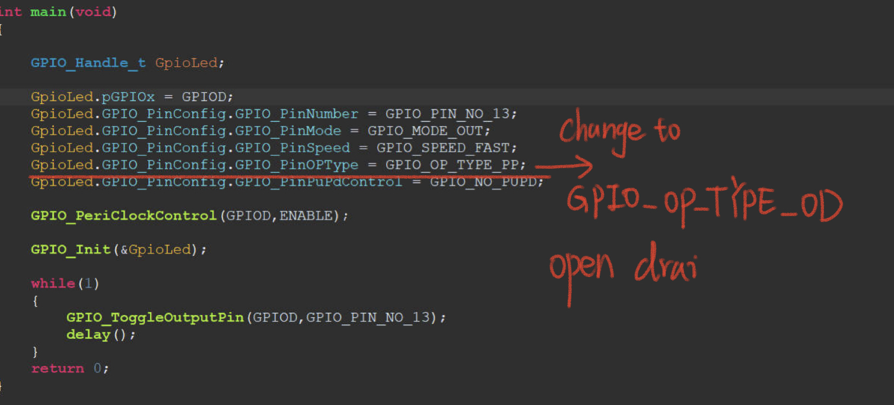
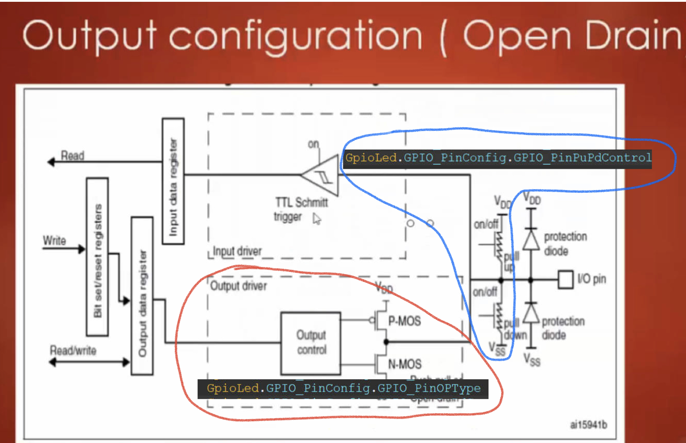
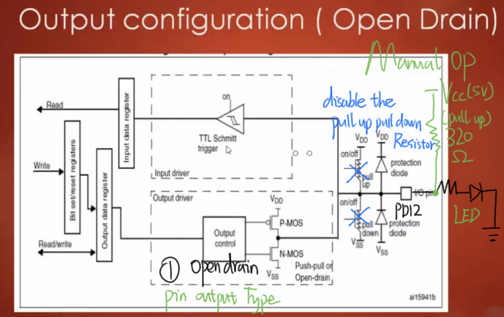
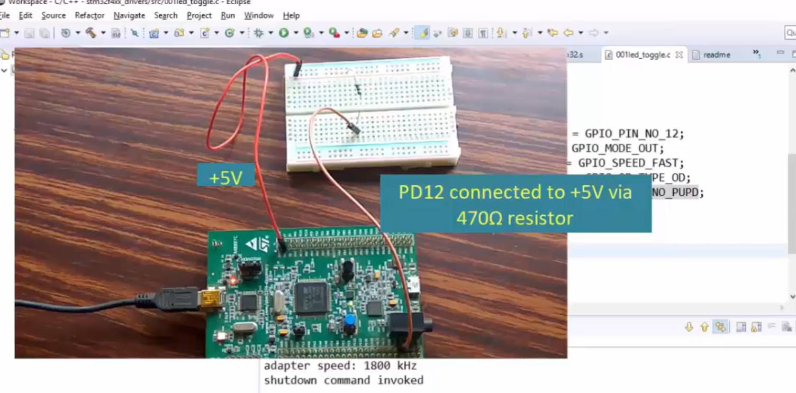

# 103. Exercise: LED toggling with OPEN DRAIN configuration

`GPIO_NO_PDPD` is used to disable the pull-up pull-down resistor which are so huge (40KΩ), the toggling LED light is too small to observe. 

