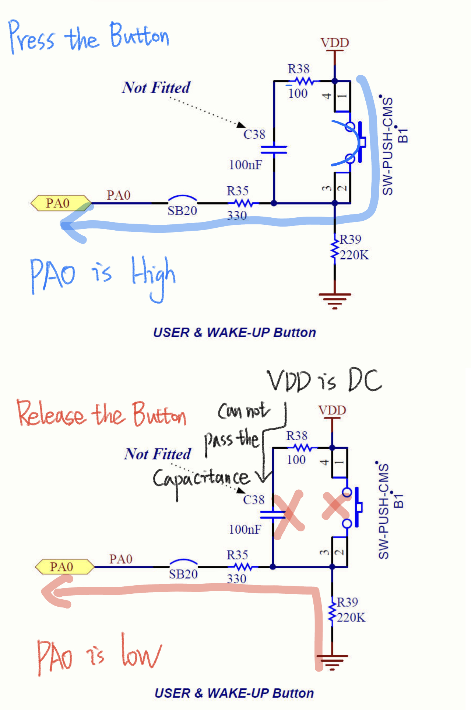
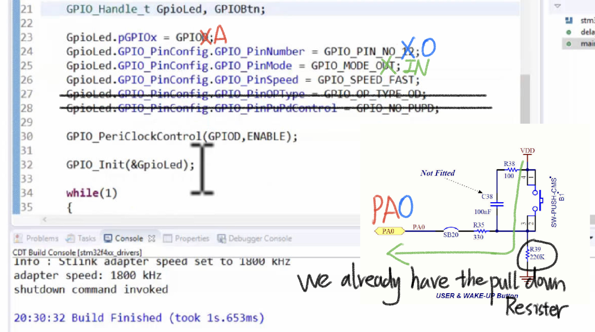
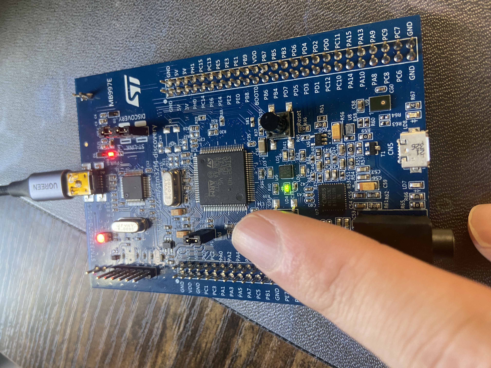

# 104. Exercise: Handling on board LED and Button




## LED Button Configuration

Reference: https://github.com/niekiran/MasteringMCU/blob/master/Resources/Source_code/Workspace/stm32f4xx_drivers/src/002led_button.c



```c
//this is led gpio configuration
	GpioLed.pGPIOx = GPIOD;
	GpioLed.GPIO_PinConfig.GPIO_PinNumber = GPIO_PIN_NO_12;
	GpioLed.GPIO_PinConfig.GPIO_PinMode = GPIO_MODE_OUT;
	GpioLed.GPIO_PinConfig.GPIO_PinSpeed = GPIO_SPEED_FAST;
	GpioLed.GPIO_PinConfig.GPIO_PinOPType = GPIO_OP_TYPE_PP;
	GpioLed.GPIO_PinConfig.GPIO_PinPuPdControl = GPIO_NO_PUPD;

	GPIO_PeriClockControl(GPIOD,ENABLE);

	GPIO_Init(&GpioLed);


	//this is btn gpio configuration
	GPIOBtn.pGPIOx = GPIOA;
	GPIOBtn.GPIO_PinConfig.GPIO_PinNumber = GPIO_PIN_NO_0;
	GPIOBtn.GPIO_PinConfig.GPIO_PinMode = GPIO_MODE_IN;
	GPIOBtn.GPIO_PinConfig.GPIO_PinSpeed = GPIO_SPEED_FAST;
	GPIOBtn.GPIO_PinConfig.GPIO_PinPuPdControl = GPIO_NO_PUPD;
```

Operation

```c
GPIO_PeriClockControl(GPIOA,ENABLE);

	GPIO_Init(&GPIOBtn);  //Inite all preset configuration into the board

	while(1)
	{
		if(GPIO_ReadFromInputPin(GPIOA,GPIO_PIN_NO_0) == BTN_PRESSED)
		{
			//delay();
			GPIO_ToggleOutputPin(GPIOD,GPIO_PIN_NO_12);
		}
	}
	return 0;
```

## Result:

