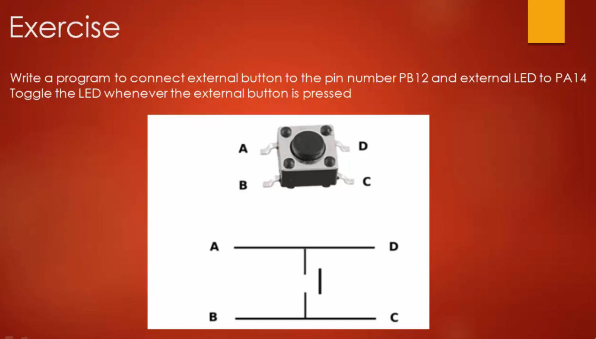
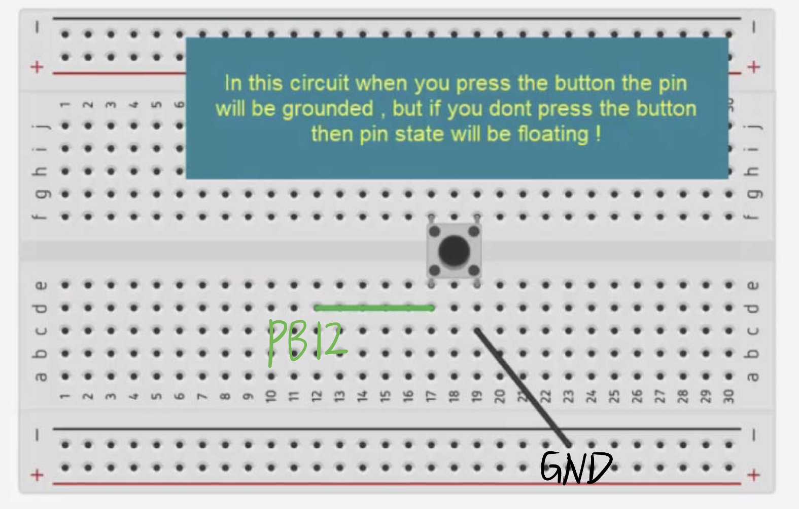
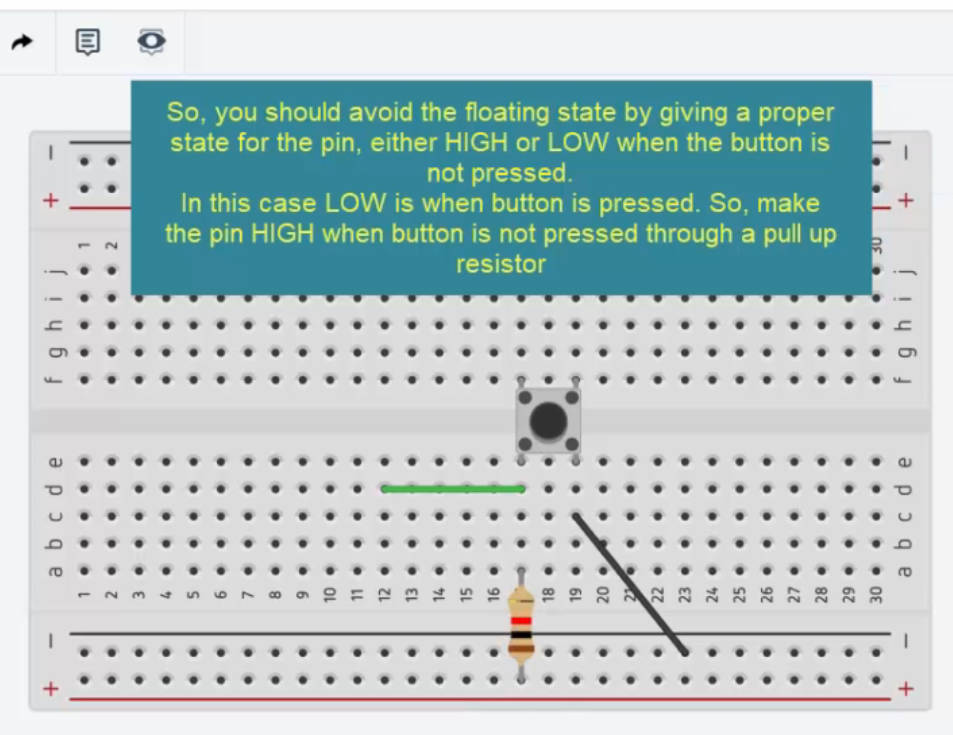
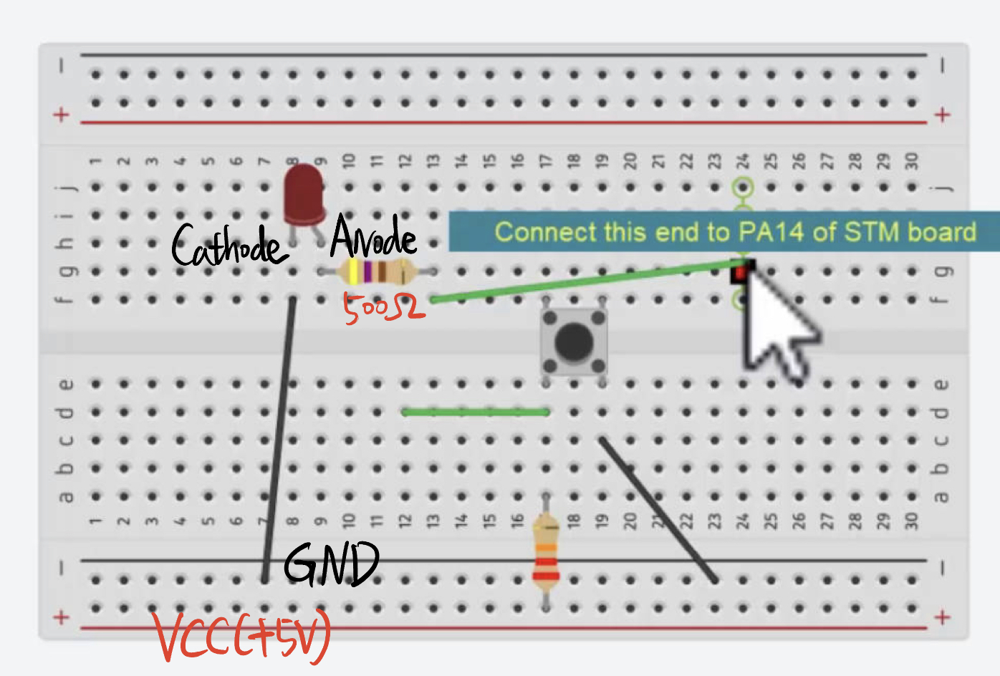

# 105. Exercise: Connecting External Button and Circuit Explanation








External Pull Up Resistor (22K) prevents the floating status of the PB12 when the button is not pressed.

 But we can adjust the configuration to activate the STM32F407G internal resistors .

## Connect the External LED to the PA14



## The Code:

The GPIOA(PA14):

```c
//this is led gpio configuration
	GpioLed.pGPIOx = GPIOA;
	GpioLed.GPIO_PinConfig.GPIO_PinNumber = GPIO_PIN_NO_8;
	GpioLed.GPIO_PinConfig.GPIO_PinMode = GPIO_MODE_OUT;
	GpioLed.GPIO_PinConfig.GPIO_PinSpeed = GPIO_SPEED_FAST;
	GpioLed.GPIO_PinConfig.GPIO_PinOPType = GPIO_OP_TYPE_PP;
	GpioLed.GPIO_PinConfig.GPIO_PinPuPdControl = GPIO_NO_PUPD;

	GPIO_PeriClockControl(GPIOA,ENABLE);

	GPIO_Init(&GpioLed);
```

The Button:

```c
//this is btn gpio configuration
	GPIOBtn.pGPIOx = GPIOB;
	GPIOBtn.GPIO_PinConfig.GPIO_PinNumber = GPIO_PIN_NO_12;
	GPIOBtn.GPIO_PinConfig.GPIO_PinMode = GPIO_MODE_IN; // In, read the signal
	GPIOBtn.GPIO_PinConfig.GPIO_PinSpeed = GPIO_SPEED_FAST;
	GPIOBtn.GPIO_PinConfig.GPIO_PinPuPdControl = GPIO_PIN_PU;

	GPIO_PeriClockControl(GPIOB,ENABLE);

	GPIO_Init(&GPIOBtn);
```

References: https://github.com/niekiran/MasteringMCU/blob/master/Resources/Source_code/Workspace/stm32f4xx_drivers/src/003led_button_ext.c

Execution:

```c
while(1)
	{
		if(GPIO_ReadFromInputPin(GPIOB,GPIO_PIN_NO_12) == BTN_PRESSED)
		{
			delay();
			GPIO_ToggleOutputPin(GPIOA,GPIO_PIN_NO_14);

		}
	}
	return 0;
//Read the signal from the pin12, PB14 toggles the LED on the external board.
```

