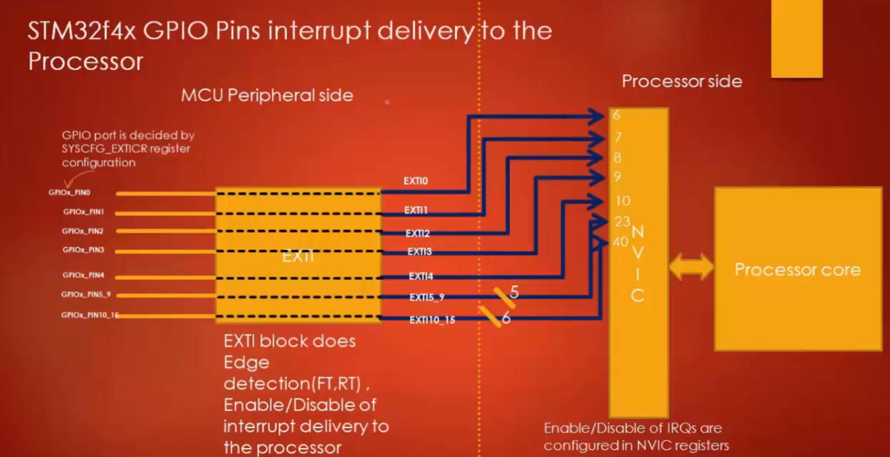
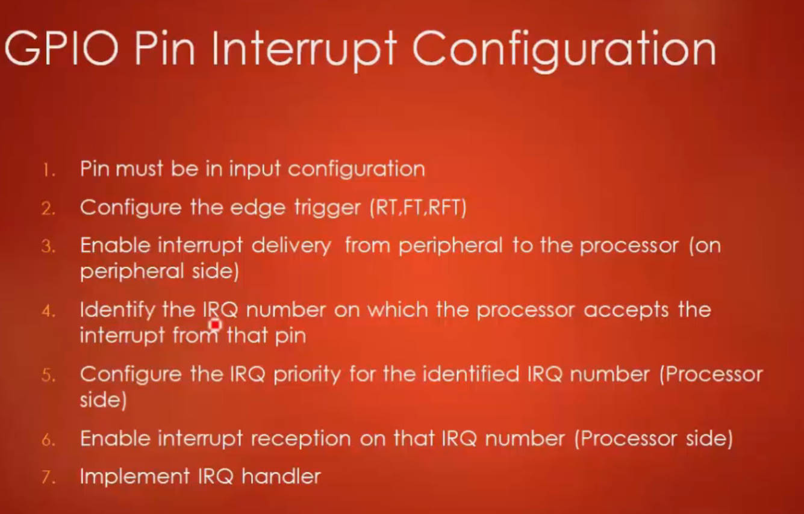

# 109. GPIO Pin Interrupt Configuration: Part 2


## the NVIC and EXTI

### NVIC (Nested Vector Interrupt Controller):

The Nested Vector Interrupt Controller (NVIC) is a peripheral in STM32 microcontrollers responsible for managing interrupts. It prioritizes and controls the execution of interrupt service routines (ISRs) based on the priority levels assigned to each interrupt source. Here are the key features and concepts related to NVIC:

1. **Interrupt Priority:**
   - Each interrupt source is assigned a priority level.
   - Lower numerical values represent higher priority. For example, priority 0 is higher than priority 1.
   - The NVIC supports multiple priority levels to allow for prioritizing different interrupts in the system.
2. **Nested Interrupts:**
   - The NVIC supports nested interrupts, meaning that an interrupt service routine can be interrupted by another interrupt with higher priority.
   - The processor automatically saves the context of the current interrupt and switches to the higher-priority interrupt.
3. **Interrupt Vector Table (IVT):**
   - The IVT is a table of addresses pointing to the ISR for each interrupt.
   - When an interrupt occurs, the processor looks up the corresponding address in the IVT and jumps to the associated ISR.
4. **Interrupt Enable and Disable:**
   - NVIC provides functions to enable and disable specific interrupts.
   - `NVIC_EnableIRQ()` and `NVIC_DisableIRQ()` are commonly used functions for enabling and disabling interrupts.
5. **Interrupt Pending and Active Flags:**
   - NVIC maintains flags to indicate whether an interrupt is pending or currently active.
   - The `NVIC_SetPendingIRQ()` and `NVIC_ClearPendingIRQ()` functions are used to set and clear interrupt pending flags.

### EXTI (External Interrupt):

The External Interrupt (EXTI) block is specifically associated with external events, such as changes in GPIO pin states, timers, or other peripherals. EXTI allows you to generate interrupts based on external signals. Here are the key points related to EXTI:

1. **GPIO Pin Configuration:**
   - EXTI is often associated with GPIO pins. You configure the EXTI lines to specify which GPIO pins can trigger interrupts.
   - Each EXTI line is associated with a particular GPIO pin.
2. **Edge Triggering:**
   - EXTI supports different triggering options, such as rising edge, falling edge, or both edges.
   - You configure the EXTI lines to determine the type of edge that triggers an interrupt.
3. **Interrupt Request (IRQ):**
   - When an event occurs (e.g., a button press or a signal change on a pin), EXTI generates an interrupt request (IRQ).
   - The NVIC is responsible for handling and prioritizing these interrupt requests.
4. **Interrupt Service Routine (ISR):**
   - EXTI interrupts are associated with specific ISRs that execute when the corresponding EXTI line is triggered.
   - You need to define and implement the ISR in your code to handle the specific external event.
5. **Clearing Interrupt Flags:**
   - After handling the interrupt in the ISR, it's crucial to clear the interrupt flags in EXTI and GPIO registers to avoid continuous triggering.





```c
	//1 . configure the mode of gpio pin

	if(pGPIOHandle->GPIO_PinConfig.GPIO_PinMode <= GPIO_MODE_ANALOG)
	{
		//the non interrupt mode
		temp = (pGPIOHandle->GPIO_PinConfig.GPIO_PinMode << (2 * pGPIOHandle->GPIO_PinConfig.GPIO_PinNumber ) );
		pGPIOHandle->pGPIOx->MODER &= ~( 0x3 << (2 * pGPIOHandle->GPIO_PinConfig.GPIO_PinNumber)); //clearing
		pGPIOHandle->pGPIOx->MODER |= temp; //setting

	}else
	{
		//this part will code later . ( interrupt mode)
		if(pGPIOHandle->GPIO_PinConfig.GPIO_PinMode ==GPIO_MODE_IT_FT )
		{
			//1. configure the FTSR
			EXTI->FTSR |= ( 1 << pGPIOHandle->GPIO_PinConfig.GPIO_PinNumber);
			//Clear the corresponding RTSR bit
			EXTI->RTSR &= ~( 1 << pGPIOHandle->GPIO_PinConfig.GPIO_PinNumber);

		}else if (pGPIOHandle->GPIO_PinConfig.GPIO_PinMode ==GPIO_MODE_IT_RT )
		{
			//2 . configure the RTSR
			EXTI->RTSR |= ( 1 << pGPIOHandle->GPIO_PinConfig.GPIO_PinNumber);
			//Clear the corresponding RTSR bit
			EXTI->FTSR &= ~( 1 << pGPIOHandle->GPIO_PinConfig.GPIO_PinNumber);

		}else if (pGPIOHandle->GPIO_PinConfig.GPIO_PinMode == GPIO_MODE_IT_RFT )
		{
			//3. configure both FTSR and RTSR
			EXTI->RTSR |= ( 1 << pGPIOHandle->GPIO_PinConfig.GPIO_PinNumber);
			//Clear the corresponding RTSR bit
			EXTI->FTSR |= ( 1 << pGPIOHandle->GPIO_PinConfig.GPIO_PinNumber);
		}

		//2. configure the GPIO port selection in SYSCFG_EXTICR
		

		//3 . enable the exti interrupt delivery using IMR
		
	}
```

