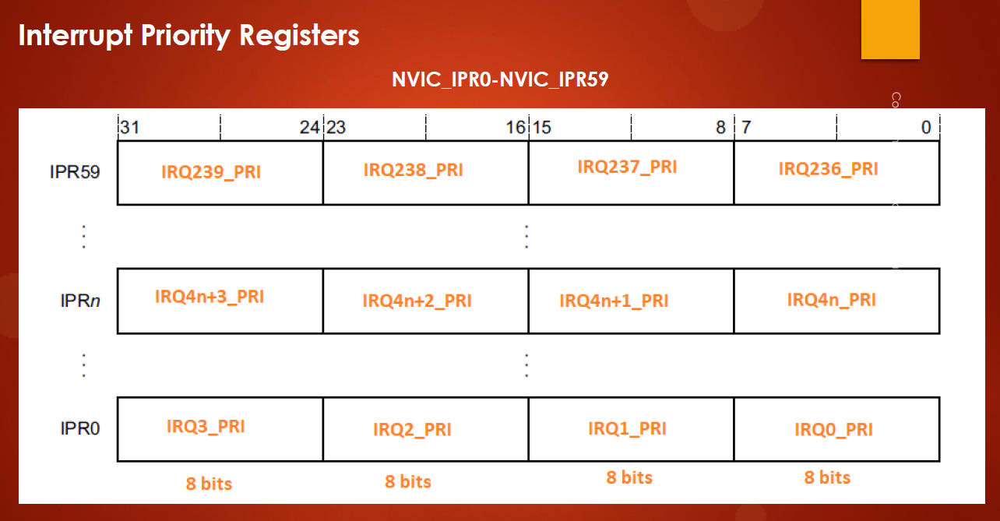
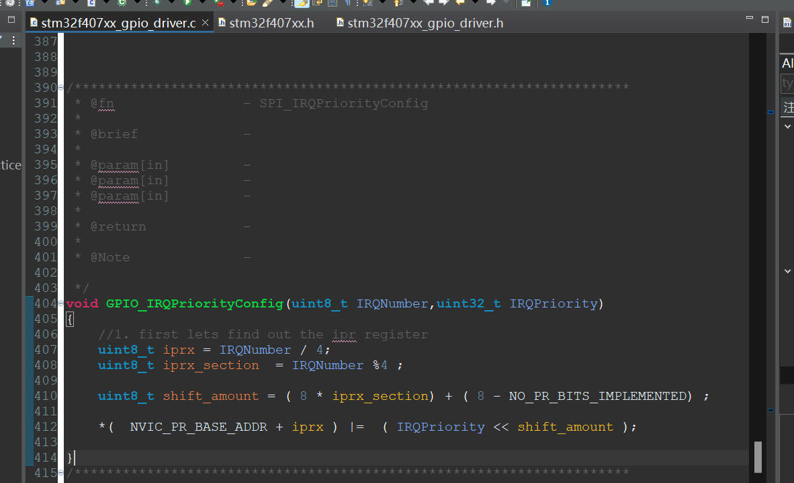
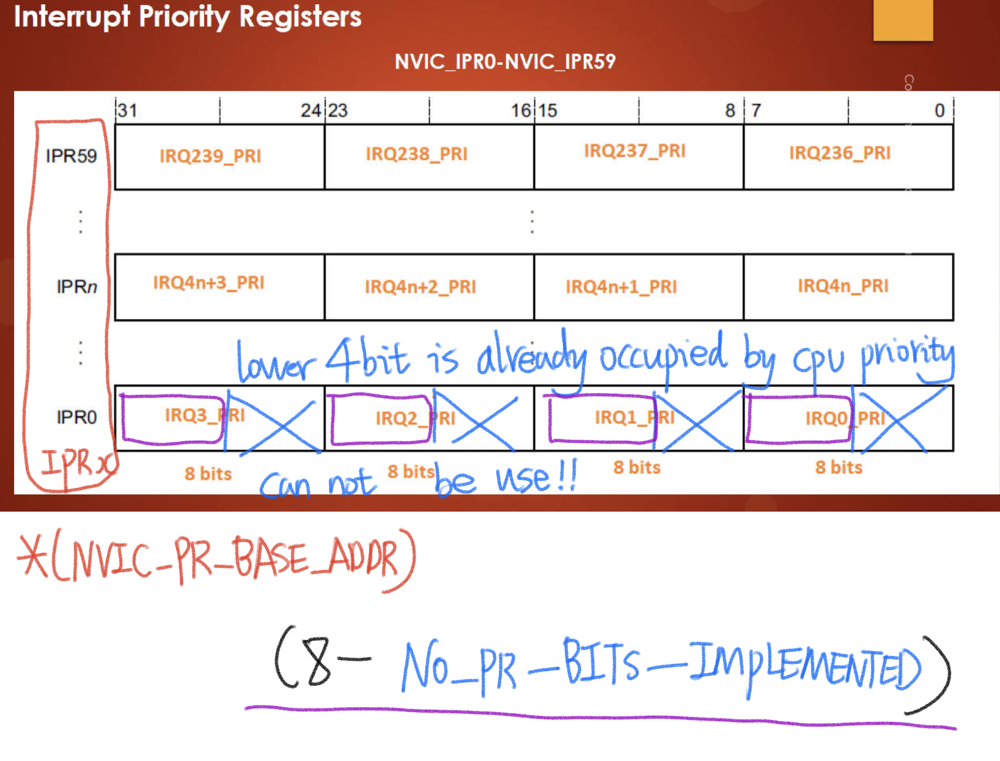

# 113. GPIO Pin Interrupt Configuration Coding: Part 6


## Interrupt Priority Register (IPR)



## Code



```c
/*
 * ARM Cortex Mx Processor number of priority bits implemented in Priority Register
 */
#define NO_PR_BITS_IMPLEMENTED  4
```

This macro defines the number of priority bits implemented in the Priority Register. In this case, it's set to 4, which means the processor supports 16 different priority levels (2^4).

```c
/*********************************************************************
 * @fn      		  - SPI_IRQPriorityConfig
 *
 * @brief             -
 *
 * @param[in]         -
 * @param[in]         -
 * @param[in]         -
 *
 * @return            -
 *
 * @Note              -
 */
void GPIO_IRQPriorityConfig(uint8_t IRQNumber, uint32_t IRQPriority)
{
	//1. first lets find out the ipr register
	uint8_t iprx = IRQNumber / 4;
	uint8_t iprx_section  = IRQNumber % 4;

	uint8_t shift_amount = (8 * iprx_section) + (8 - NO_PR_BITS_IMPLEMENTED);

	*(NVIC_PR_BASE_ADDR + iprx) |= (IRQPriority << shift_amount);
}
```

Now, let's break down the function `GPIO_IRQPriorityConfig`:

1. The function takes two parameters:
   - `IRQNumber`: This is the number of the GPIO interrupt for which the priority is being configured.
   - `IRQPriority`: This is the priority value to be set for the specified GPIO interrupt.
2. Inside the function:
   - `iprx`: Calculates the index of the Interrupt Priority Register (IPR) by dividing the `IRQNumber` by 4. This is because each IPR register covers 4 interrupt lines.
   - `iprx_section`: Calculates the section within the IPR register by taking the remainder when `IRQNumber` is divided by 4.
   - `shift_amount`: Calculates the bit shift amount to position the priority bits within the IPR register. It takes into account the number of bits used for priority and the section within the register.
3. Finally, the function sets the priority for the specified GPIO interrupt by writing the `IRQPriority` value to the appropriate bits within the corresponding Interrupt Priority Register (`NVIC_PR_BASE_ADDR + iprx`). The `<<` operator is used to shift the priority bits to the correct position within the register.

```c
uint8_t shift_amount = (8 * iprx_section) + (8 - NO_PR_BITS_IMPLEMENTED);
```

- `iprx_section`: This represents the section within the IPR register where the priority bits for the specified interrupt are located. It's the remainder when `IRQNumber` is divided by 4.
- `8 * iprx_section`: This calculates the starting bit position within the selected section of the IPR register. Since each priority value is 8 bits wide, multiplying the `iprx_section` by 8 gives the bit offset within the section.
- `(8 - NO_PR_BITS_IMPLEMENTED)`: This represents the number of bits reserved for priority within each byte of the IPR register. In this case, it's calculating how many bits are not used for priority.
- `+`: This addition combines the bit offset within the section and the number of unused bits to determine the total bit shift amount.

