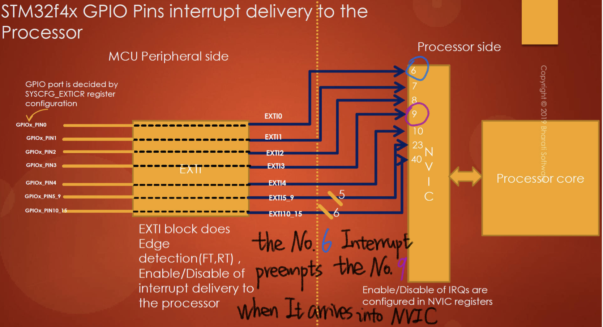
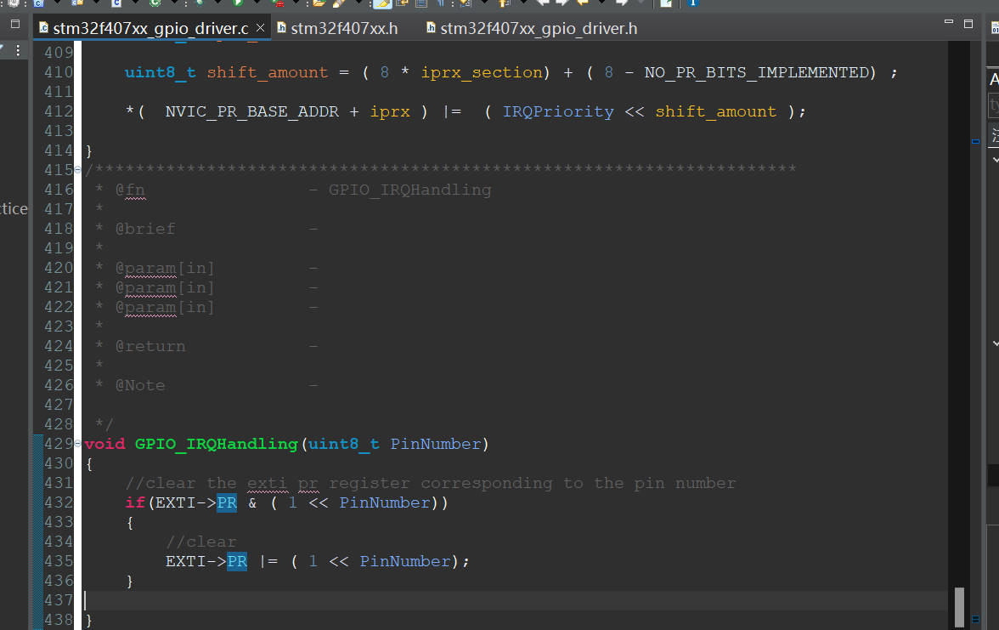
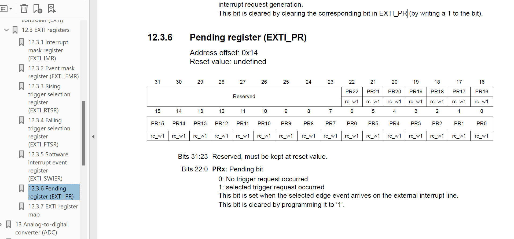

# 114. GPIO Pin Interrupt Configuration Coding: Part 7




## IRQ Handling

1. Implement the ISR Function.
2. Store the address of your ISR at the vector address location corresponding to the IRQ number for which you have written the ISR.

## Code:



```c
codevoid GPIO_IRQHandling(uint8_t PinNumber)
{
    // clear the exti pr register corresponding to the pin number
    if (EXTI->PR & (1 << PinNumber))
    {
        // clear
        EXTI->PR |= (1 << PinNumber);
    }
}
```

This function is designed to handle the clearing of the EXTI PR register for a specific GPIO pin. Let's break down the code:

1. `if (EXTI->PR & (1 << PinNumber))`: This checks if the bit corresponding to the specified GPIO pin (`PinNumber`) is set in the EXTI PR register. If the bit is set, it means that an interrupt request is pending for that pin.
2. `EXTI->PR |= (1 << PinNumber);`: If the bit is set (indicating a pending interrupt), this line of code sets the same bit again. This action clears the pending interrupt request for the specified GPIO pin. Writing a '1' to a bit in the EXTI PR register clears the corresponding pending interrupt.

### What is the EXTI (External Interrupt) PR (Pending Register) used for ? why should we clear it at first?

The EXTI (External Interrupt) PR (Pending Register) in STM32 microcontrollers is used to keep track of pending external interrupt requests. Each bit in the EXTI PR register corresponds to a specific external interrupt line, and when an external event occurs on a pin configured to trigger an interrupt, the corresponding bit is set to indicate that an interrupt request is pending.

Now, the reason for clearing the EXTI PR register is as follows:

1. **Interrupt Acknowledgment:**
   - When an external event triggers an interrupt, the corresponding bit in the EXTI PR register is set automatically.
   - **Clearing the EXTI PR register is a way of acknowledging and handling the interrupt. It signals to the microcontroller that the interrupt request has been recognized and is being processed.**
2. **Preventing Spurious Interrupts:**
   - Clearing the EXTI PR register is essential to prevent spurious or unintended interrupts. If you don't clear the pending interrupt after handling it, the microcontroller might interpret subsequent events on the same pin as additional interrupts, even if they are not intended as such.
3. **Reenabling Interrupts:**
   - Some microcontrollers automatically re-enable interrupts once they are acknowledged and handled. Clearing the EXTI PR register allows the microcontroller to re-enable interrupts for the same pin if another triggering event occurs.

