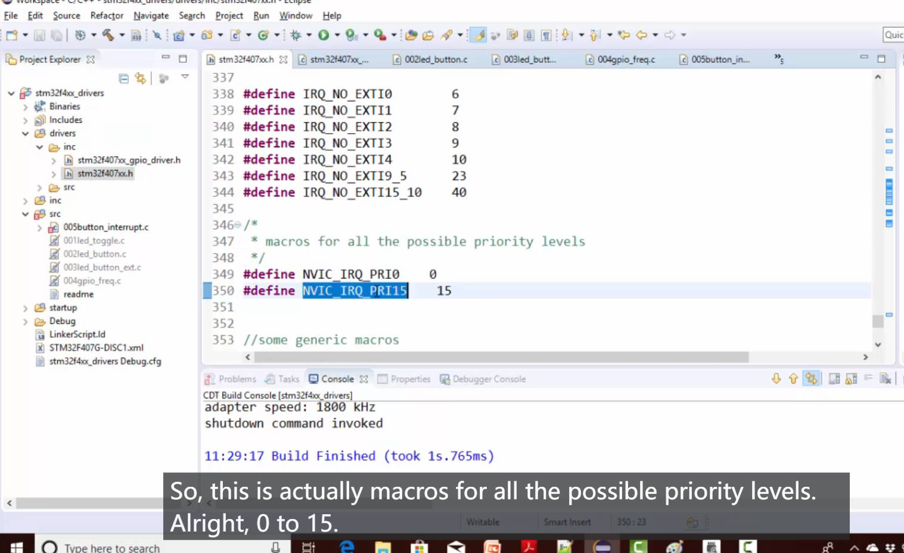

# 115. Exercise: GPIO Interrupts


## Exercise

Connect an external button to PD5 pin and toggle the LED whenever interrupt is triggered by the button press

Interrupt should be triggered during falling edge of button press.

## Practice

### LED


```c
/*
 * 005button_interrupt.c
 */

#include<string.h>
#include "stm32f407xx.h"

#define HIGH 1
#define LOW 0
#define BTN_PRESSED LOW

void delay(void)
{
	// this will introduce ~200ms delay when system clock is 16MHz
	for(uint32_t i = 0 ; i < 500000/2 ; i ++);
}

int main(void)
{

	GPIO_Handle_t GpioLed;

	//this is led gpio configuration
	GpioLed.pGPIOx = GPIOD;
	GpioLed.GPIO_PinConfig.GPIO_PinNumber = GPIO_PIN_NO_12;
	GpioLed.GPIO_PinConfig.GPIO_PinMode = GPIO_MODE_OUT;
	GpioLed.GPIO_PinConfig.GPIO_PinSpeed = GPIO_SPEED_LOW;
	GpioLed.GPIO_PinConfig.GPIO_PinOPType = GPIO_OP_TYPE_PP;
	GpioLed.GPIO_PinConfig.GPIO_PinPuPdControl = GPIO_NO_PUPD;

	GPIO_PeriClockControl(GPIOD,ENABLE);

	GPIO_Init(&GpioLed);


	//this is btn gpio configuration

	//IRQ configurations

    while(1);

}
```

### Button

Button as an outer interruption connected to PD5

```c
/*
 * 005button_interrupt.c
 */

#include<string.h>
#include "stm32f407xx.h"

#define HIGH 1
#define LOW 0
#define BTN_PRESSED LOW

void delay(void)
{
	// this will introduce ~200ms delay when system clock is 16MHz
	for(uint32_t i = 0 ; i < 500000/2 ; i ++);
}

int main(void)
{

	GPIO_Handle_t GpioLed, GPIOBtn;

	//this is led gpio configuration
	GpioLed.pGPIOx = GPIOD;
	GpioLed.GPIO_PinConfig.GPIO_PinNumber = GPIO_PIN_NO_12;
	GpioLed.GPIO_PinConfig.GPIO_PinMode = GPIO_MODE_OUT;
	GpioLed.GPIO_PinConfig.GPIO_PinSpeed = GPIO_SPEED_LOW;
	GpioLed.GPIO_PinConfig.GPIO_PinOPType = GPIO_OP_TYPE_PP;
	GpioLed.GPIO_PinConfig.GPIO_PinPuPdControl = GPIO_NO_PUPD;

	GPIO_PeriClockControl(GPIOD,ENABLE);

	GPIO_Init(&GpioLed);


	//this is btn gpio configuration
    GPIOBtn.pGPIOx = GPIOD;
	GPIOBtn.GPIO_PinConfig.GPIO_PinNumber = GPIO_PIN_NO_5;
	GPIOBtn.GPIO_PinConfig.GPIO_PinMode = GPIO_MODE_IT_FT;
	GPIOBtn.GPIO_PinConfig.GPIO_PinSpeed = GPIO_SPEED_FAST;
	GPIOBtn.GPIO_PinConfig.GPIO_PinPuPdControl = GPIO_PIN_PU;

	GPIO_PeriClockControl(GPIOD,ENABLE);

	GPIO_Init(&GPIOBtn);

	GPIO_WriteToOutputPin(GPIOD,GPIO_PIN_NO_12,GPIO_PIN_RESET);
	//IRQ configurations

    while(1);

}
```

### Why when toggle the LED, the GPIO_PinPuPdControl is GPIO_NO_PUPD, and when press the button, PinPuPdControl is GPIO_PIN_PU, what difference between them

### LED GPIO Configuration

```c
GpioLed.GPIO_PinConfig.GPIO_PinPuPdControl = GPIO_NO_PUPD;
```

This configuration (`GPIO_NO_PUPD`) means that there is no pull-up or pull-down resistor enabled for the LED pin (GPIO_PIN_NO_12). The pin is left floating when it is not actively driven high or low by the microcontroller. This is typical for output pins (like those connected to LEDs) where you want to control the state of the pin explicitly without relying on external pull-up or pull-down resistors.

### Button GPIO Configuration

```c
GPIOBtn.GPIO_PinConfig.GPIO_PinPuPdControl = GPIO_PIN_PU;
```

In this configuration, a pull-up resistor is enabled for the button pin (GPIO_PIN_NO_5). This means that when the button is not pressed (open state), the pull-up resistor pulls the pin to the high logic level (1). When the button is pressed, it connects the pin to the ground (low logic level, 0). Using a pull-up resistor is common for buttons because it ensures a defined logic level when the button is not actively being pressed.

### Summary

The main difference is in the use case and the behavior of the pins:

- For the LED pin, you want to drive it to a specific state (high or low) without relying on external components, so you set no pull-up/pull-down (`GPIO_NO_PUPD`).
- For the button pin, you use a pull-up resistor (`GPIO_PIN_PU`) to ensure a known and stable logic level when the button is not actively being pressed. When the button is pressed, it grounds the pin, resulting in a low logic level. (按钮防误触)


## IRQ Configuration


```c
GPIO_IRQInterruptConfig(IRQ_NO_EXTI9_5,ENABLE);
```

### IRQ Priority





## Implement the ISR (Interrupt Service Routine)

go to the `startup` file to find the corresponding name


go back to the `005button_interrupt.c` and implement the function.

```c
void EXTI9_5_IRQHandler(void)
{
   /// delay(); //200ms . wait till button de-bouncing gets over
	GPIO_IRQHandling(GPIO_PIN_NO_5); //clear the pending event from exti line
	GPIO_ToggleOutputPin(GPIOD,GPIO_PIN_NO_12);
}
```


Reference: https://github.com/niekiran/MasteringMCU/blob/master/Resources/Source_code/Workspace/stm32f4xx_drivers/src/005button_interrupt.c

## Prompt: This Class teacher shows how to debug 12:00 - 18:00

How to debug is worth to learn

https://www.udemy.com/course/mastering-microcontroller-with-peripheral-driver-development/learn/lecture/14277634?start=30#notes

the LED is not toggle.


Self Practice Picture 09: