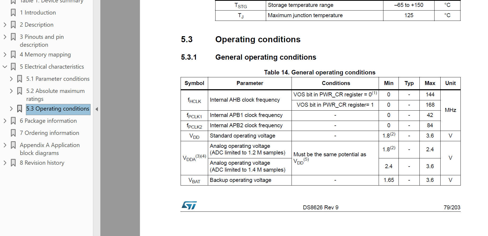
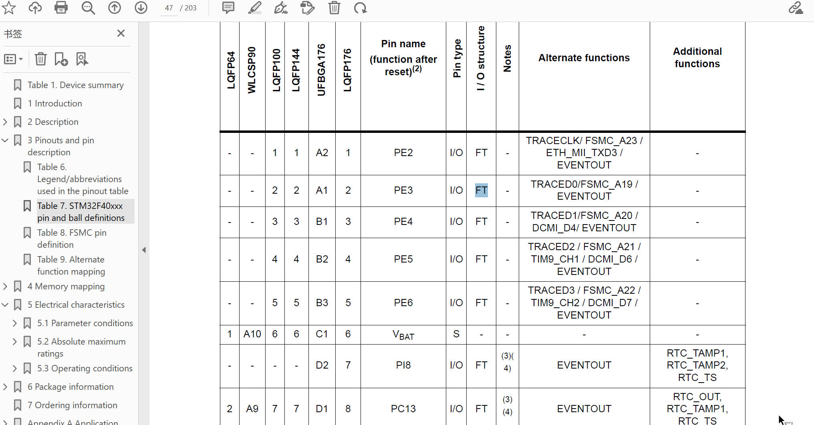
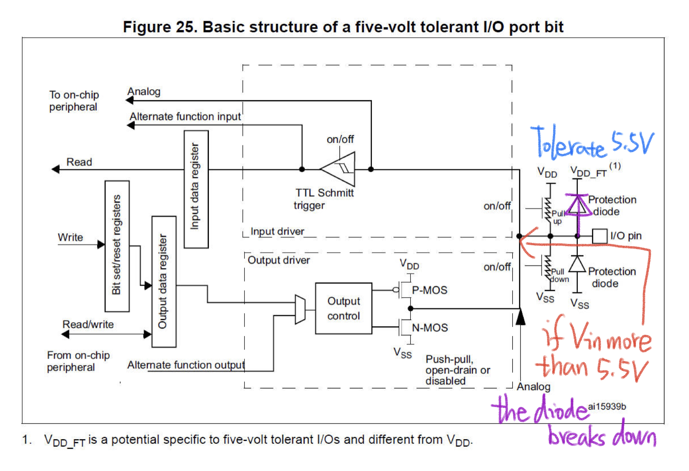
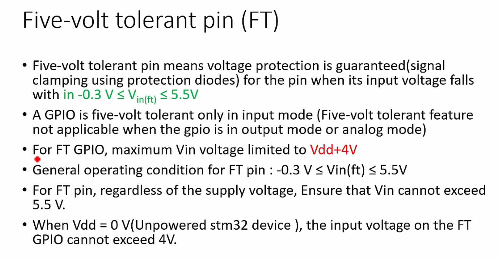

# 118. STM32 Pin Specifications

In this lecture on STM32 microcontrollers GPIO Pin specifications, the teacher covered several key topics:

1. **Absolute Maximum Ratings (AMR):**

   - Vdd (external main power supply) must be greater than 1.8V and less than or equal to 3.6V.

   - Maximum voltage applied to any Vdd pin is 4V.

   - Vss (ground reference) should be maintained at 0V, with a minimum value of -0.3V.

     

2. **General Operating Conditions:**

   - Explored the general operating conditions table in the datasheet.
   - VDD standard operating voltage is between 1.8V to 3.6V.

3. **Maximum Input Voltage (Vin):**

   - Differentiated between Three-volt tolerant (TT) pins (up to 3.3V) and Five-volt tolerant (FT) pins (up to 5.5V).

   - TTa pins are directly connected to the ADC peripheral.

   - Emphasized the importance of checking Vin limits to avoid damaging pins or the entire chip.

   - Described the input voltage limits for TT pins as Vdd + 0.3V and for FT pins as Vdd + 4V (when unpowered) or 5.5V (when powered).

     

     

4. **Tolerance and I/O Structure:**

   - **Explained that tolerance represents the voltage accepted by GPIO without damage.**
   - TT pins have protection diodes limiting Vin to Vdd + 0.3V.
   - FT pins have protection diodes allowing Vin up to Vdd + 4V (unpowered) or 5.5V (powered).

5. **Application of Tolerance:**

   - Highlighted that FT GPIO is five-volt tolerant only in input mode, not in output or analog mode.

