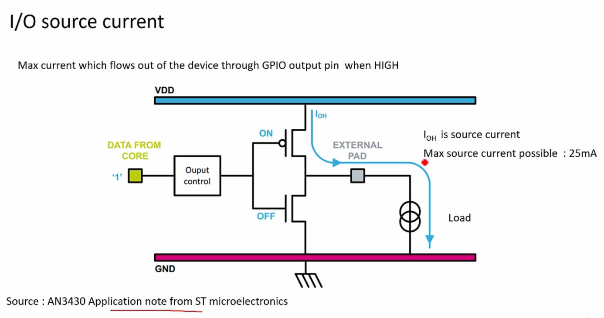
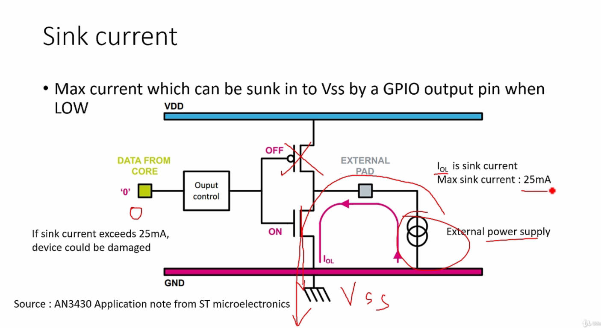
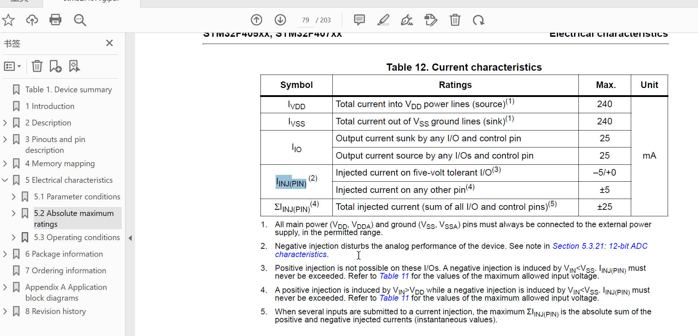

# 119. Pin Current Characteristics

In this lecture, the teacher covered various current characteristics of the STM32 microcontroller, focusing on parameters found in the datasheet. Here is a breakdown of the key points:

1. **IVDD and IVSS:**

   - **IVDD (Total Source Current):** Maximum current drawn by the microcontroller from VDD power line is 240 mA.

   - **IVSS (Total Sink Current):** Maximum current into the VSS ground line is also limited to 240 mA.

     

     

     Each pin has own limits according to the datasheet, add them together is the IVDD/IVSS

     

     The Sink Current and Source Current

     

2. **IIO (Source and Sink Currents):**

   - Source current (IOH) is the maximum current flowing out of a GPIO output pin when set to HIGH, limited to 25 mA.
   - Sink current (IOL) is the maximum current that can be sunk into VSS by a GPIO output pin when set to LOW, also limited to 25 mA.

3. **Total Current Considerations:**

   - The total current drawn from VDD (IVDD) is the sum of all source currents from GPIO pins, ensuring it does not exceed 240 mA.

4. **Current Sourcing and Sinking Examples:**

   - Explained current sourcing (LED illumination when pin is HIGH) and current sinking (LED illumination when pin is LOW) with examples.
   - Emphasized the importance of limiting sink currents to prevent pin damage.

5. **Injected Current:**

   - **Discussed injected current, which is the current induced by input voltages higher or lower than specified limits.**

   - Differentiated between positive injection (not allowed on FT pins) and negative injection (up to -5 mA allowed on FT pins).

     

6. **Positive Injection Considerations:**

   - Positive injection is not allowed on FT pins (defined as 0 mA), and exceeding VDD + 4V may lead to device damage.
   - Highlighted that positive injection should not occur unless Vin goes beyond VDD + 4V.

7. **Upcoming Topic:**

   - Teased the next lecture on microcontroller logic levels.