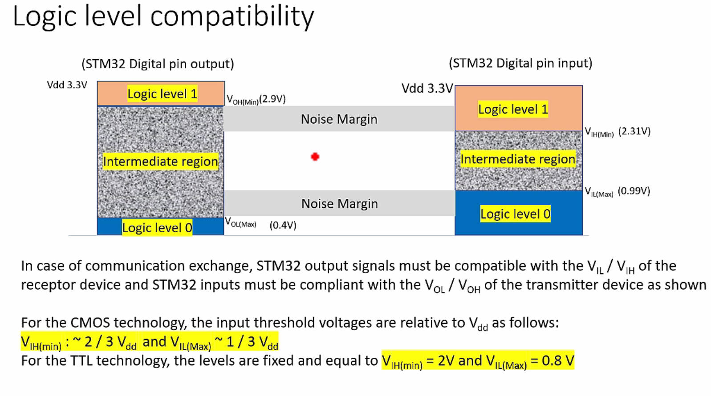
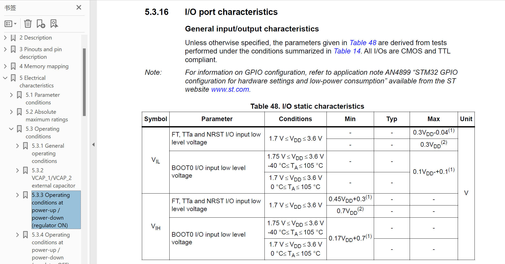
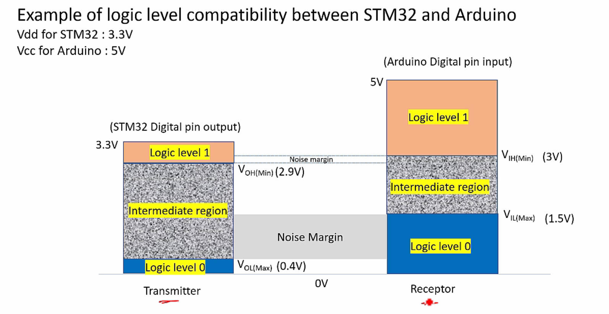
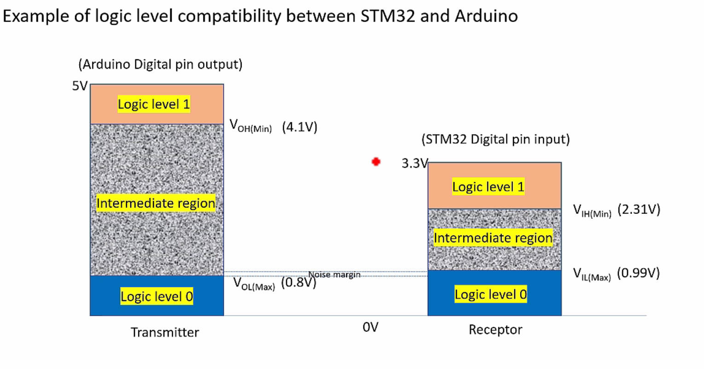

# 120. Logic Levels

**Introduction:**

- Understanding Logic Levels and Threshold Voltages for I/O pins in STM32 Microcontrollers.
- Applicable to various microcontrollers, emphasizing generic principles.
- All I/Os are CMOS and TTL compliant, crucial for device interfacing.

**Logic Level Compatibility:**

- Vital when interfacing different peripherals to STM32 microcontrollers.

- Key parameters: VIH, VIL, VOH, VOL (Input and Output Threshold Voltages).

  V:voltage I:Input O:output H:high L:low

- Communication exchange requires compatibility with receptor and transmitter devices.

  

  

**Input Threshold Voltages:**

- VIH (Input High Voltage): **Minimum voltage** for a **logical high** signal.
- VIL (Input Low Voltage): **Maximum voltage** for a **logical low** signal.
- Values relative to Vdd in CMOS technology; fixed for TTL.

**Output Threshold Voltages:**

- VOH (Output High Voltage): **Minimum voltage** for a **logical high** output.
- VOL (Output Low Voltage): **Maximum voltage** for a **logical low** output.
- Values relative to Vdd in CMOS technology; fixed for TTL.

**Case Study - STM32 and Arduino Interfacing:**

1. **STM32 Transmitter, Arduino Receiver:**

   - Check VOH (STM32) vs. VIH (Arduino).

   - Potential data corruption due to narrow noise margin.

     

2. **Arduino Transmitter, STM32 Receiver:**

   - Check VIL (STM32) vs. VOL (Arduino).

   - Potential interpretation issues due to a narrow noise margin.

   - Ensure STM32 protection against overvoltage when unpowered.

     

**Conclusion:**

- Logic level compatibility is crucial for successful communication.
- Consider threshold voltages when interfacing different microcontroller platforms.
- Use logic level shifters or diodes to address voltage disparities.
- Further exercises on Arduino-STM32 interfacing to be covered in SPI and I2C communication lectures.