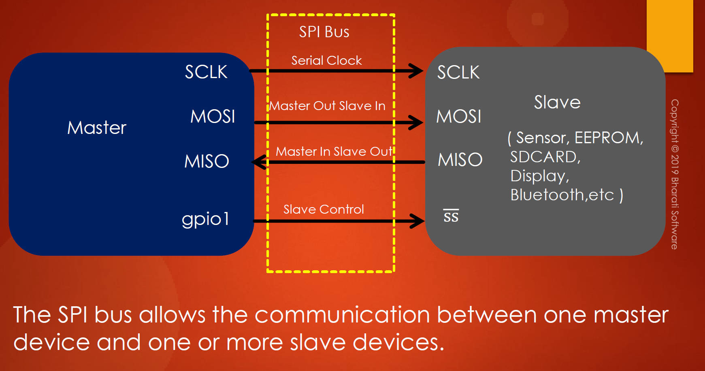
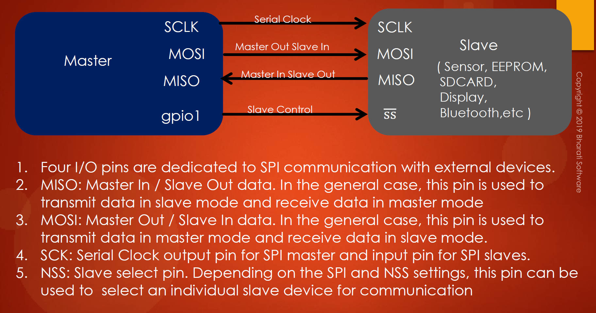

# 121. Introduction to SPI BUS

## **STM32 Class Syllabus: SPI Peripheral**

**Module 1: Introduction to SPI Protocol**

- Overview of Serial Peripheral Interface (SPI)

- Purpose of SPI in embedded systems

  

  

  

  ## Comparison with other communication protocols (CAN, I2C, Ethernet, USB, RS232, RS485)

1. **SPI (Serial Peripheral Interface):**
   - **Purpose:** Designed for communication between one master and multiple slave devices in embedded systems.
   - **Pins:** Typically uses four or more pins, including MISO, MOSI, SCK, and NSS/SS.
   - **Clock:** Synchronous communication, with the master producing the clock.
   - **Topology:** Commonly used in short-distance communication within a single PCB.
2. **CAN (Controller Area Network):**
   - **Purpose:** Developed for robust communication in automotive and industrial environments.
   - **Pins:** Uses two differential lines (CANH and CANL) for communication.
   - **Clock:** Asynchronous communication with no fixed master or slave distinction.
   - **Topology:** Suitable for longer-distance communication, supports multi-master configurations.
3. **I2C (Inter-Integrated Circuit):**
   - **Purpose:** Intended for communication between multiple devices on the same bus.
   - **Pins:** Two lines, SDA (data) and SCL (clock).
   - **Clock:** Synchronous communication, with a shared clock line.
   - **Topology:** Suitable for short-distance communication, supports multi-master configurations.
4. **Ethernet:**
   - **Purpose:** Primarily used for networking and communication between devices over a local area network (LAN).
   - **Pins:** Utilizes multiple twisted-pair cables for communication.
   - **Clock:** Typically uses a separate clock signal, follows a star or bus topology.
   - **Topology:** Suitable for longer-distance communication in networked environments.
5. **USB (Universal Serial Bus):**
   - **Purpose:** Developed for connecting various peripherals to a computer.
   - **Pins:** Uses a combination of data lines, power lines, and ground lines.
   - **Clock:** Synchronous communication with a dedicated clock line.
   - **Topology:** Hierarchical topology with a host device and multiple peripherals.
6. **RS232 (Recommended Standard 232):**
   - **Purpose:** Originally designed for serial communication between a DTE (Data Terminal Equipment) and DCE (Data Communication Equipment).
   - **Pins:** Uses a minimum of three lines: Tx (transmit), Rx (receive), and ground.
   - **Clock:** Asynchronous communication with no dedicated clock line.
   - **Topology:** Typically point-to-point communication over short distances.
7. **RS485 (Recommended Standard 485):**
   - **Purpose:** Developed for serial communication in industrial environments over longer distances.
   - **Pins:** Uses two differential lines for communication: A and B.
   - **Clock:** Asynchronous communication, supports multi-point configurations.
   - **Topology:** Supports multi-point and multi-drop communication.

**Key Considerations for Protocol Selection:**

- **Distance:** Choose protocols based on the communication distance requirements.
- **Topology:** Consider the network topology (star, bus, point-to-point) required for the application.
- **Speed:** Evaluate the data transfer speed needed for the specific application.
- **Complexity:** Assess the complexity of the protocol and its suitability for the intended use case.
- **Power Consumption:** Consider the power requirements and efficiency of each protocol.