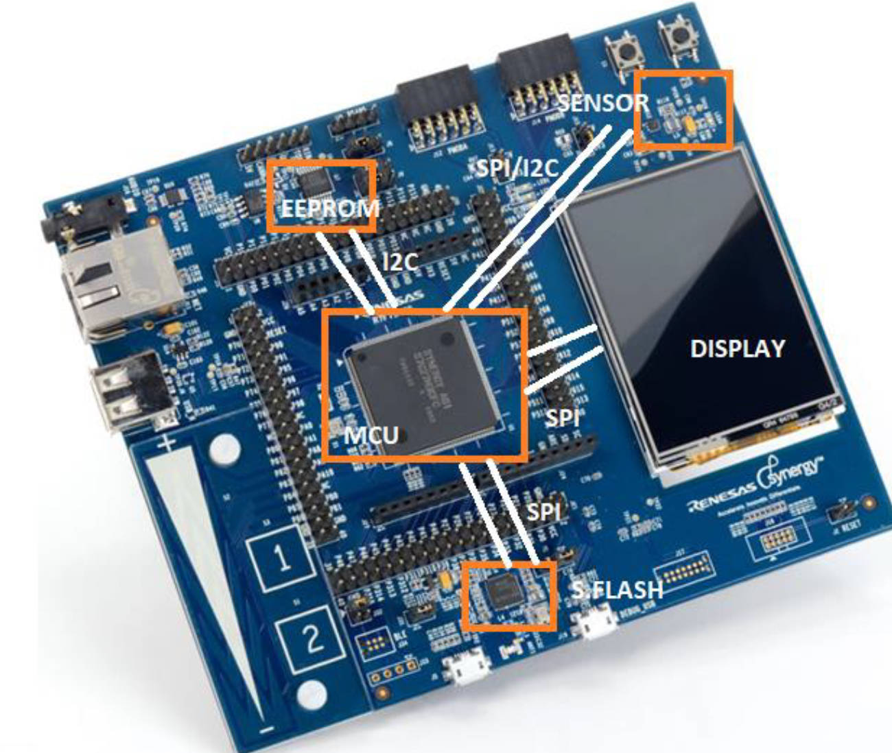
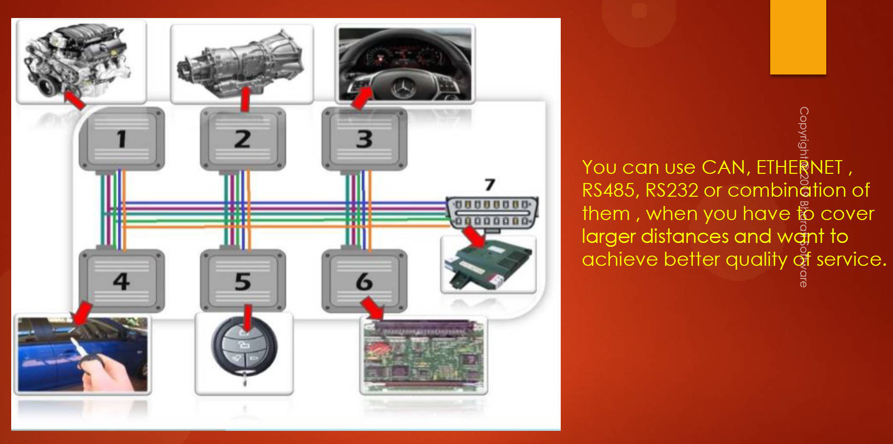

# 122. SPI Comparison with other Protocols

In the STM32 class, the teacher covered various serial data communication protocols besides SPI, including USB, Ethernet, I2C, RS-485, CAN, and RS-232. The choice of protocol depends on the application requirements. The table presented information on protocols, their maximum speed, typical use cases, and maximum working distances.

- **SPI (Serial Peripheral Interface):**

  - Short-distance protocol (up to 10 feet).
  - Higher data rates achievable (e.g., 25 Mbps with a 50MHz peripheral clock).
  - Suitable for gathering data from sensors and communicating with displays or serial flash.

- **I2C (Inter-Integrated Circuit):**

  - Lower speed compared to SPI (e.g., 3.4 Mbps in high-speed mode).
  - More complex than SPI with additional features.
  - Suited for communication with sensors over larger distances than SPI.

- **RS-485:**

  - Designed for longer distances (100 ft to 1000 ft).
  - Uses differential signaling, allowing for larger coverage.
  - Maximum speed of 10 Mbps.

- **Selection Considerations:**

  - SPI and I2C are suitable for short-distance communication within a single PCB.
  - For larger areas like cars, factories, or buildings, protocols like CAN, Ethernet, RS-485, or combinations thereof are necessary.
  - RS-485 and CAN are preferable for extended distances due to their differential signaling.

  

