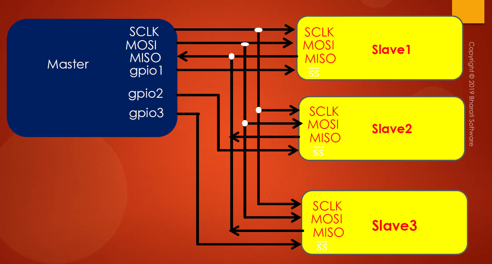
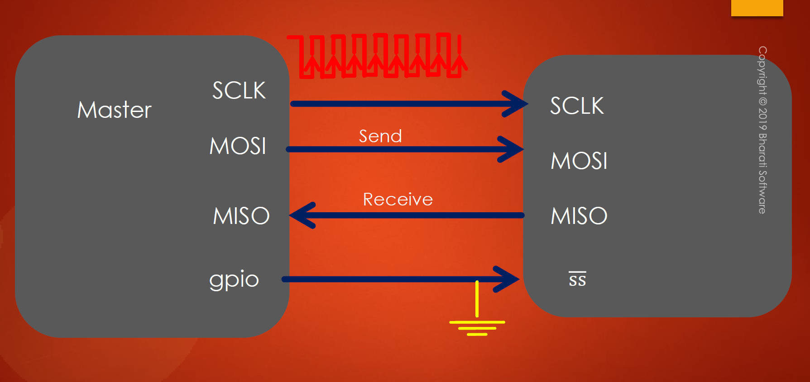

# 123. Importance of SPI Slave Select Pin

1. **Requirement for SPI Support:**
   - For successful SPI communication, both the master and slave devices must support the SPI peripheral or interface.
   - If the slave device does not support the SPI interface, communication cannot take place.
2. **Slave Selection Process:**
   - When the master wants to communicate with the slave, it must select the slave by pulling the slave select pin of the slave to the ground.
   - This step is crucial because the slave's data communication pins are activated only when the slave select pin is grounded.
   - Until the slave select pin is pulled to ground, the communication pins remain in a high impedance state.
3. **Data Transmission and Clock Synchronization:**
   - Data communication between master and slave is synchronized with the clock signal.
   - **The master sends data along with the clock signal.**
   - The clock is essential for coordinating the communication between the devices.
4. **Importance of Slave Select in SPI Communication:**
   - **The crucial keypoint is that making the slave select of the slave grounded is vital for SPI communication.**
   - Failure to pull the slave select pin to ground will result in the slave's communication pins being in a high impedance state, and the slave will not respond to master's data.

