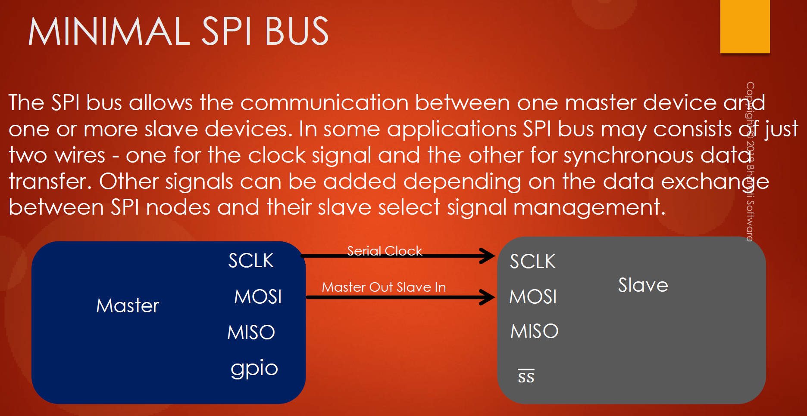

# 124. SPI Minimum Bus Configuration

1. **Minimal SPI Bus Configuration:**

   - SPI enables communication between one master device and one or more slave devices.
   - The minimal SPI bus configuration may consist of just two wires: one for the clock and the other for synchronous data transfer.
   - Additional signals, such as slave select and others, can be added based on the data exchange requirements and slave select signal management.

2. **Single Slave Scenario:**

   - In scenarios where there is only one slave, and the slave always receives data without sending any data back to the master, a minimal configuration can be used.
   - For example, the slave select pin can be internally grounded by the slave or externally connected to ground using only one wire.
   - In this case, only two lines (MOSI for data and the serial clock) are needed for SPI communication.

3. **Customizing SPI Pins Based on Application:**

   - The number of SPI pins required depends on the application's specifics, such as the number of slaves and the communication pattern.
   - It is possible to customize SPI signals based on the application's needs, and all four SPI lines may not be necessary.

4. **Takeaway:**

   - The key takeaway is that the SPI bus configuration can be tailored to the application's requirements.
   - Depending on factors like the number of slaves and the communication direction, the number of required SPI pins can be adjusted.

   

