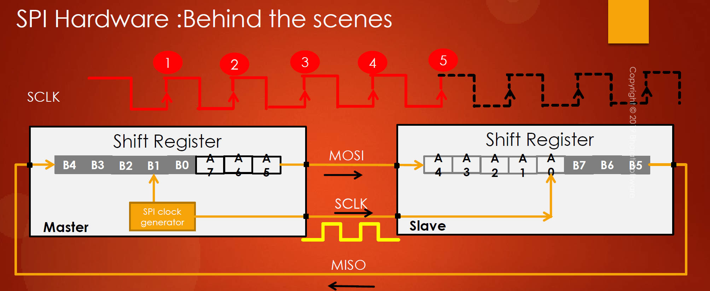

# 125. SPI Behind the Scene Data Communication Principle

1. **Shift Registers in SPI:**

   - The SPI peripheral in microcontrollers contains shift registers, essential for data exchange between master and slave devices.
   - Both the master and slave have their own shift registers, typically with 8 bits from LSB to MSB.

   Shift Register Purpose

   - **Serial Data Transfer:** The shift registers are employed to perform serial data transfer between the master and slave devices. Instead of transferring all bits of a data byte simultaneously, the bits are shifted out sequentially, one after the other, over a single data line. This is the fundamental principle of serial communication.
   - **Clock Synchronization:** The shift registers operate in synchronization with a clock signal. The clock signal dictates when each bit of data is shifted out or received. This ensures that both the master and slave devices are in agreement about the timing of data transfer.
   - **Data Exchange between Master and Slave:** The shift registers in the master and slave devices are interconnected. As the master sends bits of data, **they are shifted out of the master's shift register and simultaneously into the slave's shift register.** This process allows for the exchange of data between the master and slave devices.

   

   

   

   

   

   

   

   

   

   

2. **Connection and Synchronization:**

   - MOSI (Master Out Slave In) of the master is connected to MOSI of the slave, clock pins are interconnected, and MISO (Master In Slave Out) of the slave is linked to MISO of the master.
   - SPI communication is synchronous, with a clock governing the data exchange.

3. **Principle of Shift Registers:**

   - Data transfer occurs by shifting bits through the shift registers for each clock cycle.
   - An animation demonstrated how, after each clock cycle, data moves from the LSB to the MSB position in both the master and slave shift registers.

4. **Data Exchange Process:**

   - Data from the master shift register is sent to the slave during the clock cycles.
   - After eight clock cycles, the data in the master and slave shift registers is exchanged.

5. **Data Reception:**

   - **In SPI, data reception is inherent, as MISO is connected.**
   - Whenever the master sends data, it also receives data as a result of the shift process.