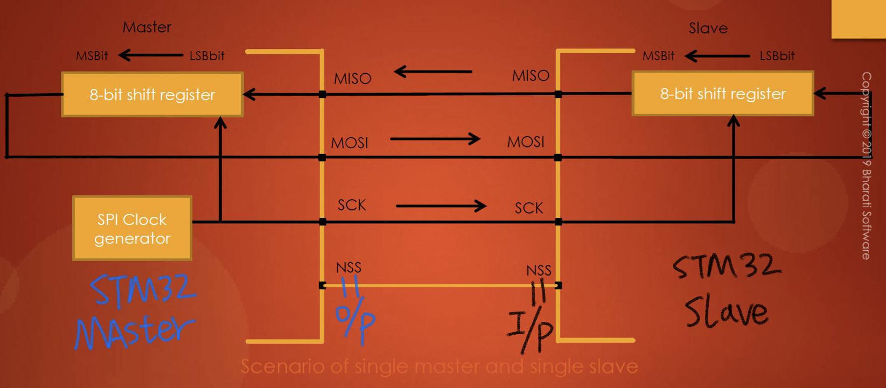

# 128. NSS Settings in STM32 Master and Slave Modes

The lecture focused on **slave select pin (NSS)** management, specifically in two scenarios: when the device is in slave mode and when it is in master mode.

1. **Slave Mode:**

   - In slave mode, NSS functions as a standard "chip select" input, allowing communication with the master.
   - When the device is in master mode, NSS can be used as either an input or an output.
   - As an input, NSS prevents multi-master bus collisions, enabling the SPI circuit to have multiple masters.
   - Multi-master mode was briefly mentioned, but the lecture didn't delve into it.

2. **Master Mode:**

   - In standard communication with a single master and single slave, NSS is kept as an output.
   - For a single master and single slave scenario, using NSS might not be necessary, but if used, it should be configured as an input on the slave side and as an output on the master side.
   - It was emphasized that NSS should always be configured as an output when the device is in master mode to drive a slave select signal.

   

3. **Conclusion:**

   - The importance of NSS being configured as an output in master mode was reiterated.
   - The upcoming lecture will cover different types of slave management.