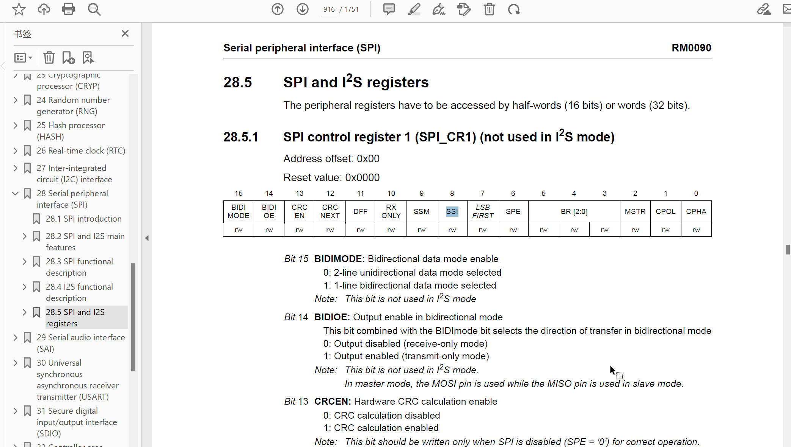
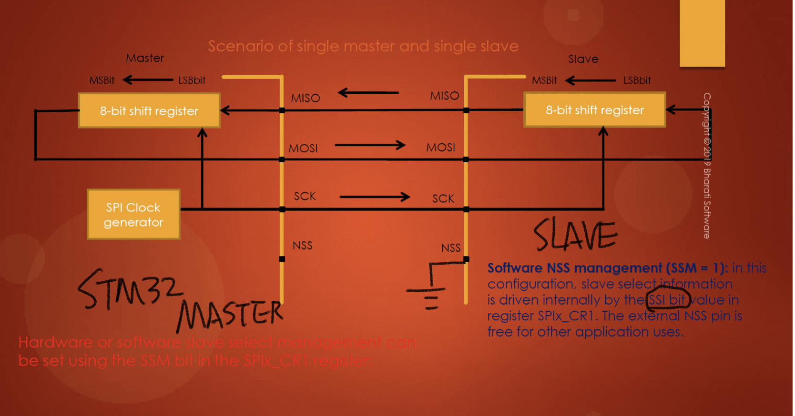
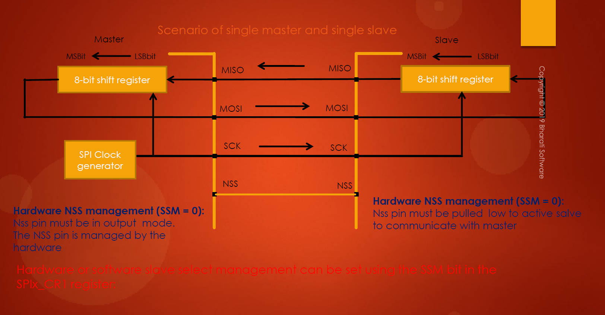
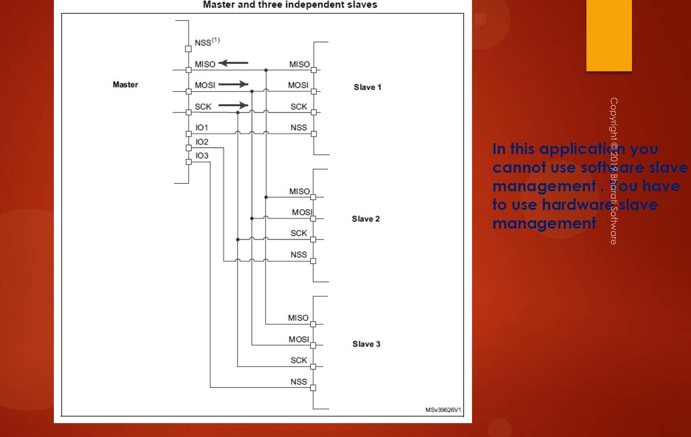

# 129. STM32 SPI Hardware and Software Slave Management

The lecture covered two types of slave managements in STM32 microcontrollers: hardware slave management and software slave management.

1. **Software Slave Management:**

   - Involves setting the **SSM (Software Slave Management)** bit to 1 in the control register.
   - **SSI (Slave Select Internal)** bit is used to internally drive the slave select information.
   - If SSI is 0, NSS (Slave Select) is grounded internally, allowing communication with the master.
   - If SSI is 1, NSS is pulled high to VDD.
   - Useful when you don't want to use the external NSS pin, and it frees the NSS pin for other applications.

   

   

2. **Hardware Slave Management:**

   - Involves keeping SSM at 0.
   - NSS pin must be used for slave select and must be pulled low to activate communication with the master.
   - The master controls the NSS pin in output mode; SSI has no meaning in this context.
   - Useful when the application requires using the NSS pin for slave selection.

   

3. **Multiple Slaves Scenario:**

   - In a scenario with one master and multiple slaves, software slave management is not applicable.
   - Master must use different IO pins to control slave selection individually.
   - NSS pin of the master is not used; instead, separate pins (GPIOs) control slave selection.
   - NSS pin should be connected to VDD to avoid errors, or left unconfigured if not in use.

   

**Note:**

- Software slave management is chosen by setting the SSM bit to 1.
- Hardware slave management is chosen by keeping SSM at 0.
- NSS pin management varies based on the selected slave management type.
- In scenarios with one master and multiple slaves, separate pins control slave selection instead of using software slave management.
- NSS pin should be connected to VDD or left unconfigured in such scenarios.