# 130. SPI CPOL and CPHA Discussion

1. **SPI Communication Factors:**

   - Clock Phase (CPHA)

     1. **Definition:** **Clock Phase (CPHA) determines when data is sampled and when it is shifted during a clock cycle.**

     2. **In STM32 Terms:** The STM32 SPI peripheral allows you to configure the CPHA through the "CPHA" bit in the control registers.

     3. Options:

     - CPHA = 0: Data is sampled on the first edge (rising or falling) of the clock.
     - CPHA = 1: Data is sampled on the second edge of the clock.

   - Clock Polarity (CPOL)

     1. **Definition:** **Clock Polarity (CPOL) defines the idle state of the clock line (high or low).**

     2. **In STM32 Terms:** Configurable through the "CPOL" bit in the control registers of the SPI peripheral.

     3. Options:

     - CPOL = 0: Clock idles at a low state.
     - CPOL = 1: Clock idles at a high state.

   - Data Frame Format (default: 8-bit)

     1. **Definition:** Data Frame Format specifies the size of the data frame being transmitted (default is often 8 bits).

     2. **In STM32 Terms:** The STM32 SPI peripheral supports various data frame formats, including 8, 16, or 32 bits. This is often configured through bits like "DFF" (Data Frame Format) in the control registers.

     3. Options:

     - DFF = 0: 8-bit data frame.
     - DFF = 1: 16-bit data frame.

   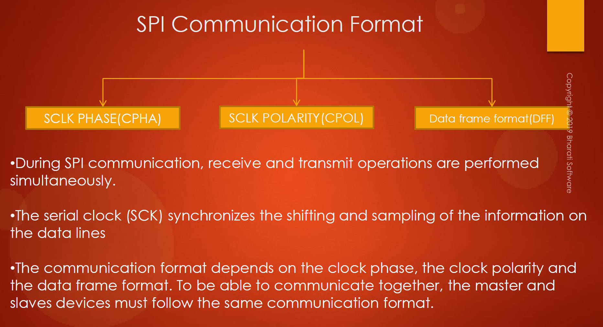

2. **Communication Overview:**

   - Simultaneous receive and transmit operations.
   - Master and slave devices must follow the same communication format for successful data exchange.

3. **Clock Polarity (CPOL):**

   - CPOL controls the idle state of the clock (low or high).
   - Default is low (0), but it can be configured based on application needs.

   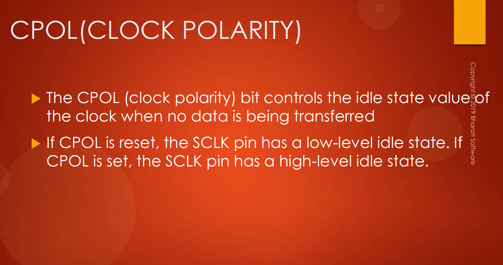

   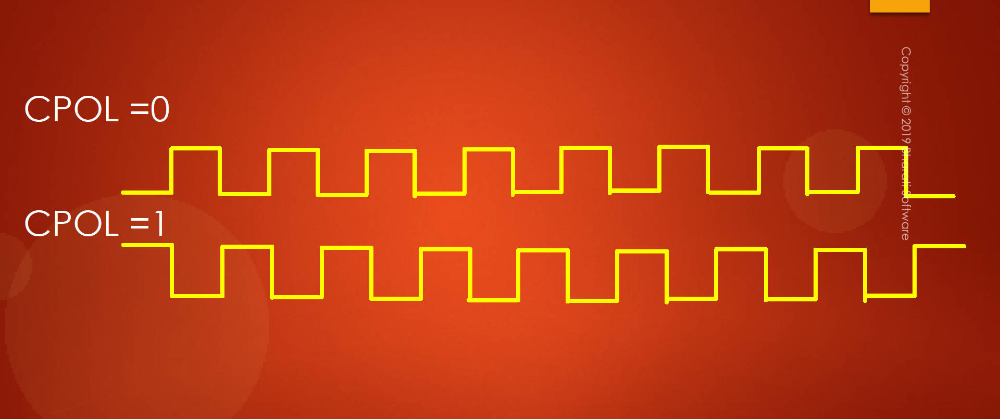

4. **Clock Phase (CPHA):**

   - CPHA decides when data is sampled during clock edges.
   - The combination of CPOL and CPHA bits determines data capture clock edge.
   - Four modes of SPI (SPI modes 0-3) based on different CPOL and CPHA combinations.

   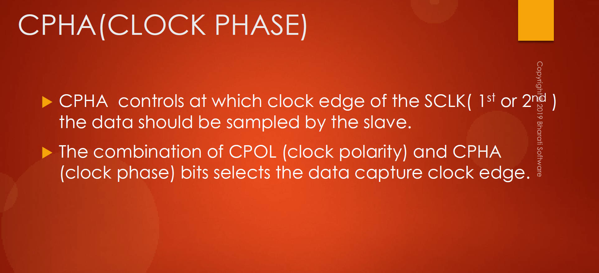

   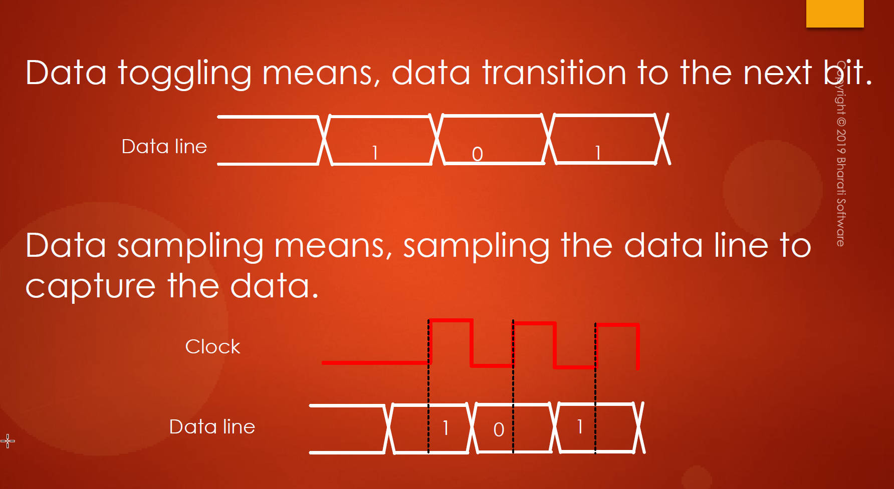

5. **Data Sampling:**

   - If CPHA=1, data is sampled on the trailing edge (second edge) of the clock.
   - If CPHA=0, data is sampled on the leading edge (first edge) of the clock.

   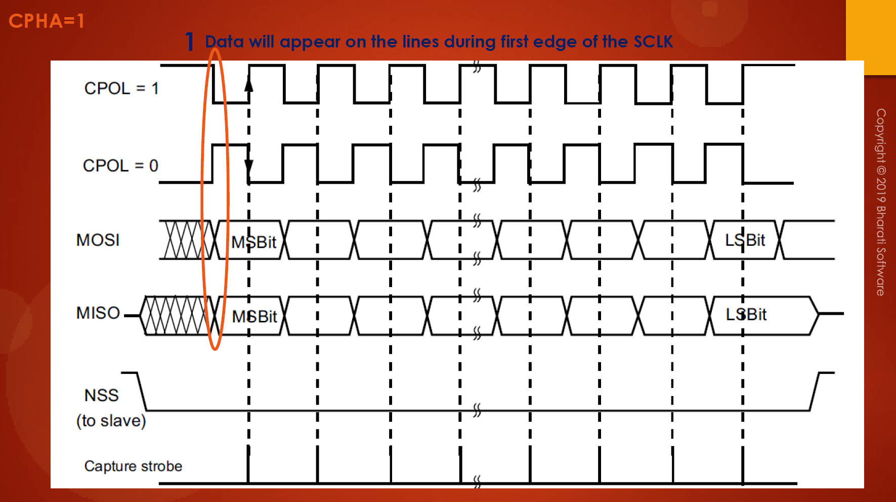

   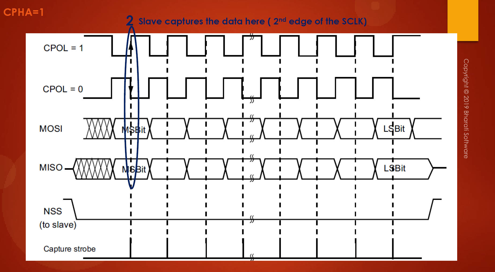

   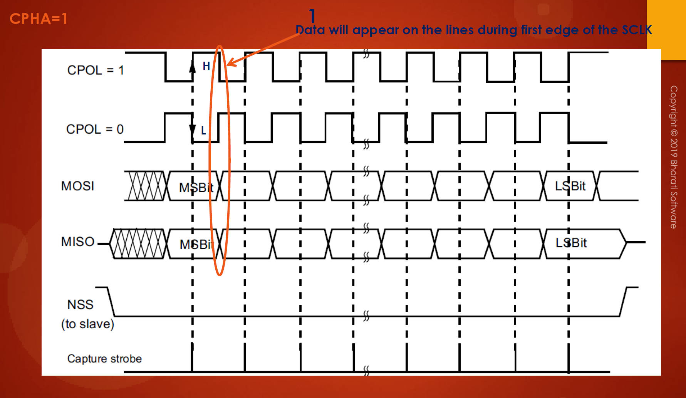

   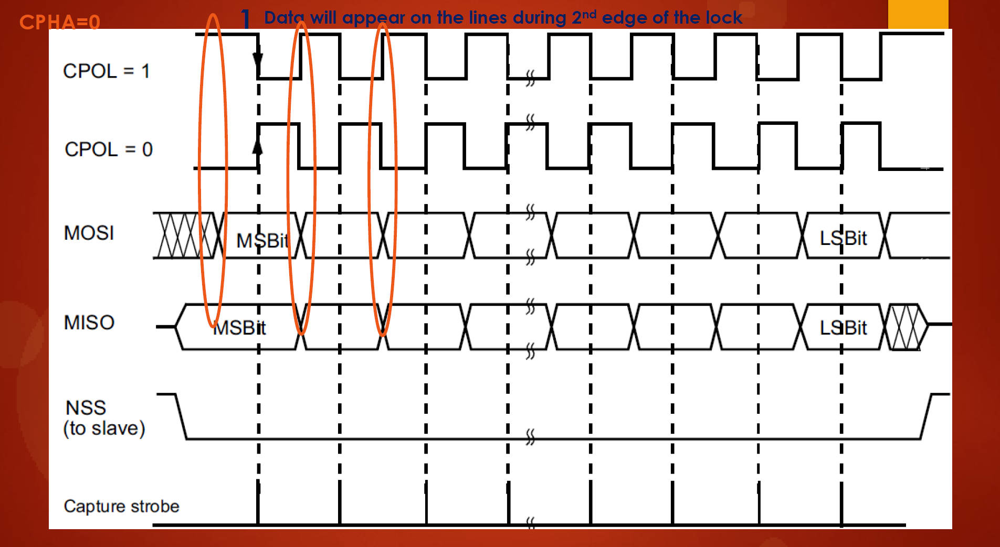

   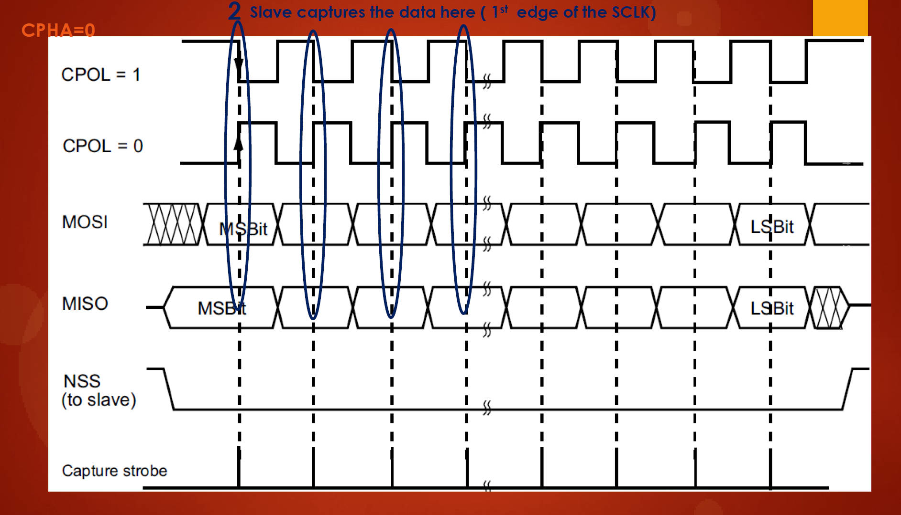

6. **Application Considerations:**

   - The choice of CPHA and CPOL should align with specific application requirements.
   - Default settings (CPHA=0, CPOL=0) are suitable for normal operations.

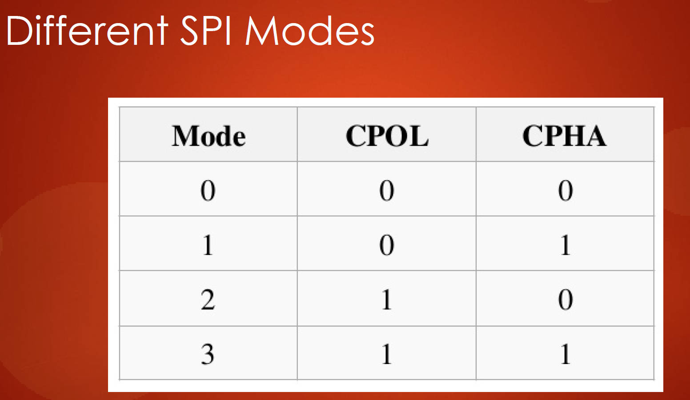

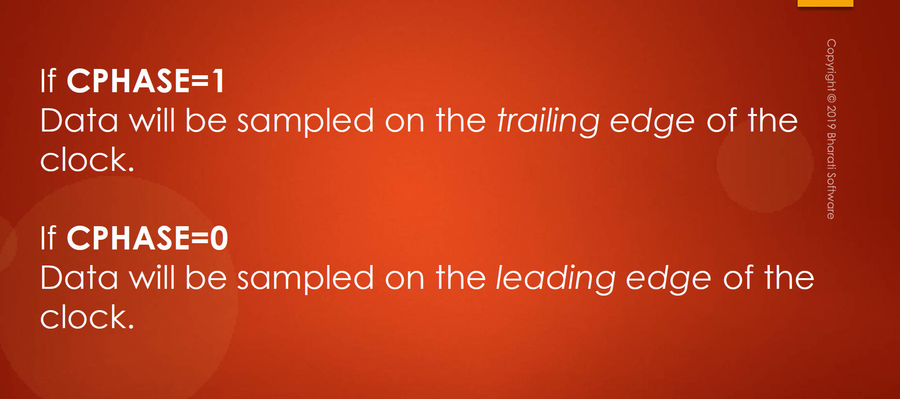