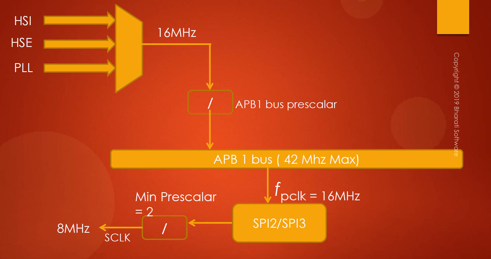
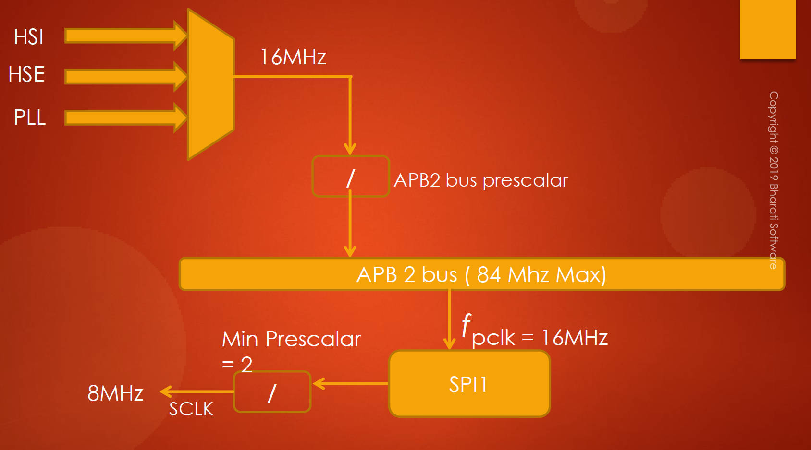

# 133. SPI Serial Clock Frequency

 SPI (Serial Peripheral Interface) serial clock and its configuration. 

1. **Determining Maximum Serial Clock Speed:**

   - Identify the speed of the APBx bus on which the SPI peripheral is connected (APB1, APB2, APB3).
   - For the example with the internal 16MHz HSI Oscillator, the APB1 bus speed is 16MHz.
   - The maximum speed of the APB1 bus can go up to 42MHz.

   

2. **Calculating Serial Clock Speed for SPI2 and SPI3:**

   - The default prescaler for SPI peripheral is 2.
   - Calculate the maximum serial clock by dividing the APB1 bus speed by the prescaler (16MHz / 2 = 8MHz).
   - SPI2 and SPI3 can produce a serial clock speed up to 8MHz.

   

3. **Adjusting Prescaler for Variable Serial Clock Speed:**

   - The prescaler value can be adjusted to vary the serial clock speed according to the application requirements.
   - The default value is 2, and it cannot go below that.

4. **Serial Clock Speed for SPI1:**

   - SPI1 is on the APB2 bus, with a maximum operating frequency of 84MHz.
   - SPI1 can produce a serial clock speed up to 42MHz.

5. **Summary for Serial Clock Configuration:**

   - When using the internal 16MHz RC oscillator, SPI1, SPI2, and SPI3 peripherals can produce a maximum serial clock of 8MHz.