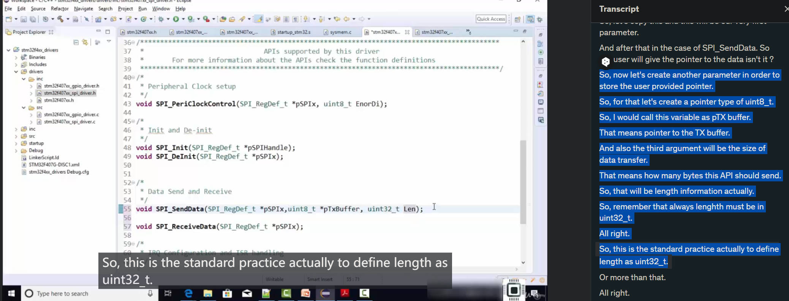
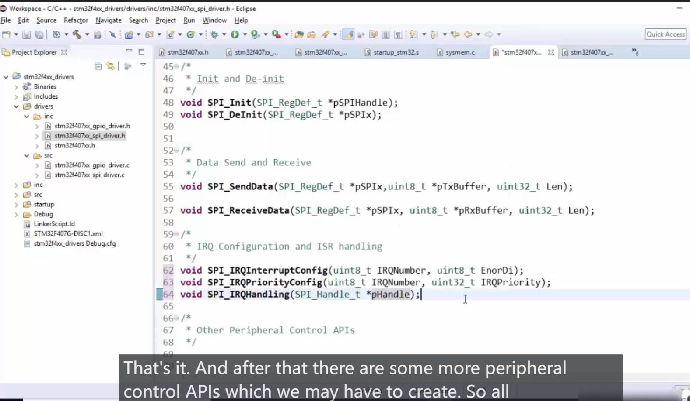

# 136. SPI Adding API Prototypes to Driver Header File


## SPI Driver Header (spi_driver.h) Updates

1. Structure Definitions:
   - Confirm the creation of the **configuration** structure and **handler** structure in `spi_driver.h`.



## Next Steps

- IRQ Definitions:

  - These will be created later when dealing with SPI interrupts.

  

## Frame of the SPI Head File

```c
/*
 *  Configuration structure for SPIx peripheral
 */
typedef struct
{
	uint8_t SPI_DeviceMode;
	uint8_t SPI_BusConfig;
	uint8_t SPI_SclkSpeed;
	uint8_t SPI_DFF;
	uint8_t SPI_CPOL;
	uint8_t SPI_CPHA;
	uint8_t SPI_SSM;
}SPI_Config_t;          /*User Defines*/


/*
 *Handle structure for SPIx peripheral
 */
typedef struct
{
	SPI_RegDef_t 	*pSPIx;   /*!< This holds the base address of SPIx(x:0,1,2) peripheral >*/
	SPI_Config_t 	SPIConfig;
	uint8_t 		*pTxBuffer; /* !< To store the app. Tx buffer address > */
	uint8_t 		*pRxBuffer;	/* !< To store the app. Rx buffer address > */
	uint32_t 		TxLen;		/* !< To store Tx len > */
	uint32_t 		RxLen;		/* !< To store Tx len > */
	uint8_t 		TxState;	/* !< To store Tx state > */
	uint8_t 		RxState;	/* !< To store Rx state > */
}SPI_Handle_t;         /*SPI Handle the user COnfiguration*/


/*
 * SPI application states
 */
#define SPI_READY 					0
#define SPI_BUSY_IN_RX 				1
#define SPI_BUSY_IN_TX 				2

/*
 * Possible SPI Application events
 */
#define SPI_EVENT_TX_CMPLT   1
#define SPI_EVENT_RX_CMPLT   2
#define SPI_EVENT_OVR_ERR    3
#define SPI_EVENT_CRC_ERR    4


/*
 * @SPI_DeviceMode
 */
#define SPI_DEVICE_MODE_MASTER    1
#define SPI_DEVICE_MODE_SLAVE     0


/*
 * @SPI_BusConfig
 */
#define SPI_BUS_CONFIG_FD                1
#define SPI_BUS_CONFIG_HD                2
#define SPI_BUS_CONFIG_SIMPLEX_RXONLY    3

/*
 * @SPI_SclkSpeed
 */
#define SPI_SCLK_SPEED_DIV2             	0
#define SPI_SCLK_SPEED_DIV4             	1
#define SPI_SCLK_SPEED_DIV8             	2
#define SPI_SCLK_SPEED_DIV16             	3
#define SPI_SCLK_SPEED_DIV32             	4
#define SPI_SCLK_SPEED_DIV64             	5
#define SPI_SCLK_SPEED_DIV128             	6
#define SPI_SCLK_SPEED_DIV256             	7

/*
 * @SPI_DFF
 */
#define SPI_DFF_8BITS 	0
#define SPI_DFF_16BITS  1

/*
 * @CPOL
 */
#define SPI_CPOL_HIGH 1
#define SPI_CPOL_LOW 0

/*
 * @CPHA
 */
#define SPI_CPHA_HIGH 1
#define SPI_CPHA_LOW 0

/*
 * @SPI_SSM
 */
#define SPI_SSM_EN     1
#define SPI_SSM_DI     0


/*
 * SPI related status flags definitions
 */
#define SPI_TXE_FLAG    ( 1 << SPI_SR_TXE)
#define SPI_RXNE_FLAG   ( 1 << SPI_SR_RXNE)
#define SPI_BUSY_FLAG   ( 1 << SPI_SR_BSY)


/******************************************************************************************
 *								APIs supported by this driver
 *		 For more information about the APIs check the function definitions
 ******************************************************************************************/
/*
 * Peripheral Clock setup
 */


/*
 * Init and De-init
 */


/*
 * Data Send and Receive
 */


/*
 * IRQ Configuration and ISR handling
 */


/*
 * Other Peripheral Control APIs
 */


/*
 * Application callback
 */


#endif /* INC_STM32F407XX_SPI_DRIVER_H_ */
```

Reference: https://github.com/niekiran/MasteringMCU/blob/master/Resources/Source_code/Workspace/stm32f4xx_drivers/drivers/inc/stm32f407xx_spi_driver.h