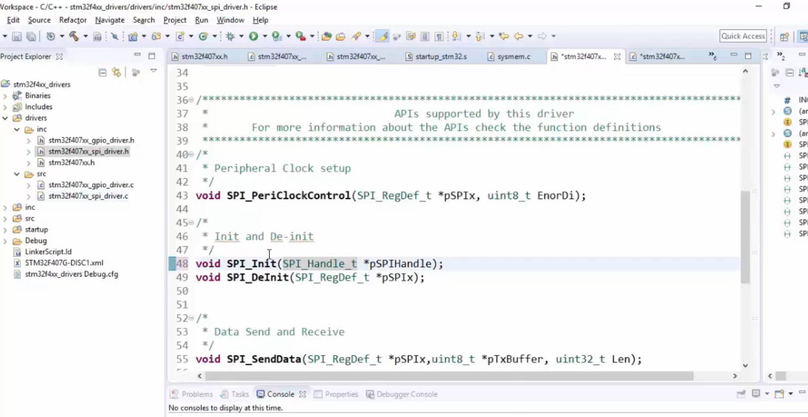
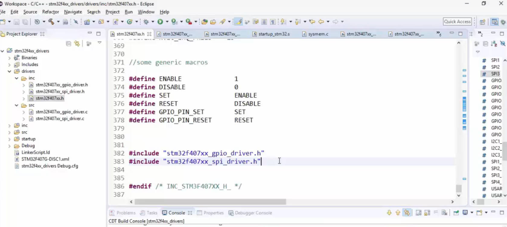

# 137. Implementation of SPI Peripheral Clock Control


## Introduction

Welcome back to the STM32 lecture series! In this session, we'll be diving into the SPI (Serial Peripheral Interface) driver implementation. We are currently working in the `SPI_driver.c` file and defining various APIs that we will code in the upcoming sections.

## Correction in SPI Driver Header

Before we proceed, there's a small correction in the `SPI_driver.h` file. The SPI initialization should use the `SPI handle` structure. Therefore, make sure to change it to the `SPI handle` type.



## Adding SPI Driver Reference

To ensure a smooth integration, let's add the SPI driver reference at the beginning of `stm32f407xx_spi_driver.c`. This is accomplished by including the `spi_driver.h` file.

```c
#include "spi_driver.h"
```

Reference: https://github.com/niekiran/MasteringMCU/blob/master/Resources/Source_code/Workspace/stm32f4xx_drivers/drivers/src/stm32f407xx_spi_driver.c


## Initial API - SPI Peripheral Control

Our first API to code is the SPI Peripheral Control. Copy the relevant code from `driver.c`, and make sure to replace references to GPIO with SPI.

```c
/*********************************************************************
 * @fn      		  - SPI_PeriClockControl
 *
 * @brief             -
 *
 * @param[in]         -
 * @param[in]         -
 * @param[in]         -
 *
 * @return            -
 *
 * @Note              -

 */
void SPI_PeriClockControl(SPI_RegDef_t *pSPIx, uint8_t EnorDi)
{

	if(EnorDi == ENABLE)
	{
		if(pSPIx == SPI1)
		{
			SPI1_PCLK_EN();
		}else if (pSPIx == SPI2)
		{
			SPI2_PCLK_EN();
		}else if (pSPIx == SPI3)
		{
			SPI3_PCLK_EN();
		}
	}
	else
	{
		//TODO
	}
}
```

## Resolving Errors

If you encounter red marks or errors, ensure that you've included the SPI driver in `stm32f407xx.h` and included the SPI-specific header in the MCU Header File too.

```c
// In device specific header file (bottom)
#include "stm32f407xx_gpio_driver.h"  // Make sure this is already present
#include "stm32f407xx_spi_driver.h"   // Add this for SPI driver
```



This inclusion should resolve any errors related to missing references.

## Compilation

Compile the code and resolve any additional issues that may arise. If you encounter errors such as "SPI1 base is undefined," check for discrepancies like using `BASE` instead of `BASEADDR`.

## Expanding for Additional SPI Peripherals

Include the necessary definitions for SPI peripherals in your code. For example:

```c
#define SPI1_BASEADDR 0x40013000U
#define SPI2_BASEADDR 0x40003800U
#define SPI3_BASEADDR 0x40003C00U
// Add more as needed
```

