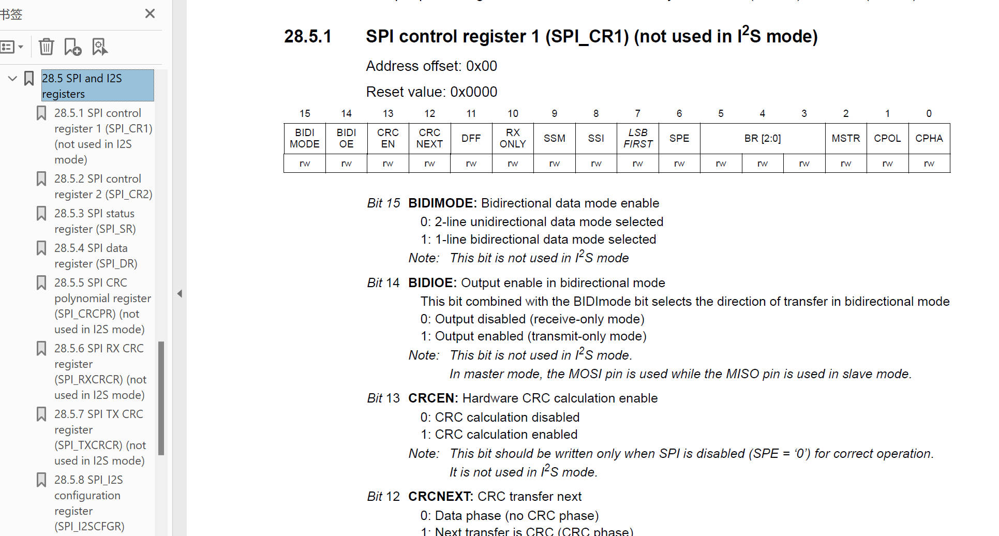
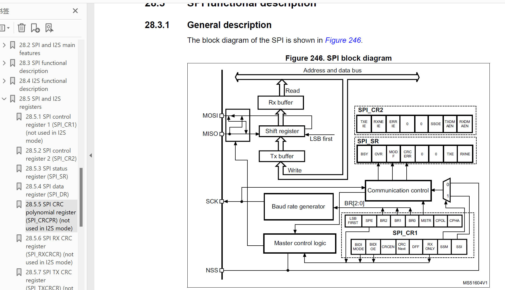
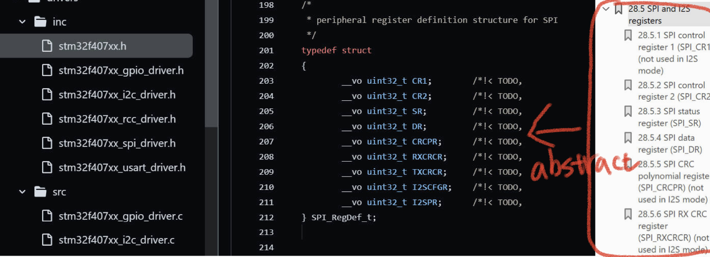
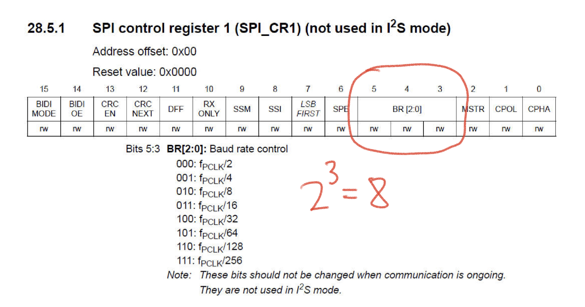
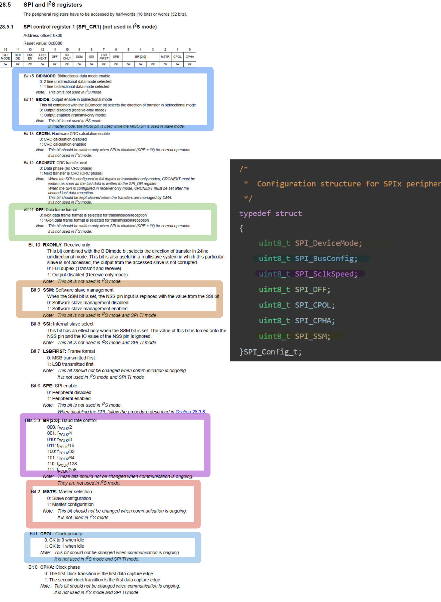

# 138. SPI User Configuration Options Writing and Register Bit Definition Macros


This documentation provides an organized summary of the content covered in your STM32 class regarding SPI initialization. It covers the concepts of SPI registers, their bit fields, and the process of initializing the SPI peripheral using the SPI_Init API.

## SPI Registers





1. **Control Registers:**
   - CR1 and CR2 are the control registers for the SPI peripheral.
   - Control registers store configurable parameters and control the overall behavior of the SPI peripheral.
2. **Data Registers:**
   - SPI peripherals have one or two data registers to handle user data during communication.
3. **Status Registers:**
   - Status registers house various status flags that flag events during the operation of the peripheral.
   - Common status flags include error events, RX buffer full, TX buffer empty, bus idle, CRC error, etc.

### SPI Block Diagram

as figure 02, you can see.

- The CR1 register contains bit fields such as BR0, BR1, and BR2, which control the baud rate generator.
- The baud rate generator determines the serial clock speed.
- CR2 holds various communication control bits.
- The communication control block updates the status register to record events.

### Abstract the Frame into code



1.Write the Frame Structure of the SPI register into the `stm32f407.h` head file, because these register are inside the MCU.

```c
/*
 * peripheral register definition structure for SPI
 */
typedef struct
{
	__vo uint32_t CR1;        /*!< TODO,     										Address offset: 0x00 */
	__vo uint32_t CR2;        /*!< TODO,     										Address offset: 0x04 */
	__vo uint32_t SR;         /*!< TODO,     										Address offset: 0x08 */
	__vo uint32_t DR;         /*!< TODO,     										Address offset: 0x0C */
	__vo uint32_t CRCPR;      /*!< TODO,     										Address offset: 0x10 */
	__vo uint32_t RXCRCR;     /*!< TODO,     										Address offset: 0x14 */
	__vo uint32_t TXCRCR;     /*!< TODO,     										Address offset: 0x18 */
	__vo uint32_t I2SCFGR;    /*!< TODO,     										Address offset: 0x1C */
	__vo uint32_t I2SPR;      /*!< TODO,     										Address offset: 0x20 */
} SPI_RegDef_t;
```

Reference: https://github.com/niekiran/MasteringMCU/blob/master/Resources/Source_code/Workspace/stm32f4xx_drivers/drivers/inc/stm32f407xx.h

2.Then we should create what user wanna control into the `stm32f407_SPI_driver.h` as the configuration.

How to write `SPI_Config_t`: https://github.com/knightsummon/Mastering-Microcontroller-and-Embedded-Driver-Development/blob/main/36.%20SPI%20Driver%20API%20Requirements%20and%20Configuration%20Structure/134.%20SPI%20API%20Requirements%20and%20Configuration%20items.md

So the user configuration act like this:

```c
/*
 *  Configuration structure for SPIx peripheral
 */
typedef struct
{
	uint8_t SPI_DeviceMode;
	uint8_t SPI_BusConfig;
	uint8_t SPI_SclkSpeed;
	uint8_t SPI_DFF;
	uint8_t SPI_CPOL;
	uint8_t SPI_CPHA;
	uint8_t SPI_SSM;
}SPI_Config_t;
```


## SPI_Init API

The SPI_Init API is responsible for configuring the SPI peripheral. It involves setting various bit fields in the control registers based on user-defined parameters.

SPI_Init API 负责配置 SPI 外设。 它涉及根据用户定义的参数设置控制寄存器中的各种位字段。

### User-Configurable Parameters

1. **Device Mode: uint8_t SPI_DeviceMode**

   - Two possible modes: `SPI_DEVICE_MODE_MASTER` and `SPI_DEVICE_MODE_SLAVE`.

   ```c
   /*
    * @SPI_DeviceMode
    */
   #define SPI_DEVICE_MODE_MASTER    1
   #define SPI_DEVICE_MODE_SLAVE     0
   ```

2. **Bus Configuration: SPI_BusConfig**

   - Three possible options: `SPI_BUS_CONFIG_FD` (full duplex), `SPI_BUS_CONFIG_HD` (half duplex), and `SPI_BUS_CONFIG_SIMPLEX` (simplex).

   ```c
   /*
    * @SPI_BusConfig
    */
   #define SPI_BUS_CONFIG_FD                1
   #define SPI_BUS_CONFIG_HD                2
   #define SPI_BUS_CONFIG_SIMPLEX_RXONLY    3
   ```

   

3. **Clock Speed: uint8_t SPI_SclkSpeed**

   - Configurable options for clock speed based on the reference manual.
   - Macros for clock speed options like `SPI_SCLK_SPEED_DIV2`, `SPI_SCLK_SPEED_DIV4`, ..., `SPI_SCLK_SPEED_DIV256`.

   ```c
   /*
    * @SPI_SclkSpeed
    */
   #define SPI_SCLK_SPEED_DIV2             	0
   #define SPI_SCLK_SPEED_DIV4             	1
   #define SPI_SCLK_SPEED_DIV8             	2
   #define SPI_SCLK_SPEED_DIV16             	3
   #define SPI_SCLK_SPEED_DIV32             	4
   #define SPI_SCLK_SPEED_DIV64             	5
   #define SPI_SCLK_SPEED_DIV128             	6
   #define SPI_SCLK_SPEED_DIV256             	7
   ```

   

4. **Data Frame Format (DFF): uint8_t SPI_DFF**

   - Two options: `SPI_DFF_8BITS` and `SPI_DFF_16BITS`.

   ```c
   /*
    * @SPI_DFF
    */
   #define SPI_DFF_8BITS 	0
   #define SPI_DFF_16BITS  1
   ```

   

5. **CPOL and CPHA: uint8_t SPI_CPOL**

   - Macros for CPOL: `SPI_CPOL_HIGH` and `SPI_CPOL_LOW`.
   - Macros for CPHA: `SPI_CPHA_HIGH` and `SPI_CPHA_LOW`.

   ```c
   /*
    * @CPOL
    */
   #define SPI_CPOL_HIGH 1
   #define SPI_CPOL_LOW 0
   ```

   

6. **SSM (Slave Select Management): uint8_t SPI_SSM**

   - Two options: `SPI_SSM_HW` (hardware) and `SPI_SSM_SW` (software).
   - Note: Software slave management is disabled by default.

   ```c
   /*
    * @SPI_SSM
    */
   #define SPI_SSM_EN     1
   #define SPI_SSM_DI     0
   ```

   

### The Configuration Macros are created, translating the demands from user into digital that program can understand.

As you can see, the user configuration `SPI_Config_t` is aimed to manipulate the CR Register, so we can always first read the CR Register to see what Condition can CR Register offers, then abstract these conditions into `SPI_Config_t`




## Bit Field Configuration

1. **Device Mode (CR1 Register - Bit 2):**
   - Set the MSTR bit to 1 for master mode; otherwise, it defaults to slave mode.
2. **Bus Configuration (CR1 and CR2 Registers - Bits 14-15):**
   - BIDIMODE (Bit 15): Set to 1 for half-duplex, 0 for full duplex.
   - BIDIOE (Bit 14): Controls output enable in bidirectional mode.
3. **Simplex Communication (CR1 Register - Bit 10):**
   - Set to 1 for receive-only mode in 2-line unidirectional mode.
4. **Clock Speed Configuration (CR1 Register - Bits 3-5):**
   - Configure the BR bits based on desired clock speed options.
5. **Data Frame Format (DFF - CR1 Register - Bit 11):**
   - Set to 1 for a 16-bit data frame; otherwise, it defaults to 8 bits.
6. **CPOL and CPHA Configuration (CR1 Register - Bits 0-1):**
   - CPOL (Bit 0) and CPHA (Bit 1) are configured based on user preferences.
7. **SSM Configuration (CR1 Register - Bit 9):**
   - Set to 1 to enable software slave management.

## Important Notes

- Check and configure the necessary bit fields based on the desired configuration options.
- Debugging tip: Verify the device mode and bus configuration bit fields if the SPI peripheral is not producing clock as expected.