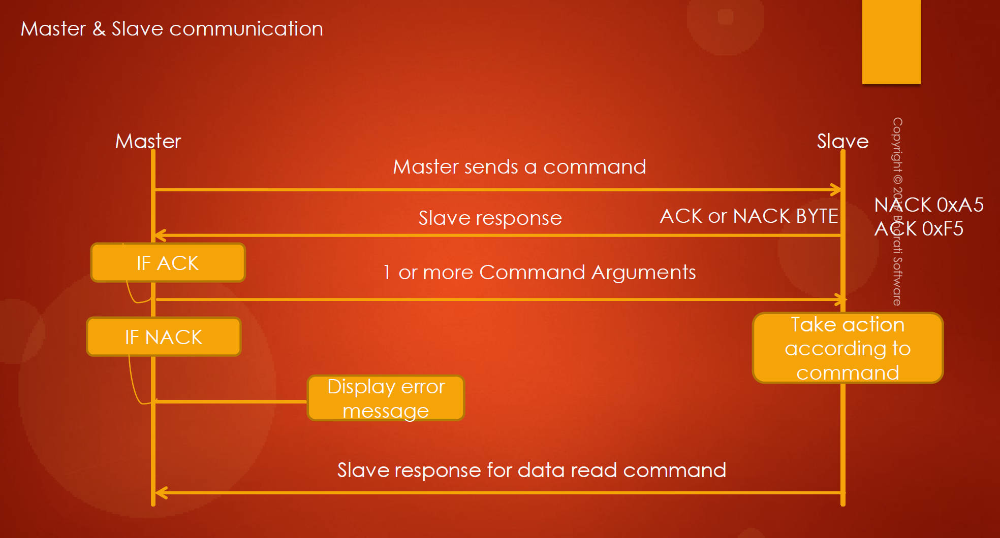

# 158. Exercise: SPI Command and Response based on Communication

## Introduction

Welcome back to the STM32 Class! In this lecture, we will be diving into an exercise focused on SPI Master and SPI Slave command and response based communication. The goal is to create a system where the SPI Master (ST board) sends commands to the SPI Slave (Arduino), and the Slave responds accordingly. Let's go through the details of the exercise.

## Circuit Configuration

- ST board (SPI Master) is in SPI master mode.
- Arduino (SPI Slave) is in SPI slave mode.
- Connect MISO (PB14) of the STM32 Discovery board to LV3 and HV3 to pin 12 of the Arduino.
- Connect NSS to LV4 and HV4 to Chip select (pin 10) on the Arduino.
- Power up the Arduino and download the SPI slave sketch `002SPISlaveCmdHandling.ino` onto it.

## Command and Response Overview

- When the button on the master is pressed, the master sends a command to the slave.
- The slave responds based on the command implementation.

### Command and Response Flow

1. Master sends a command.
2. Slave checks if the command is supported.
3. If supported, the slave responds with either 0xF5 (ACK) or 0xA5 (NACK).
4. If ACK is received, the master sends one or more command arguments to the slave.
5. Slave takes necessary action based on the command implementation.
6. For data read commands, the slave may send a response back.

## Supported Commands

1. **CMD_LED_CTRL**

   - Arguments: Pin number (1 byte) and Value (1 or 0 to turn on or off the LED).
   - Controls the LED on the Arduino board.

2. **CMD_SENSOR_READ**

   - Arguments: Analog pin number.
   - Reads the analog value of the specified pin.

   

3. **CMD_LED_READ**

   - Arguments: Pin number.
   - Reads the status of the LED (1 if ON, 0 if OFF).

   

4. **CMD_PRINT**

   - Sends data to the Arduino for display (similar to a previous exercise).

   

5. **CMD_READ_ID**

   - No arguments.
   - Returns a 10-byte board ID string.

   

## Exercise Implementation

1. Set up the main function with necessary initializations (GPIO, SPI, etc.).
2. Wait for the button press to initiate communication.
3. Send CMD_LED_CTRL as the first command and handle ACK or NACK.
4. If ACK, send the corresponding arguments.
5. If the command involves reading, receive and process the response from the slave.
6. Repeat the process for other commands.

## Conclusion

This exercise aims to familiarize you with SPI command and response communication between an STM32 board and an Arduino. In the next lecture, we will delve into the practical implementation of this exercise. Stay tuned!