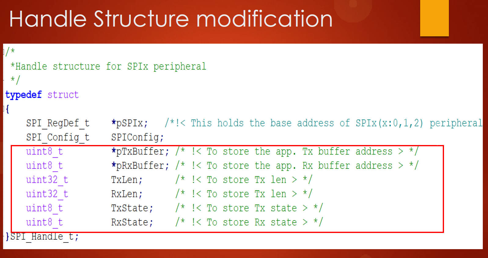
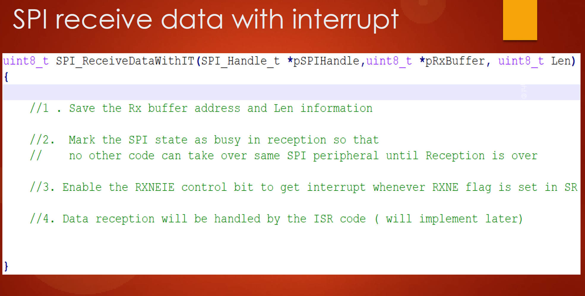

# 163. SPI Interrupt Mode API Implementation and Changes to Handle Structure


## Introduction

Welcome back to the lecture. In this session, we'll enhance the `SPI_SendData` function to support interrupt-based data transmission. The existing `SPI_SendData` is a blocking API, and now we'll create two new APIs with interrupt capability.

### New APIs

1. `SPI_SendDataIT`

   - This API supports interrupt-based data transmission.
   - Parameters: `SPIHandle` (handle structure), `TxBuffer`(application's Tx buffer address), `TxLen` (Tx length).
   - The function doesn't directly write data into the data register but saves the Tx buffer address, length, and other information for later processing in the interrupt handler.
   - Marks the SPI state as busy to prevent other code from taking over the same SPI peripheral until the data transmission is complete.
   - Enables the TXEIE control bit to trigger an interrupt when the TXE flag is set in the SR.
   - Returns without sending data, making it a non-blocking API.

   ```c
   /*stm32f407xx_spi_driver.h*/
   /*
    * Data Send and Receive
    */
   void SPI_SendData(SPI_RegDef_t *pSPIx,uint8_t *pTxBuffer, uint32_t Len);
   void SPI_ReceiveData(SPI_RegDef_t *pSPIx, uint8_t *pRxBuffer, uint32_t Len);
   
   uint8_t SPI_SendDataIT(SPI_Handle_t *pSPIHandle,uint8_t *pTxBuffer, uint32_t Len);
   uint8_t SPI_ReceiveDataIT(SPI_Handle_t *pSPIHandle, uint8_t *pRxBuffer, uint32_t Len);
   ```

   

### Handle Structure Modification

1. TxBuffer
   - Pointer to store the application's Tx buffer address for ISR code reuse.
2. RxBuffer
   - Pointer to store the application's Rx buffer address.
3. TxLen
   - Variable to store the Tx length.
4. TxState
   - State variable to maintain the SPI peripheral's state during data transmission.
5. RxState
   - State variable to maintain the SPI peripheral's state during data reception.

## Implementation Steps

1. **Update Handle Structure**

   - Modify the handle structure to include new member elements:` TxBuffer`, `RxBuffer`, `TxLen`, `TxState`, and `RxState`.

2. **Create Place Holder Variables**

   - Create placeholder variables in the handle structure to save the application's Tx address, length, and SPI state.

3. **Implement SPI_SendDataIT**

   - In the driver.c file, implement the SPI_SendDataIT function.
   - Save Tx buffer address, length, and other information in placeholder variables.
   - Mark SPI state as busy.
   - Enable TXEIE control bit for interrupt generation.
   - Return without sending data, making it a non-blocking API.

   ```c
   /*stm32f407xx_spi_driver.c*/
   uint8_t SPI_SendDataIT(SPI_Handle_t *pSPIHandle,uint8_t *pTxBuffer, uint32_t Len)
   {
   	uint8_t state = pSPIHandle->TxState;
   
   	if(state != SPI_BUSY_IN_TX)
   	{
   		//1 . Save the Tx buffer address and Len information in some global variables
   		
   		//2.  Mark the SPI state as busy in transmission so that
   		//    no other code can take over same SPI peripheral until transmission is over
   	
   
   		//3. Enable the TXEIE control bit to get interrupt whenever TXE flag is set in SR
   		
   
   	}
   
   
   	return state;
   }
   ```

   

4. **Define SPI Application States Macros**

   - Create macros in the SPI driver header file to represent possible SPI application states: READY, BUSY_IN_RX, BUSY_IN_TX, etc.

5. **Next Steps**

   - In the upcoming lecture, we will delve into the actual implementation of the interrupt service routine (ISR) code to handle data transmission during interrupt-based mode.

## Homework for Students

1. **Modify Handle Structure**

   - Update the handle structure in the SPI driver to include new member elements for TxBuffer, RxBuffer, TxLen, TxState, and RxState.

   

2. **Define Application States Macros**

   - Include macros in the SPI driver header file to represent different SPI application states.

   

3. **Implement SPI_SendDataIT**

   - Write the code for SPI_SendDataIT in the driver.c file as per the provided guidelines.

   

4. **Prepare for Next Lecture**

   - Get ready to implement the interrupt service routine (ISR) code in the next lecture.