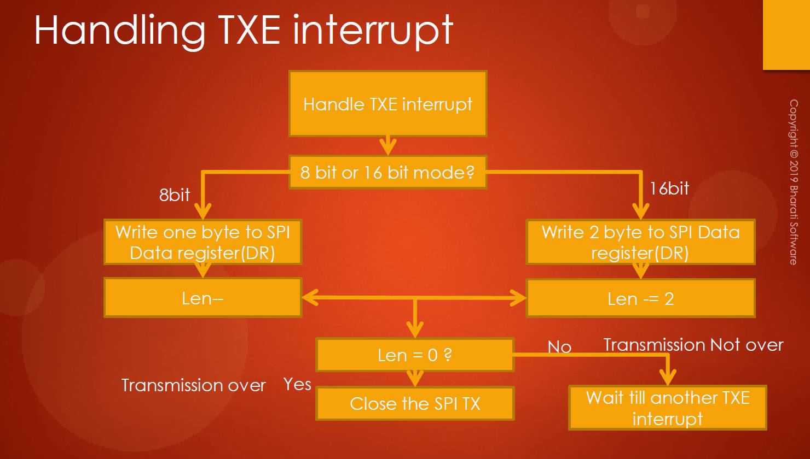

# 166. SPI Handling of Interrupts


## Introduction

Welcome back to the STM32 class! In today's lecture, we will focus on implementing the SPI (Serial Peripheral Interface) Interrupt Service Routine (ISR). This is a crucial part of the SPI driver, and we'll be working on the `SPI_IRQHandling()` function in the SPI driver header file.

## Implementation Steps

1. **Navigate to Header File:** Open the SPI driver header file, and locate the `SPI_IRQHandling()` function.
2. **Copy Function:** Copy the function and proceed to the driver.c file for implementation.
3. **Implementation in driver.c:** Paste and implement the `SPI_IRQHandling()` function at the end of the driver.c file.

```c
// stm32f407xx_spi_driver.c
void SPI_IRQHandling(SPI_Handle_t *pHandle)
{

}
```


## Understanding the Flowcharts

### Reasons for Interrupt Triggering:

- When control enters the ISR, it signifies that the SPI peripheral has triggered an interrupt.
- There are six possible reasons for this interrupt, such as TXE, RXNE, or errors like CRC errors or overrun errors.


### Decoding Interrupt Cause:

- It is crucial to understand why the interrupt was triggered.
- Check the Status Register (SR) to determine the cause of the interrupt.

### Handling Interrupt Causes:

1. RXNE Event:
   - If interrupt is due to the RXNE flag, handle the reception of data.
2. TXE Event:
   - If interrupt is due to the TXE flag, handle the transmission of data bytes.
   - Write data to the data register.
   - Decrease the length, and if length reaches 0, close the SPI TX.
3. Error Handling:
   - If interrupt is due to an ERROR flag, handle the error.
   - Clear the error and inform the application about the specific error that occurred.
   - The application can then decide how to proceed based on the error type (e.g., requesting data resend or discarding received data).

## Implementation Details for TXE Event

- For TXE interrupts:

  - Check the data frame format (8 or 16 bits).
  - Write data to the data register accordingly.
  - Decrease the length (saved in global pointers in the handle structure).
  - If length reaches 0, close the SPI TX to prevent further TXE interrupts.
  - Otherwise, wait for another TXE interrupt to send the next byte.

  

## Conclusion

Understanding and implementing the ISR for SPI is crucial for handling various events triggered by the SPI peripheral. If there are any doubts or confusion, they will be clarified during the implementation phase in the upcoming lectures.