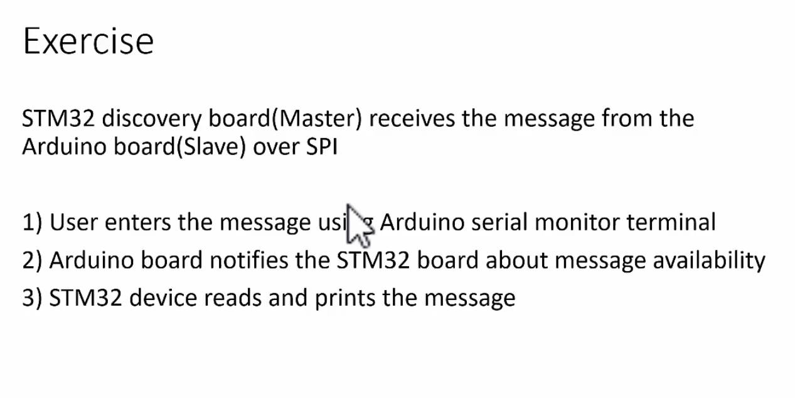
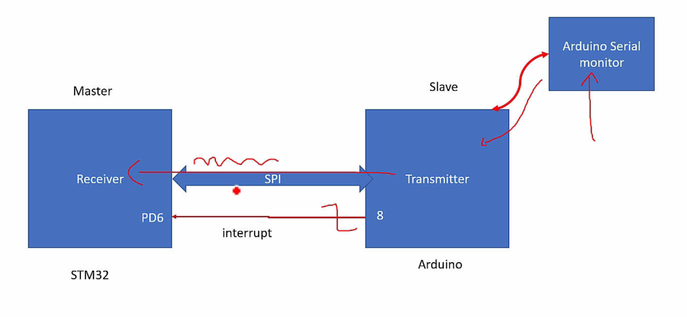
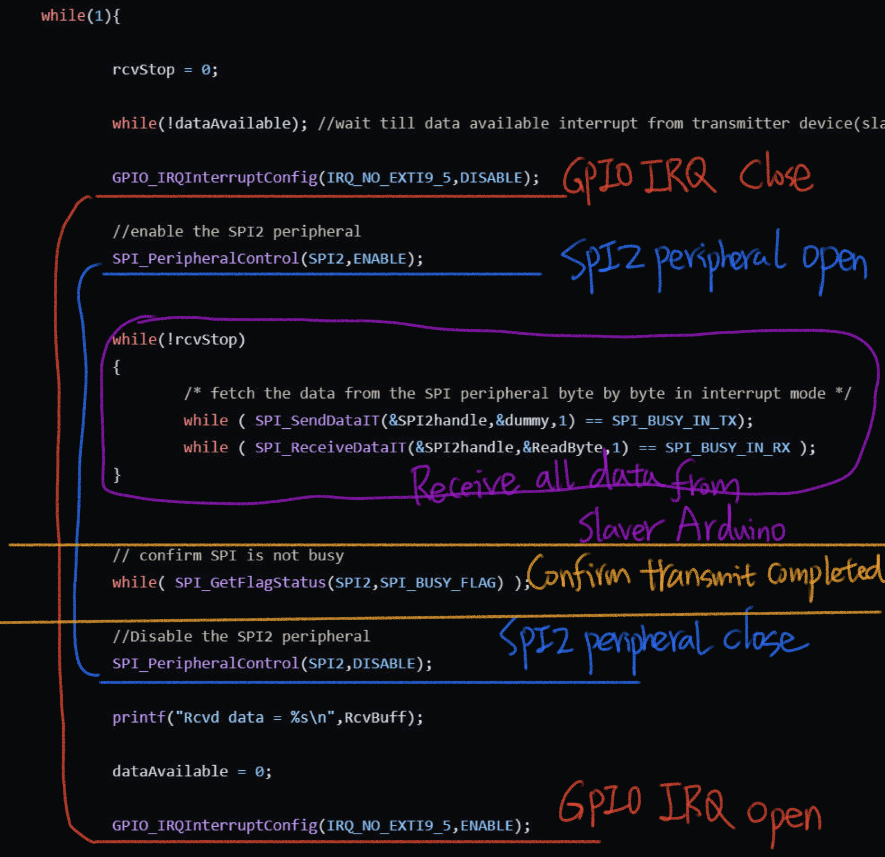

# 170. Exercise


## Overview

In this exercise, the STM32 discovery board acts as the Master, and an Arduino board acts as the Slave. The communication between the two boards is established using SPI (Serial Peripheral Interface) with interrupt-based data communication APIs.



### Connection Setup

1. **Hardware Connections:**
   - Connect Arduino as the transmitter and STM32 as the receiver.
   - Utilize the same SPI pins as in the previous exercise (MISO, MOSI, Clock, and NSS).
   - Introduce an additional pin: Connect Pin 8 of the Arduino board to PD6 of the STM32 discovery board. This pin serves as an interrupt line for notifying data availability.
2. **Operation:**
   - User enters a message using Arduino serial monitor.
   - Arduino notifies STM32 about message availability through an interrupt.
   - The interrupt is triggered by a high-to-low transition on the additional pin (Pin 8).




## Implementation

### Master Code (STM32)

The master code (`009spi_message_rcv_it.c`) is responsible for handling the SPI communication and processing received data.

Reference: https://github.com/niekiran/MasteringMCU/blob/master/Resources/Source_code/Workspace/stm32f4xx_drivers/src/009spi_message_rcv_it.c

1. **Initialization:**

   - Configure GPIOs and SPI for communication.
   - Initialize an interrupt on pin PD6 to receive notifications from the Arduino.

   ```c
   /*
    * PB14 --> SPI2_MISO
    * PB15 --> SPI2_MOSI
    * PB13 -> SPI2_SCLK
    * PB12 --> SPI2_NSS
    * ALT function mode : 5
    */
   
   void SPI2_GPIOInits(void)
   {
   	GPIO_Handle_t SPIPins;
   
   	SPIPins.pGPIOx = GPIOB;
   	SPIPins.GPIO_PinConfig.GPIO_PinMode = GPIO_MODE_ALTFN;
   	SPIPins.GPIO_PinConfig.GPIO_PinAltFunMode = 5;
   	SPIPins.GPIO_PinConfig.GPIO_PinOPType = GPIO_OP_TYPE_PP;
   	SPIPins.GPIO_PinConfig.GPIO_PinPuPdControl = GPIO_NO_PUPD;
   	SPIPins.GPIO_PinConfig.GPIO_PinSpeed = GPIO_SPEED_FAST;
   
   	//SCLK
   	SPIPins.GPIO_PinConfig.GPIO_PinNumber = GPIO_PIN_NO_13;
   	GPIO_Init(&SPIPins);
   
   	//MOSI
       SPIPins.GPIO_PinConfig.GPIO_PinNumber = GPIO_PIN_NO_15;
   	GPIO_Init(&SPIPins);
   
   	//MISO
   	SPIPins.GPIO_PinConfig.GPIO_PinNumber = GPIO_PIN_NO_14;
   	GPIO_Init(&SPIPins);
   
   
   	//NSS
   	SPIPins.GPIO_PinConfig.GPIO_PinNumber = GPIO_PIN_NO_12;
   	GPIO_Init(&SPIPins);
   
   
   }
   
   void SPI2_Inits(void)
   {
   	SPI2handle.pSPIx = SPI2;
   	SPI2handle.SPIConfig.SPI_BusConfig = SPI_BUS_CONFIG_FD;
   	SPI2handle.SPIConfig.SPI_DeviceMode = SPI_DEVICE_MODE_MASTER;
   	SPI2handle.SPIConfig.SPI_SclkSpeed = SPI_SCLK_SPEED_DIV32;
   	SPI2handle.SPIConfig.SPI_DFF = SPI_DFF_8BITS;
   	SPI2handle.SPIConfig.SPI_CPOL = SPI_CPOL_LOW;
   	SPI2handle.SPIConfig.SPI_CPHA = SPI_CPHA_LOW;
   	SPI2handle.SPIConfig.SPI_SSM = SPI_SSM_DI; //Hardware slave management enabled for NSS pin
   
   	SPI_Init(&SPI2handle);
   }
   ```

   

2. **SPI Interrupt Handling:**

   - Use `SPI_SendDataIT `and `SPI_ReceiveDataIT` for interrupt-based data communication.
   - Enable SPI interrupt to handle data reception.

   ```c
   		GPIO_IRQInterruptConfig(IRQ_NO_EXTI9_5,DISABLE);
   
   		//enable the SPI2 peripheral
   		SPI_PeripheralControl(SPI2,ENABLE);
   
   
   		while(!rcvStop)
   		{
   			/* fetch the data from the SPI peripheral byte by byte in interrupt mode */
   			while ( SPI_SendDataIT(&SPI2handle,&dummy,1) == SPI_BUSY_IN_TX);
   			while ( SPI_ReceiveDataIT(&SPI2handle,&ReadByte,1) == SPI_BUSY_IN_RX );
   		}
   ```

   Disabling the GPIO interrupt (`GPIO_IRQInterruptConfig`) while enabling the SPI peripheral (`SPI_PeripheralControl`) serves a specific purpose in the provided code. Let's break down the reasons for doing this:

   1. **Notification Handling:** The GPIO interrupt on pin PD6 is used to notify the STM32 master that there is data available on the Arduino slave side. When the Arduino is ready to transmit data, it triggers an interrupt on PD6 by making a high-to-low transition on this pin.
   2. **Avoiding Unnecessary Interruptions:** Once the STM32 master receives the notification and prepares to initiate SPI communication, it disables the GPIO interrupt. This step prevents any further interruptions from the notification pin while the master is actively communicating with the slave over SPI.
   3. **Ensuring Data Consistency:** Disabling the GPIO interrupt ensures that no additional notifications are processed while the master is in the process of reading data from the slave. This helps maintain the integrity of the received data and prevents potential issues that could arise from multiple notifications during SPI communication.
   4. **Control Flow:** After disabling the GPIO interrupt, the SPI peripheral is enabled (`SPI_PeripheralControl`). This signifies that the master is ready to receive data from the slave over the SPI communication bus.

3. **Data Reception:**

   - Wait for the notification interrupt from Arduino by checking the `dataAvailable` flag.

   - Disable further interrupts from the slave.

   - Receive data byte by byte until the end of the message or a maximum length (500 bytes).

     ```c
     		// confirm SPI is not busy
     		while( SPI_GetFlagStatus(SPI2,SPI_BUSY_FLAG) );
     
     		//Disable the SPI2 peripheral
     		SPI_PeripheralControl(SPI2,DISABLE);
     ```

4. **Data Output:**

   - Print the received data in the SWV ITM data console.

   ```c
   printf("Rcvd data = %s\n",RcvBuff);
   ```

   

### Slave Code (Arduino)

The slave code (`003SPISlaveUartReadOverSPI.ino`) handles data transmission from Arduino to STM32.

Reference: https://github.com/niekiran/MasteringMCU/blob/master/Resources/Arduino/spi/003SPISlaveUartReadOverSPI/003SPISlaveUartReadOverSPI.ino

1. **Message Input:**
   - User enters a message in the Arduino serial monitor.
2. **Notification:**
   - Trigger a high-to-low transition on Pin 8 to notify STM32 about the message.
3. **SPI Communication:**
   - Utilize SPI to send the message to STM32.

## Execution Steps

1. Download and flash the master code (`009spi_message_rcv_it.c`) onto the STM32 board.
2. Download and upload the slave code (`003SPISlaveUartReadOverSPI.ino`) to the Arduino board.
3. Reset both boards.
4. Enable SWV ITM data console for message monitoring.
5. Open the Arduino serial monitor and type a message.
6. Execute the master code on the STM32 board to receive and display the message.

## Code Explanation

The master code is explained in detail, covering GPIO and SPI initialization, interrupt handling, data reception, and output. Understanding the interaction between the master and slave codes is crucial for successful communication.

## Conclusion

The exercise demonstrates interrupt-based SPI communication between an STM32 discovery board and an Arduino. Replicate the setup, understand the provided code, and feel free to reach out with any questions.