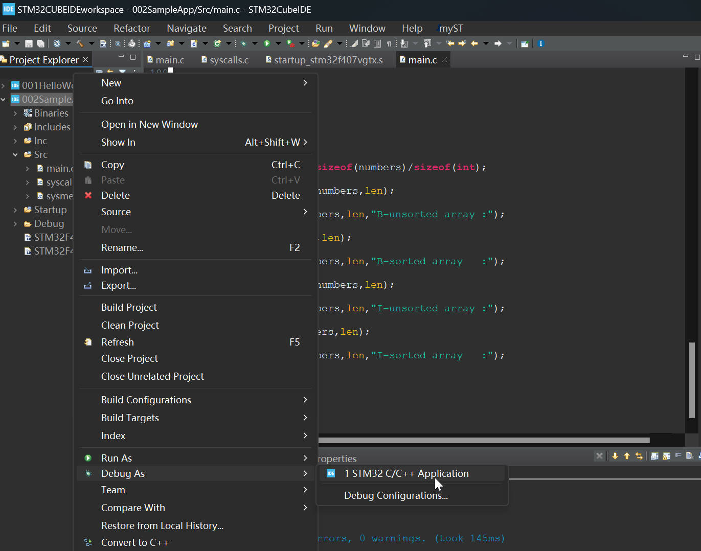
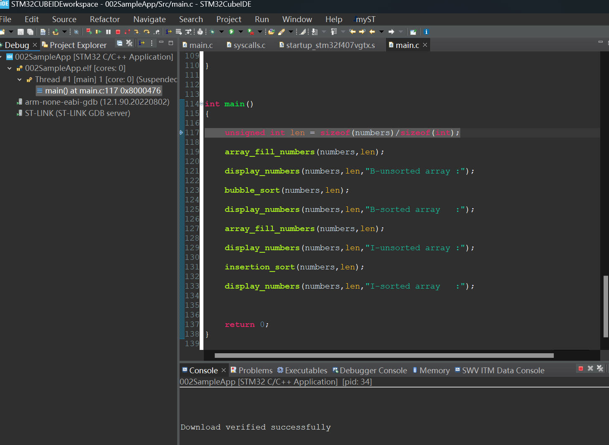
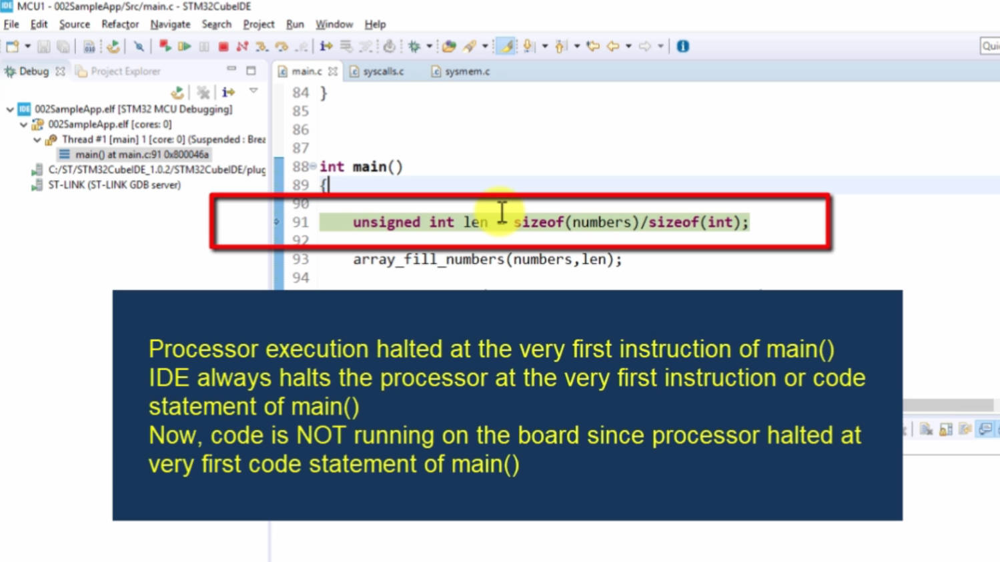
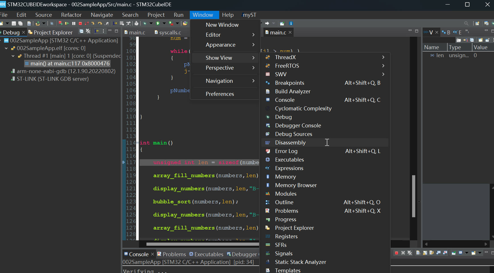
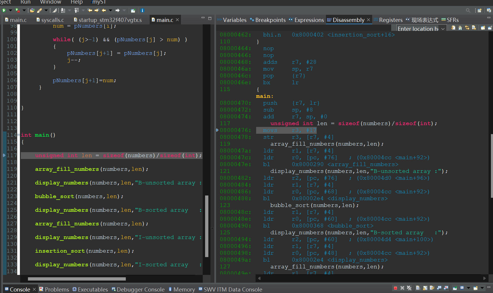
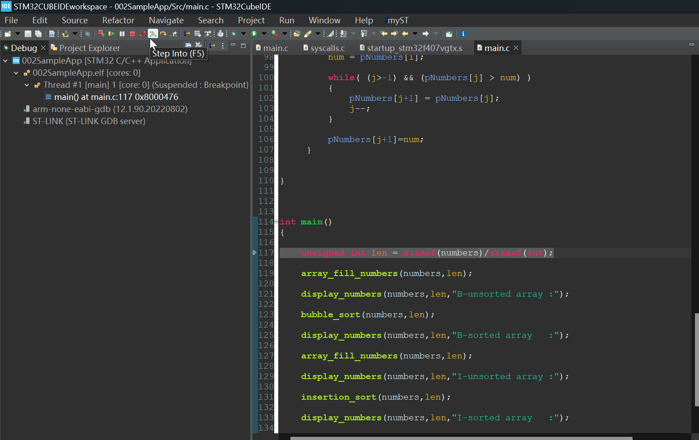
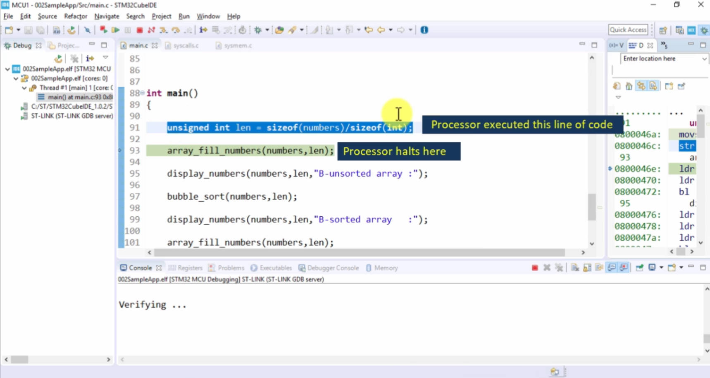
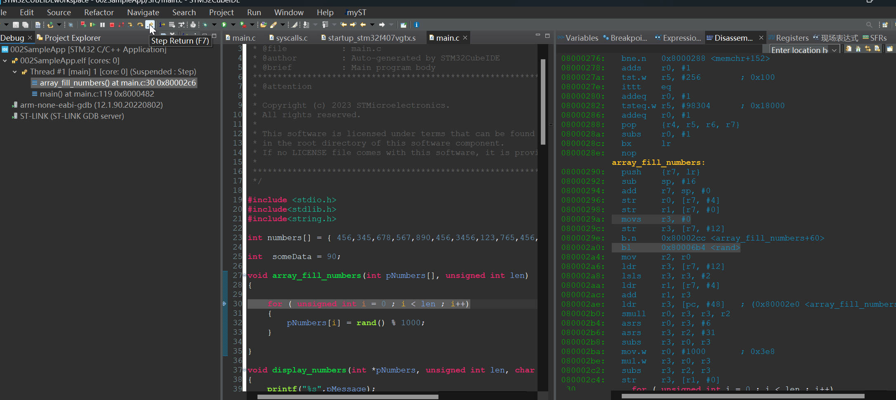
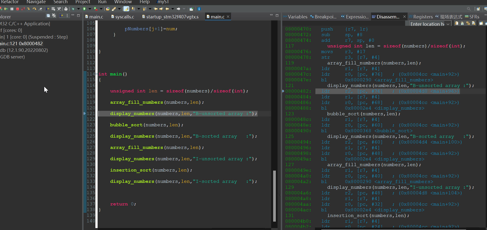
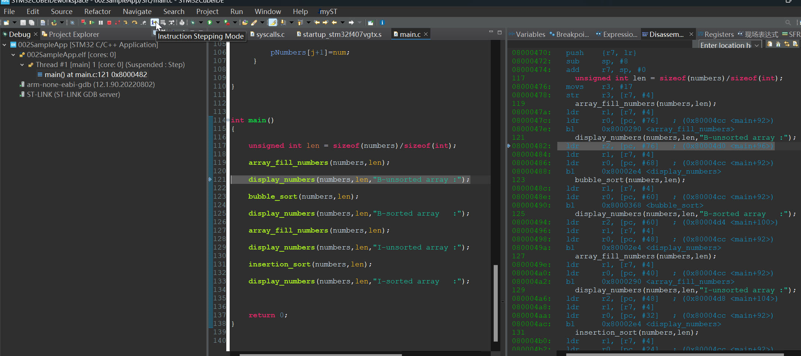

# 18. Single Stepping

## Debbug the Code Make the Code Loaded into Discovery Kit 

Switch to the debug perspective of the IDE

Processor waits on the first instruction line

Check in there to see `disassembly`

Step by step running the code

Press `Step into`, the instruction line will runed line by line

`step return` directly jumps out of the loop

## Instruction Stepping Mode

`Step into` : Step into a function  
`Step over`: Step over a function in one go  
`Step return`: Step to the return result of a loop  